# 🌋 RESQ-BOX — Project Knowledge Base & Central Dashboard

> [!NOTE]
> Selamat datang di **Knowledge Base RESQ-BOX**! Berkas ini berfungsi sebagai **Map of Content (MOC) & Beranda Proyek** saat dibuka melalui aplikasi **Obsidian**. Semua tautan di bawah menggunakan format internal link `[[...]]` yang dapat diklik langsung untuk berpindah antar dokumen.

---

## 🗺️ Peta Navigasi Dokumen Utama (Map of Content)

| Dokumen | Deskripsi & Isi Utama | Status / Versi |
| :--- | :--- | :---: |
| 📋 **[[PRD]]** | **Product Requirement Document**: Spesifikasi teknis komprehensif, arsitektur sistem, skema kurikulum SMP Kelas 8, dan 95 rekam milestone pengembangan. | `v3.33 (Aktif)` |
| 📈 **[[progress_report]]** | **Laporan Progres Lengkap**: Dokumentasi teknis terperinci per fitur — **Bab 110–117: audit menyeluruh, pengerasan keamanan (Supabase Auth + RLS ketat), kapasitas >1000 pemain, observabilitas produksi, dan pembesaran tipografi**; Bab 109: Sinkronisasi Blok Arduino ↔ Firmware ESP32. | `v4.0 (Update)` |
| 🎨 **[[design]]** | **Design System & Visual Guidelines**: Pedoman warna pixel art, tipografi retro 8-bit, prinsip visual game, dan panduan antarmuka responsif. | `v2.0` |
| 🧭 **[[walkthrough]]** | **Walkthrough & Panduan Pengujian**: Panduan verifikasi fitur, pengujian kurikulum 2 pertemuan, LKPD PjBL, 20 tugas mandiri, dan build produksi. | `v3.33 (Update)` |
| 📚 **[[LKPD_PJBL_RESQ_BOX_5_KELOMPOK|LKPD_PJBL_RESQ_BOX_5_KELOMPOK.md]]** | **Panduan Implementasi 2 Pertemuan & LKPD PjBL**: Skenario KBM sekolah mitra 2 pertemuan, 20 tugas mandiri individu Level 3 ringkas beserta kunci blok, dan 5 studi kasus kelompok PjBL. | `v1.0 (Resmi)` |
| 📖 **[[Readme]]** | **Dokumentasi Umum Repositori**: Gambaran umum proyek, arsitektur teknologi, lisensi, dan profil anggota tim pengembang LIDM 2026. | `v2.5` |
| 🤖 **[[agent]]** | **Pedoman Agentic AI Coding**: Konteks arsitektur, boundary pengerjaan, dan panduan bagi asisten pengembang AI. | `v1.0` |
| 📝 **[[update]]** | **Catatan Ringkas Pembaruan**: Catatan log pembaruan fitur cepat lintas modul. | `v1.5` |
| 🎛️ **[[header]]** | **Spesifikasi Header & Telemetri**: Dokumentasi tata letak header retro indikator telemetri. | `v1.0` |

---

## ⚡ Sorotan Pembaruan Terkini: Pengerasan Keamanan Backend, Kesiapan Kapasitas >1000 Pemain, Observabilitas Produksi, & Pembesaran Tipografi (Bab 110–117)

> [!IMPORTANT]
> **Perubahan arsitektur keamanan.** Backend RESQ-BOX bermigrasi dari skema lama (anon key + RPC tanpa otorisasi) ke **Supabase Auth + Row Level Security ketat**. Rincian lengkap: **[[progress_report#Bab 111: Pengerasan Keamanan Backend — Migrasi ke Supabase Auth, RLS Ketat per-Pemilik, Penutupan 11 RPC Berbahaya, dan Penghapusan Kredensial Plaintext|progress_report.md (Bab 111)]]**.

### 1. Keamanan Data & Akun — Terverifikasi **11/11 AMAN**

- **Isolasi data ditegakkan DATABASE, bukan browser.** 8 policy per-pemilik: user #1 **hanya** dapat melihat & mengubah barisnya sendiri; guru terbatas pada kelas yang dia ampu; admin lebih luas. Diverifikasi dengan uji perilaku nyata (`supabase/test_isolation.mjs`) — bukan sekadar pemeriksaan konfigurasi.
- **11 RPC berbahaya dihapus.** Sebelumnya `SECURITY DEFINER` di-`GRANT` ke `anon` **tanpa cek otorisasi**, sehingga siapa pun pemegang anon key dapat menghapus seluruh kelas/siswa dan memalsukan nilai.
- **Kebocoran hash password ditutup.** Akses ke `user_accounts` dicabut total; view `students` tidak lagi memuat kolom password aktif.
- **Plaintext password dihapus.** Ganti password memakai `supabase.auth.updateUser()` (bcrypt di server); dashboard guru berhenti menampilkan password siswa.
- **Pemalsuan nilai & level ditutup.** Nilai dihitung server (`official_level_score`); kolom `role`, `is_admin`, `classroom_code`, `unlocked_level` dikunci trigger.
- **Batas laju** pada 8 aksi sensitif untuk mencegah brute-force dan banjir perintah.
- **Bug kritis yang ditemukan lewat pengujian perilaku**: pengguna yang sudah login sempat **tidak bisa membaca datanya sendiri** (`HTTP 403 permission denied for function can_read_student`) karena hak eksekusi fungsi bantu RLS dicabut dari peran `authenticated` — padahal PostgreSQL mengevaluasi policy sebagai peran peminta. Diperbaiki di migrasi 07.

### 2. Integritas Data Siswa

- **Trigger profil diperbaiki**: sebelumnya **setiap** siswa baru punya `classroom_code = NULL` sehingga tidak pernah muncul di Posko Guru (rahasia ditulis Supabase *setelah* baris `auth.users` dibuat, sementara trigger `AFTER INSERT` sudah berjalan).
- **Realtime diaktifkan** untuk `profiles` — siswa baru kini muncul otomatis di Posko Guru tanpa refresh.

### 3. Kapasitas >1000 Pemain

- **Unduhan dingin ~6,3 MiB → ~2,8 MiB**; kunjungan ulang **~0 byte** berkat `Cache-Control` immutable.
- `public/` **10,23 MB → 4,69 MB**; latar WebP **−85%**; model 3D `terrain-688.stl.gz` **−69,5%** (3,17 MB → 966 KB).
- Precache PWA **4.760 → 2.287 KiB** dengan precache selektif.
- **Database berhenti tumbuh tanpa batas**: satu baris per (siswa, level), bukan `INSERT` murni per peristiwa.
- **Model kapasitas berparameter** (`capacity/README.md`) dengan pengali ×10–×1000 + `loadtest.js` yang dapat dijalankan.

### 4. Kesiapan Produksi

- **Observabilitas**: pelaporan error ke Sentry + Web Vitals (LCP/CLS/INP/TTFB/FCP), **dengan penyuntingan data pribadi** (email/UUID/JWT/telepon/kredensial dibuang sebelum dikirim).
- **Error boundary seluruh aplikasi** — sebelumnya hanya 2 tempat; kini kegagalan di rute mana pun menampilkan pemulihan, bukan layar putih.
- **Mode Hemat Data** untuk sekolah berkuota terbatas — scene 3D tidak dimuat sama sekali.
- **Halaman Kebijakan Privasi** publik (`/privacy`) berisi penanganan data anak.
- **CI + 29 uji otomatis** (`typecheck`, `build`, `test`, `test:sql`) berjalan pada setiap push.
- **Runbook operasional** (`docs/RUNBOOK.md`): 4 metrik wajib dipantau, prosedur tanggap insiden, prosedur uji restore backup.

### 5. Keterbacaan

- **1.731 penggantian tipografi di 57 berkas** — tidak ada lagi teks di bawah **12px** (sebelumnya ada 651 kemunculan, termasuk 12× **7px**).
- **95 emoji bawaan sistem operasi dihapus**; simbol teks monokrom yang seragam (`✓ ★ ➔ ▶`) dipertahankan karena bukan emoji OS dan mengikuti warna font.

### 6. Pekerjaan yang Masih Terbuka

Lihat **[[progress_report#Bab 117: Ringkasan Capaian Sesi — Status Keamanan Terverifikasi, Kapasitas, dan Daftar Pekerjaan yang Masih Terbuka|progress_report.md (Bab 117)]]**. Ringkasnya: naik ke Supabase Pro (menghapus risiko proyek dijeda), mengisi `VITE_SENTRY_DSN`, memasang alarm 4 metrik, uji restore backup, verifikasi di peramban sungguhan, dan 382 label diagram SVG yang belum dapat dibesarkan tanpa menata ulang geometrinya.

---

## ⚡ Sorotan Sebelumnya: Mawar Kompas Peta Merapi, Bahasa Ramah IPA Tutorial Resqy, Proteksi Sentuh Tablet/HP, & Atribusi Gambar Edukasi (Bab 105 & Milestone 95)

> [!TIP]
> Rincian lengkap pembaruan dapat dibaca di **[[progress_report#Bab 105: Penambahan Mawar Kompas Arah Mata Angin (Level 2), Penyederhanaan Narasi Tutorial Maskot Resqy Berbasis IPA SMP, Proteksi Input Sentuh Layar Mobile/Tablet, Perbaikan Stacking Toolbox Workspace, serta Atribusi Otentik Sumber Gambar Edukasi Merapi|progress_report.md (Bab 105)]]** dan **[[PRD#95|PRD.md (Milestone 95)]]**.

1. **🧭 Mawar Kompas Arah Mata Angin Peta Merapi (Level 2)**:
   - Menambahkan ornamen kompas mawar retro dengan arah jarum Utara (U/N) mengarah ke atas pada kanvas peta erupsi Merapi, dengan tipografi jelas dan proporsional.
2. **🦉 Penyederhanaan Narasi Tutorial Resqy Ramah Siswa SMP**:
   - Menghapus seluruh istilah komputasi teknis (ESP32, koding, mikrokontroler) dari `tutorialConfig.ts` dan menggantinya dengan konsep sains IPA SMP Kelas 8 (alat peraga mitigasi kebencanaan, diorama cerdas, sensor kebencanaan).
3. **📱 Proteksi Layar Sentuh Mobile & Tablet**:
   - Menghilangkan popup callout / context menu saat menekan lama (long-press) analog virtual dan tombol kontrol lainnya.
   - Menonaktifkan efek double-tap zoom di browser ponsel/tablet (`touch-action: manipulation`).
4. **🧱 Perbaikan Stacking Order & Z-Index Toolbox Workspace**:
   - Memastikan menu flyout block coding Blockly tertata rapi tanpa tembus atau bertabrakan dengan panel lain saat dibuka.
5. **📷 Atribusi Resmi Sumber Gambar Edukasi Merapi**:
   - Menautkan sumber otentik pada gambar materi erupsi:
     - *Wedhus Gembel*: [Kompas.com](https://lifestyle.kompas.com/read/2010/10/29/22092982/kecil-peluang-erupsi-merapi-eksplosif).
     - *Peta KRB Merapi*: [syawal88.wordpress.com](https://syawal88.wordpress.com/2010/11/17/dapatkah-gunung-mati-menjadi-gunung-aktif/).
     - *Banjir Lahar Dingin*: [Detikcom](https://news.detik.com/berita/d-7301571/4-fakta-banjir-lahar-dingin-semeru-yang-tewaskan-3-orang).
   - Dilengkapi badge sumber klikable langsung pada container gambar, panel teks materi, dan modal Lightbox fullscreen.

---

## ⚡ Sorotan Sebelumnya: Kurikulum Implementasi 2 Pertemuan Mitra, LKPD PjBL 5 Kelompok, & 20 Tugas Mandiri Level 3 (Bab 104 & Milestone 94)

> [!TIP]
> Rincian lengkap pembaruan dapat dibaca di **[[progress_report#Bab 104: Penyusunan Panduan Implementasi 2 Pertemuan KBM Sekolah Mitra, Integrasi LKPD PjBL 5 Kelompok Merapi & Gempa Bumi, Rekapitulasi Ringkas 20 Tugas Mandiri Individu Level 3, serta Peningkatan Readability Modal UI|progress_report.md (Bab 104)]]** dan **[[LKPD_PJBL_RESQ_BOX_5_KELOMPOK|LKPD_PJBL_RESQ_BOX_5_KELOMPOK.md]]**.

1. **📅 Desain Alur Pembelajaran Sekolah Mitra (2 Pertemuan + PR Mandiri)**:
   - **Pertemuan 1 (80 Menit)**: Orientasi masalah kebencanaan, penuntasan **Level 1** (*Earth Explorer: 8 strata geologis*) dan **Level 2** (*Disaster Analyst: 6 pos mitigasi lereng Merapi*), serta pengarahan tugas mandiri rumah.
   - **Tugas Mandiri di Rumah (PR)**: Pengerjaan mandiri **20 Misi Studi Kasus Level 3 (Job 1 s.d. Job 20)** di web RESQ-BOX secara ringkas (skenario + tujuan + kunci blok) sebelum masuk pertemuan berikutnya.
   - **Pertemuan 2 (80 Menit)**: PjBL 5 kelompok memprogram sistem mitigasi kompleks di simulator Level 3 (Action Lab / Proyek Saya) tanpa panduan blok, uji simulasi 20 detik target 0 korban jiwa, presentasi, dan asesmen.
2. **🌋 5 Studi Kasus Kelompok PjBL Menantang (Pertemuan 2)**:
   - *Kelompok 1 (Lembah Sungai)*: Erupsi Merapi mengancam lembah sungai ➔ Blok aksi: `Evakuasi Menjauh dari Wilayah Sungai`.
   - *Kelompok 2 (Sekolah)*: Gempa sedang (5-6 SR) saat jam belajar ➔ Blok aksi: `Evakuasi Keluar Bangunan`.
   - *Kelompok 3 (Pemukiman)*: Gempa besar (>7 SR) di pemukiman padat ➔ Blok aksi: `Evakuasi ke Tanah Lapang Terdekat`.
   - *Kelompok 4 (Lereng Atas)*: Aktivitas magma Waspada & Siaga ➔ Blok aksi: `Evakuasi Warga ke Zona KRB II & KRB I`.
   - *Kelompok 5 (Puncak & Seluruh Lereng)*: Letusan eksplosif awan panas ➔ Blok aksi: `Evakuasi Total ke Luar Area Peta`.
3. **🎯 4 Batasan Pedagogis & Teknis yang Ditegakkan Mutlak**:
   - **Zero Etnosains**: Dihapus total dari materi dan tugas (hanya mengadopsi struktur sintaks LKPD).
   - **Zero Sensor Fisik**: Mengeliminasi istilah sensor analog hardware; alat peraga mengacu pada aktuator LED RGB, sirine EWS, dan display maket diorama.
   - **Zero Banjir Lahar Dingin**: Materi mitigasi murni fokus pada Gempa Bumi dan Erupsi Merapi.
   - **Bahasa Ramah Anak SMP Kelas 8**: Kalimat lugas, mudah dipahami, tanpa istilah asing rumit.
   - **100% Selaras Toolbox Blockly**: Hanya menggunakan 19 blok resmi di toolbox Level 3 (`INITIAL_TOOLBOX`).
4. **🔍 Peningkatan Readability & Keterbacaan Modal UI**:
   - Memperbesar ukuran teks dan menebalkan tipografi modal interaktif (Panduan Resqy, Proyek Saya, pop-up studi kasus, dan Discovery Modal) agar terbaca jelas dari perangkat laptop maupun tablet siswa.

---

## ⚡ Sorotan Sebelumnya: Sistem Panduan Interaktif Game Onboarding Maskot Resqy (Bab 103 & Milestone 93)

> [!TIP]
> Rincian lengkap pembaruan dapat dibaca di **[[progress_report#Bab 103: Sistem Panduan Interaktif Game Onboarding Maskot Resqy (Onboarding Walkthrough Ala Game RPG / Mobile Legends, Spotlight Highlight Glow, Narasi Dialog Bertahap, Diferensiasi Akun Siswa & Guru, serta Persistensi Per Rute)|progress_report.md (Bab 103)]]**.

1. **🦉 Maskot Visual Resqy 2D Pixel Art SVG (`ResqyMascot.tsx`)**:
   - Menghadirkan karakter maskot resmi burung hantu berbulu cokelat dengan kacamata emas penjelajah (*golden goggles*), ekspresi mata ramah, sayap mengepak, dan animasi berbicara interaktif.
2. **🌟 Spotlight Highlight Glow & Dialog Ala Game RPG / Mobile Legends**:
   - Efek sorot dinamis dengan bounding box tepat pada elemen yang sedang dijelaskan (`boxShadow` 9999px + pulsing border emas amber).
   - Dialog speech box adaptif (otomatis memilih letak atas/bawah agar tidak menutupi elemen target), dilengkapi badge topik, indikator dot steps, dan navigasi keyboard.
3. **🗺️ 9 Alur Panduan Komprehensif Seluruh Rute Platform**:
   - `/login`: Pengenalan RESQ-BOX, opsi Masuk/Daftar Siswa & Guru, form kredensial, dan tombol demo cepat.
   - `/` (Dashboard Siswa): Runtutan materi kurikulum 3 level, strategi pembelajaran bertingkat, teknik evaluasi (Wordle, TTS, 20 Misi), HUD pemain, tombol Panduan & Bengkel Profil.
   - `/` (Dashboard Guru): Portal guru untuk menguji modul ajar dan tombol akses ke Posko Guru.
   - `/profile`: Bengkel Avatar Pixel, form identitas siswa, keamanan ganti password, dan rekam kesiapsiagaan.
   - `/level1`: Panduan kontrol gerak & aksi, modul sains tim ekspedisi [🔍], Radar Bumi, dan gerbang Wordle Sains.
   - `/level2`: Panduan 6 pos mitigasi lereng Merapi (SOP 72 Jam TSB, Drill Gempa, Status PVMBG, Zonasi KRB, Barak BNPB), dan TTS Crossword.
   - `/level3`: Peta 20 Misi 4 Sektor, cara kerja visual block coding, maket Digital Twin 3D 20 detik, dan rapor guru.
   - `/workspace`: Studio pemrograman mitigasi, kanvas 3D 75 AI warga, panel telemetri sensor, dan tombol Uji Algoritma.
   - `/teacher`: Posko Guru, manajemen kelas, kode kelas, rekap nilai gabungan, cetak rapor resmi, dan ekspor CSV.
4. **💾 Persistensi Otomatis & Replay Trigger `[🦉 Panduan Resqy]`**:
   - Muncul otomatis hanya sekali saat pertama kali mengunjungi rute terkait, disimpan di `localStorage` per akun user (`resqbox_tour_completed_${tourKey}_${userId}`).
   - Pengguna dapat memanggil ulang tutorial kapan saja dengan menekan tombol mengambang `[🦉 Panduan Resqy]`.

---

## ⚡ Sorotan Sebelumnya: Penyelarasan Total Modal Panduan & Misi Pembelajaran (Bab 102 & Milestone 93)

> [!TIP]
> Rincian lengkap pembaruan dapat dibaca di **[[progress_report#Bab 102: Penyelarasan Total Modal Panduan & Misi Pembelajaran Dashboard (Tab Interaktif 4 Sektor, Rincian 8 Area Geologis Level 1, 6 Pos Mitigasi Level 2, 20 Misi Studi Kasus Level 3, dan Tombol Kontekstual Dinamis)|progress_report.md (Bab 102)]]**.

1. **📑 Sistem 4 Tab Interaktif (`SEMUA TAHAP`, `TAHAP 1`, `TAHAP 2`, `TAHAP 3`)**:
   - Menghadirkan bilah navigasi tab pixel kayu di modal notice board `PANDUAN & MISI` (`src/app/Dashboard/index.tsx`).
   - Menyajikan ringkasan komprehensif alur kurikulum IPA SMP Kelas 8 dan status ketuntasan siswa saat ini.
2. **🌍 Penyelarasan Penuh Tahap 1 (Earth Explorer)**:
   - Memetakan 8 Area Geologis (Permukaan, Kerak, Mantel, Inti Luar, Inti Dalam, Batas Divergen, Konvergen, dan Transform top-down).
   - Menjelaskan kehadiran 5 Karakter Ekspedisi & Resqy, kristal geotermal, modul sains [🔍], dan evaluasi **Wordle Sains** Bu Tyas, M.Pd. sebagai syarat kelulusan ke Level 2.
3. **🌋 Penyelarasan Penuh Tahap 2 (Disaster Analyst)**:
   - Menggantikan deskripsi usang puzzle drag-and-drop dengan 6 Pos Mitigasi Kebencanaan: Ruang Kelas (SOP 72 Jam TSB), Drill Gempa (Drop-Cover-Hold On), Lapangan Evakuasi (Titik Kumpul), Pos PGA Merapi (Seismograf & Status PVMBG), Simulasi Erupsi (KRB I–III saat AWAS), dan Barak Pengungsian BNPB.
   - Evaluasi **TTS Crossword Mitigasi** Bu Tyas, M.Pd. sebagai syarat kelulusan ke Level 3.
4. **🎮 Penyelarasan Penuh Tahap 3 (Simulation Game / Action Lab)**:
   - Memetakan 20 Misi Studi Kasus dalam 4 Sektor Tematik (EWS & Sensor, Gempa 3-Tingkat, Erupsi Efusif Lahar Sungai, dan Erupsi Eksplosif Awan Panas).
   - Menjelaskan Visual Block Coding ramah anak, Digital Twin 3D Merapi dengan observasi 20 detik dan tombol *Reset Kondisi*, serta sinkronisasi otomatis ke Posko Guru (`/teacher`) dan diorama fisik ESP32.
5. **🎯 Tombol Kontekstual Pintar**:
   - Tombol aksi di bawah modal otomatis beradaptasi dengan tab aktif dan status unlock level pemain (`unlockedLevel`).

---

## ⚡ Sorotan Sebelumnya: Minimalist Overhaul Journey Progress Tracker & Restorasi Highlight Dinamis Radar Bumi (Bab 101 & Milestone 92)

> [!TIP]
> Rincian lengkap pembaruan dapat dibaca di **[[progress_report#Bab 101: Minimalist Overhaul Journey Progress Tracker (Anti-Collision, Z-Index Optimization) & Restorasi Highlight Dinamis Radar Bumi (PixelEarthDiagram)|progress_report.md (Bab 101)]]** dan **[[PRD#92. Minimalist Overhaul Journey Progress Tracker (Anti-Collision, Z-Index Optimization) & Restorasi Highlight Dinamis Radar Bumi (PixelEarthDiagram)|PRD.md (Milestone 92)]]**.

1. **✂️ Desain Minimalis & Borderless Murni**:
   - Menghapus kotak card latar belakang gelap tebal, border amber ganda, dan padding berlebih pada `JourneyProgressTracker.tsx`.
   - Mengeliminasi seluruh bilah header (judul teks, badge level, badge area aktif, dan tombol toggle `[−]`/`[+]`).
   - Tampilan murni menyajikan progress bar kapsul ramping yang melayang ringan di atas latar belakang permainan.
2. **🛡️ Tata Letak Anti-Collision (Bebas Tabrakan Teks Metrik)**:
   - Avatar karakter mini dan panah penunjuk `▼` diposisikan di **atas** bar kapsul menunjuk ke bawah.
   - Label jarak dan metrik area (`0 km`, `35 km`, `2.900 km`, dll.) berada rapi di **bawah** node checkpoint.
   - Menghilangkan tumpang tindih visual 100% saat avatar melintasi node checkpoint.
3. **🔝 Z-Index Non-Blocking & Bebas Hambatan Popup**:
   - Kontainer tracker disetel ke `z-10` dengan `pointer-events-none` agar klik/sentuhan mouse tembus langsung ke elemen game di bawahnya.
   - Tombol prompt interaksi di Level 1 (`hudData.nearObjectType`) dinaikkan ke `bottom-20 sm:bottom-24` dengan `z-30 pointer-events-auto`, memastikan tombol interaksi dan popup selalu tampil di atas tracker dan responsif.
4. **🌍 Restorasi Highlight Dinamis Radar Bumi (`PixelEarthDiagram.tsx`)**:
   - Mengembalikan logika selektif `hasActive = !!activeLayerId`: lapisan interior bumi yang sedang dijelajahi karakter menyala terang dengan aura putar dan pembesaran halus, sementara lapisan lainnya diredupkan ke `opacity: 0.32` demi fokus edukatif.
5. **✅ Verifikasi Build 100%**:
   - `npx tsc -b` sukses 0 error dan `npm run build` sukses 100% dalam 2.62s - 4.16s (32 precache entries valid).

---

## ⚡ Sorotan Sebelumnya: Real-Time Journey Progress Tracker 2D Pixel Art & Preview Avatar Karakter di Level 1 & Level 2 (Bab 100 & Milestone 91)

> [!TIP]
> Rincian lengkap pembaruan dapat dibaca di **[[progress_report#Bab 100: Real-Time Journey Progress Tracker 2D Pixel Art & Preview Avatar Karakter di Level 1 & Level 2|progress_report.md (Bab 100)]]** dan **[[PRD#91. Real-Time Journey Progress Tracker 2D Pixel Art & Preview Avatar Karakter (Level 1 & Level 2)|PRD.md (Milestone 91)]]**.

1. **🗺️ Komponen Reusable `JourneyProgressTracker.tsx`**:
   - Dibuat dengan antarmuka kapsul retro 2D pixel (`bg-slate-950/90`, border amber, shadow tegas) di *bottom-center* viewport (di area batuan dasar atas bar pintasan kontrol keyboard).
   - Menampilkan judul bernuansa retro `'Press Start 2P'`, badge nama area aktif, tombol ciutkan/perluas (`−`/`+`), fill gradient dinamis (Hijau ➔ Kuning ➔ Oranye ➔ Merah), dan tooltip hover.
2. **📍 Segmentasi Checkpoint Area Presisi**:
   - **Level 1 (8 Area Geologis)**: Permukaan Bumi (`mountain`, 0 km), Kerak Bumi (`pickaxe`, 35 km), Mantel Bumi (`flame`, 2.900 km), Inti Luar (`zap`, 5.150 km), Inti Dalam (`crystal`, 6.371 km), Batas Divergen (`divergent`, Pemekaran), Batas Konvergen (`convergent`, Subduksi), dan Batas Transform (`transform`, Sesar S.A.).
   - **Level 2 (6 Area Mitigasi)**: Ruang Kelas Teori (`book`, SOP 72 Jam), Simulasi Drill (`earthquake`, Drop-Cover), Lapangan Evakuasi (`runner`, Titik Kumpul), Pos PGA Merapi (`seismogram`, Status PVMBG), Simulasi Erupsi (`volcano`, Status AWAS), dan Barak Pengungsian (`tent`, Zona Aman KRB I).
   - Indikator status node visual: *Tuntas* (lingkaran hijau zamrud dengan centang pixel `✓`), *Aktif* (lingkaran amber berpendar dengan efek pulse halo), dan *Terkunci* (lingkaran slate abu-abu).
3. **🏃 Preview Avatar Karakter Bergerak Real-Time (60 FPS)**:
   - Preview miniatur avatar kustom siswa (`PixelAvatarRenderer`) dengan penunjuk segitiga `▲` bergerak mulus melintasi bar progress secara real-time mengikuti pergerakan langkah karakter di peta kanvas tanpa re-render React berlebih.
   - Avatar otomatis membalik hadap kiri/kanan (`scaleX`) mengikuti arah hadap karakter pemain.
4. **🎨 Zero OS Emoji & Ikon Pixel Baru**:
   - Seluruh icon checkpoint menggunakan SVG 2D pixel art kustom dengan `shapeRendering="crispEdges"`.
   - Menambahkan ikon pixel art tenda BNPB kustom 16x16 (`tent`) di `PixelIcon.tsx`.
5. **✅ Verifikasi Build 100%**:
   - `npx tsc -b` bersih 0 error dan `npm run build` sukses 100% dalam 2.73 detik (32 precache entries valid).

---

## ⚡ Sorotan Sebelumnya: Sinkronisasi Real-Time Misi Level 3 ke Dashboard Guru, Evaluasi Bertingkat [PROGRES] / [TUNTAS], Isolasi Mutlak Per-Akun Siswa, dan Rekonsiliasi Otomatis (Bab 99 & Milestone 90)

> [!TIP]
> Rincian lengkap pembaruan dapat dibaca di **[[progress_report#Bab 99: Sinkronisasi Real-Time Misi Level 3 ke Dashboard Guru, Evaluasi Bertingkat [PROGRES] / [TUNTAS], Isolasi Mutlak Per-Akun Siswa, dan Rekonsiliasi Otomatis|progress_report.md (Bab 99)]]** dan **[[PRD#90. Sinkronisasi Real-Time Misi Level 3 ke Dashboard Guru, Evaluasi Bertingkat [PROGRES] / [TUNTAS], Isolasi Mutlak Per-Akun Siswa, dan Rekonsiliasi Otomatis|PRD.md (Milestone 90)]]**.

1. **🔄 Pembuatan Modul Sinkronisasi Level 3 (`level3Sync.ts`)**:
   - Menghadirkan fungsi `syncLevel3Progress()` yang menghitung skor proporsional 20 level misi ($\text{skor} = \frac{\text{misi}}{20} \times 100$) dan mengirimkan payload lengkap (`completed_missions`, `completed_count`, `last_completed_id`, status teks, stage label) ke `submitLevelProgress()`.
   - Mengintegrasikan pemanggilan instan di `completeMission()` (`missionStore.ts`) setiap kali siswa menyelesaikan misi apa pun (misal Job 1, Job 2) tanpa harus menunggu seluruh 20 misi tuntas.
   - Menambahkan *passive sync* di `Level3/index.tsx` saat mount untuk menjamin progres di localStorage langsung tersinkronkan ke server.
2. **📊 Overhaul Evaluasi Level 3 di Dashboard Guru (`TeacherDashboard/index.tsx`)**:
   - Menghubungkan pembacaan `sub3` untuk seluruh siswa di tabel pemantauan.
   - Mengubah status Level 3 dari teks statis menjadi badge reaktif:
     - `[ PROGRES ]` (cyan) dengan subtext `${score3} Poin (${completedCount}/20)` saat ada misi selesai (misal Job 1 & 2 = 10 Poin).
     - `[ TUNTAS ]` (emerald) dengan subtext `100 Poin` saat seluruh 20 misi tuntas.
     - `AKTIF` (purple) dengan subtext `Lab Simulasi` saat level terbuka namun belum ada misi dikerjakan.
     - `TERKUNCI` (slate) saat siswa masih di Level 1 atau 2.
   - Memperbarui Modal Detail Siswa: kartu Level 3 kini menampilkan Nilai Simulasi, Rasio Misi Selesai (`X / 20`), progress bar dinamis, dan deskripsi stage.
   - Memperbarui Cetak Rapor Siswa & Ekspor CSV: menyertakan kolom Skor Lv 3, status evaluasi, dan jumlah misi tuntas.
3. **🛡️ Penguatan Isolasi Progres Multi-Akun & Rekonsiliasi Otomatis**:
   - Seluruh penyimpanan misi (`resqbox_missions_${userId}`) dan workspace terisolasi mutlak per ID akun siswa.
   - Mengembangkan mekanisme rekonsiliasi otomatis di `fetchClassroomSubmissions()` (`supabaseClient.ts`) yang memindai progres lokal siswa dan langsung menyintesis submisi Level 3 jika siswa telah mengerjakan misi sebelumnya.
4. **✅ Verifikasi Build 100%**:
   - `npx tsc --noEmit` lolos 100% (0 error) dan `npm run build` sukses 100% dalam 2.56 detik (32 precache entries valid).

---

## ⚡ Sorotan Sebelumnya: Eliminasi Redundansi Blok Evakuasi, Durasi Simulasi 20 Detik, Preservasi Dampak Lingkungan Pasca-Bencana, dan Tombol Reset Kondisi Peta 3D (Bab 98 & Milestone 89)

> [!TIP]
> Rincian lengkap pembaruan dapat dibaca di **[[progress_report#Bab 98 Eliminasi Redundansi Blok Evakuasi Penyesuaian 20 Misi Studi Kasus Pembatasan Durasi Bencana 20 Detik Preservasi Dampak Lingkungan Pasca-Bencana dan Tombol Reset Kondisi Peta 3D|progress_report.md (Bab 98)]]** dan **[[PRD#89. Eliminasi Redundansi Blok Evakuasi, Penyesuaian 20 Misi Studi Kasus, Pembatasan Durasi Bencana 20 Detik, Preservasi Dampak Lingkungan Pasca-Bencana, dan Tombol Reset Kondisi Peta 3D|PRD.md (Milestone 89)]]**.

1. **✂️ Eliminasi Blok Redundan "Tentukan Jalur Evakuasi" & Penyelarasan 20 Study Cases (`missions.ts`)**:
   - Blok `resq_jalur_evakuasi` dihapus dari `core.ts`, `jsGenerator.ts`, `BlocklyComponent.tsx`, dan `validationEngine.ts`.
   - Kategori *Aksi & Evakuasi* kini rapi menyajikan 5 blok aksi evakuasi nyata: `resq_evak_keluar_bangunan`, `resq_evak_tanah_lapang`, `resq_evak_krb`, `resq_evak_luar_map`, `resq_evak_jauhi_sungai`.
   - Ke-20 studi kasus misi disesuaikan (Job 10, Job 16–20) tanpa lagi memerlukan blok rute evakuasi lama.
2. **⏱️ Pembatasan Durasi Bencana Menjadi Tepat 20 Detik & Countdown Timer**:
   - Simulasi gempa dan letusan Merapi kini otomatis dibatasi tepat **20 detik** (`SIMULATION_DURATION_MS = 20000`) di Workspace.
   - Tombol eksekusi menampilkan hitung mundur waktu riil: `BERHENTI (Xs)` saat aktif dan kembali ke `MULAI` setelah 20 detik selesai.
   - Pengguna tetap dapat mengklik tombol manual `BERHENTI` kapan saja jika ingin menghentikan simulasi lebih awal.
3. **🌋 Preservasi Dampak Lingkungan Pasca-Bencana pada Peta 3D (`Merapi3DScene.tsx`)**:
   - Saat 20 detik habis, **hanya aktivitas fisika bencananya yang mereda** (getaran tanah/kamera berhenti, semburan kolom kawah dan lontaran bom berhenti, hardware mist/motor/gempa dinonaktifkan).
   - **Kondisi lingkungan dan dampak bencana tetap dipertahankan**:
     - *Gempa*: Rekahan aspal jalan tetap menganga, bangunan roboh/amblas tetap hancur beserta puing-puingnya, tiang listrik tetap miring/tumbang.
     - *Erupsi Eksplosif*: Awan panas (*wedhus gembel*) tetap menyelimuti lereng dan lembah sungai (Kali Gendol, Kali Kuning, Boyong), bangunan tetap hangus berjelaga hitam, pohon tetap arang tanpa daun, air sungai tetap keruh berlumpur lahar dingin.
     - *Erupsi Efusif*: Lidah aliran lelehan lava pijar tetap membeku/membara di lereng kawah & hulu sungai, sungai tetap berwarna lahar, pepohonan tetap terbakar.
     - *Warga / NPC*: Tetap bertahan di zona aman hasil evakuasi (lapangan terbuka / barak KRB I / luar peta).
     - Label status informatif: `PASCA-GEMPA: DAMPAK KERUSAKAN BANGUNAN & JALAN`, `PASCA-ERUPSI EKSPLOSIF: DAMPAK AWAN PANAS & ABU VULKANIK`, atau `PASCA-ERUPSI EFUSIF: ENDAPAN LAVA PIJAR & LAHAR`.
4. **↺ Tombol "Reset Kondisi" pada Toolbar Pojok Kanan Atas Peta 3D**:
   - Ditambahkan tepat pada toolbar diorama: `[ Garis KRB ] [ Reset View ] [ Gedein Peta ] [ Reset Kondisi ]`.
   - Berkedip lembut (*pulse animation*) dengan aksen warna rose saat peta mendeteksi kerusakan pasca-bencana.
   - Mengembalikan 100% kondisi peta ke keadaan normal: bangunan kembali utuh, tiang tegak, jalan menutup, pohon berdaun hijau kembali, air sungai biru jernih, awan panas & lava dibersihkan, dan 75 NPC kembali ke posisi awal.
5. **✅ Verifikasi Build 100%**:
   - `npx tsc --noEmit` lolos 100% (0 error) dan `npm run build` sukses 100% dalam 3.73 detik (32 precache entries valid).

---

## ⚡ Sorotan Sebelumnya: Standardisasi Panduan Lokasi Kategori Blok di Seluruh 20 Level Study Case Level 3 (Bab 98 & Milestone 88)

> [!TIP]
> Rincian lengkap pembaruan dapat dibaca di **[[progress_report#D. Standardisasi Panduan Lokasi Kategori Blok di Seluruh 20 Level Study Case (Blockly Toolbox Guidance UX)|progress_report.md (Bab 98)]]** dan **[[PRD#88. Standardisasi Panduan Lokasi Kategori Blok di Seluruh 20 Level Study Case (Blockly Toolbox Guidance UX)|PRD.md (Milestone 88)]]**.

1. **🧩 Panduan Eksplisit Kategori Toolbox di Semua 20 Level (`missions.ts`)**:
   - Seluruh 20 level study case Level 3 (`job_01` hingga `job_20`) kini secara eksplisit mencantumkan nama kategori asal saat menginstruksikan siswa mengambil blok di kanvas.
   - Format navigasi: `Kategori [Nama Kategori] ➔ ambil blok '[Nama Blok]'`.
   - Memetakan 6 kategori toolbox resmi: **Sistem** (oranye), **Simulasi Bencana** (merah), **Peringatan & EWS** (tosca), **Aksi & Evakuasi** (ungu), **Kondisi Bencana** (biru), dan **Pengambilan Keputusan** (pink).
2. **🧭 Kartu Panduan Lokasi Blok di Pop-up Modal Level 3 & MissionPanel**:
   - Modal pop-up peta Level 3 memuat kartu cyan `🧭 PANDUAN KATEGORI BLOK` sebelum siswa memulai misi.
   - Sidebar MissionPanel di Workspace menyajikan kartu hijau `🧭 PANDUAN LOKASI BLOK:` sebagai petunjuk cepat permanen.
   - Engine validasi (`validationEngine.ts`) memberi tahu kategori asal blok jika ada blok yang terlewat saat validasi.
3. **🗺️ Peta Level 3 Dipangkas Menjadi Tepat 20 Level**:
   - Menghapus 30 level ekstra (Level 21–50) sehingga pas **20 level bertingkat** sesuai 4 sektor tematik kurikulum SMP Kelas 8 (Sektor 1: EWS & Sensor; Sektor 2: Gempa Bumi; Sektor 3: Erupsi Efusif & Lahar; Sektor 4: Erupsi Eksplosif & Awan Panas).
   - Lebar kanvas disesuaikan `4650px` dengan scrollbar horizontal responsif, indikator `TUNTAS: 0 / 20`, dan tiang bendera finish di ujung Level 20.
2. **🛡️ Konseptualisasi & Integrasi Rute "Jalur Lingkar Utama (Bebas Lahar)"**:
   - Lembah alur sungai (Kali Gendol/Kuning) adalah *death trap* lahar dingin dan awan panas.
   - **Jalur Lingkar Utama** adalah jaringan jalan evakuasi lingkar di punggung bukit (*ridge*) yang bebas dari ancaman lahar karena berada di elevasi tinggi di atas tebing sungai, menghubungkan lereng atas langsung ke Barak Pengungsian KRB I di selatan.
   - Terkoneksi dinamis ke blok Blockly `resq_jalur_evakuasi`, `resq_posko`, dan `resq_sirine_ews`.
3. **🚶 Eliminasi Total "Conga-Line" (Multi-Lane Lateral Spreading)**:
   - Menghitung vektor normal tegak lurus sumbu jalan: NPC tidak lagi berjalan di satu garis tengah tipis, melainkan menyebar melintang di lebar jalan ($-0.65$ s/d $+0.65$) di trotoar kiri, bahu jalan, tengah jalan, dan trotoar kanan.
   - Tiap individu memiliki `walkPhase` dan kecepatan unik sehingga langkah kaki tidak sinkron serempak seperti robot.
4. **👥 4 Arketipe Realistis Warga Desa (75 NPC)**:
   - **20 Anak Sekolah (`role: 'student'`)**: Seragam biru-putih dan pramuka, tubuh mungil, langkah lincah. 10 anak di dalam kelas sekolah beton, 10 di pekarangan.
   - **10 Petugas BPBD/TAGANA (`role: 'officer'`)**: Rompi oranye khas BPBD dan helm keselamatan kuning bersiaga di Posko BPBD, RSUD, dan Barak KRB I.
   - **13 Lansia (`role: 'elder'`)**: Pakaian warna tanah/khaki, langkah santai dan hati-hati.
   - **32 Warga Dewasa (`role: 'adult'`)**: Baju warna-warni, 12 orang berada di dalam rumah tinggal kayu.
5. **🏢 Respons Bencana Cerdas Berbasis Material Dinding**:
   - **Gempa Ringan**: Indoor jalan cepat keluar ruangan; outdoor berhenti sejenak ($1.5$s) mendongak ke atas memeriksa genteng dan plang (`lookUpTimer`), lalu jalan menjauhi dinding.
   - **Gempa Sedang**: Bangunan kayu lari keluar ($1.8\times$) karena rawan runtuh; gedung beton (Sekolah/RSUD/BPBD) memicu **Duck and Cover** (merunduk di kolong meja/pilar kokoh lindungi kepala dan bertahan di tempat); outdoor lari cepat ($1.9\times$) ke Lapangan Terbuka.
   - **Gempa Besar**: Semua tiarap di tanah/lantai. NPC yang Duck & cover di bawah meja beton / lapangan terbuka selamat; yang dekat dinding roboh non-beton tertimpa reruntuhan (knocked out).
6. **🌋 Erupsi Merapi Multi-Phase & Dynamic Bomb Dodge**:
   - **Waspada**: 90% normal, sesekali berhenti menatap puncak kawah Merapi (`gazeTimer`) melihat kepulan asap kawah.
   - **Siaga**: Warga berkemas, kecepatan $1.7\times$, evakuasi ke KRB I di selatan, mobil evakuasi patroli sirine.
   - **Awas**: Evakuasi massal tanpa henti ($2.5\times$) menuju batas selatan ($Z \ge 104$).
   - **Dynamic Bomb Dodge**: NPC mendeteksi bom vulkanik yang meluncur turun dalam radius $< 8.5$m dan meliuk ke samping ($1.6$m) secara dinamis untuk menghindar!
   - **Awan Panas**: Gedung beton kokoh melindungi dari awan panas 600°C; warga di ruang terbuka tanpa gedung beton tereliminasi.
   - **Erupsi Efusif**: Aliran sungai ditandai sebagai Danger Grid, NPC mengambil jalan lingkar bukit menjauhi lava.
7. **✅ Verifikasi Build 100%**:
   - `npx tsc --noEmit` bersih 0 error dan `npm run build` sukses 100% dalam 2.29 detik.

---

## ⚡ Sorotan Sebelumnya: Overhaul Visual Bundaran Lampu Sensor LED Pusat (Digital Twin 3D Merapi) — Super Terang, Dual Glow Halo, Ground Light Pool & PointLight Ultra-Luminance (Bab 96)

> [!TIP]
> Rincian lengkap pembaruan dapat dibaca di **[[progress_report#96. Overhaul Visual Bundaran Lampu Sensor LED Pusat (Digital Twin 3D Merapi): Bola Lampu Raksasa, Inti Pijar Putih, Dual Volumetric Glow Halo, Ground Light Pool, dan PointLight Ultra-Terang|progress_report.md (Bab 96)]]** dan **[[PRD#86. Overhaul Visual Bundaran Lampu Sensor LED Pusat (Digital Twin 3D Merapi — Super Terang, Dual Glow Halo, Ground Light Pool & PointLight Ultra-Luminance)|PRD.md (Milestone 86)]]**.

1. **🔴 Respons Tanggapan Screenshot Pengguna**:
   - Pengguna menandai bundaran lampu di persimpangan jalan dekat KRB II: *"lampu yang disini itu loh kurang terang banget"*.
   - Dilakukan perombakan total pada `buildCentralLed()` di [`Merapi3DScene.tsx`](./src/app/EvacuationGame/Merapi3DScene.tsx).
2. **💡 Bola Lampu Raksasa & Inti Putih Panas**:
   - Radius bola utama diperbesar dari 0.48 menjadi **1.35 unit** dengan `emissiveIntensity: 8.5` (hampir 3x lipat).
   - Di dalam bola lampu disematkan bola inti putih murni (`radius: 0.85`, `#ffffff`) untuk mereplikasi pijar fisik lampu LED berdaya tinggi.
3. **✨ Dual Volumetric Glow Halos**:
   - *Inner Halo*: Bola radius 2.6 unit dengan `AdditiveBlending` dan opacity 0.65 (`BackSide`).
   - *Outer Corona Flare*: Bola radius 5.2 unit dengan `AdditiveBlending` dan opacity 0.35 (`BackSide`), menciptakan kabut aura cahaya atmosfer yang tebal dan dramatis.
4. **🛣️ Kolam Cahaya di Atas Aspal & Rumput (Ground Light Pool)**:
   - Cincin proyeksi cahaya horizontal selebar 17 unit (`RingGeometry(0.3, 8.5, 36)`) ber-`AdditiveBlending` diletakkan tepat di atas jalan persimpangan ($y = 0.08$), menyinari aspal dan lingkungan sekitar secara nyata.
5. **🔦 PointLight Intensitas 25.0**:
   - Sumber cahaya dinaikkan 10x lipat dari 2.5 menjadi **25.0** dengan jarak penerangan 60 unit dan decay 1.2.
6. **🌈 Animasi Denyut Pulse & Sinkronisasi 4 Warna Neon Murni**:
   - Render loop `animate()` mempertahankan intensitas puncak `8.5 * pulse` dan `25.0 * pulse` tanpa terpotong.
   - Sinkronisasi warna otomatis memperbarui kelima komponen (mesh utama, inti, halo dalam, halo luar, kolam tanah, dan pointlight) secara serempak dengan warna neon intensif (`#00ff66`, `#ffea00`, `#ff6600`, `#ff0033`).
7. **✅ Verifikasi Build Produksi 100%**:
   - `npx tsc --noEmit` lolos 0 error dan `npm run build` selesai sukses dalam 2.83 detik.

---

## ⚡ Sorotan Sebelumnya: Perbaikan Evaluasi Logika Letusan Blockly, Audio Sintesis Sirine EWS Kontinu, Peningkatan Luminansi Lampu Status, Penghapusan Indikator Asap Mist, dan Eliminasi Istilah Teknis Hardware (Bab 95)

> [!TIP]
> Rincian lengkap pembaruan dapat dibaca di **[[progress_report#95. Perbaikan Evaluasi Logika Kondisional Letusan Blockly, Audio Sintesis Sirine EWS Kontinu, Peningkatan Luminansi Lampu Status, Penghapusan Indikator Asap Mist, dan Eliminasi Istilah Teknis Hardware|progress_report.md (Bab 95)]]** dan **[[PRD#85. Perbaikan Evaluasi Logika Letusan Blockly, Audio Sintesis Sirine EWS Kontinu, Peningkatan Luminansi Lampu Status, Penghapusan Indikator Asap Mist, dan Eliminasi Istilah Teknis Hardware|PRD.md (Milestone 85)]]**.

1. **🧩 Evaluasi Logika Blok Predikat Letusan**:
   - Blok `resq_tipe_letusan` kini mengembalikan predikat kondisi boolean runtime `(api.getEruptionType() === '${tipe}')`.
   - Menghilangkan bug di mana string `"EFUSIF"` selalu bernilai *truthy* di JavaScript. Kini saat simulasi bertipe Eksplosif, kondisi `Kalau [Tipe Letusan: Efusif]` menghasilkan `false` dan sirine EWS **tidak akan berbunyi keliru**.
2. **🔊 Audio Sintesis Sirine EWS & Alarm Kontinu**:
   - Modul `retroAudio` dilengkapi `startEwsSiren()` dan `stopEwsSiren()` dengan dual oscillator (sawtooth + sine) dan filter bandpass 750 Hz.
   - Suara sirine berbunyi looping terus-menerus selama `api.setBuzzer(true)` aktif, dan terputus seketika saat buzzer mati atau simulasi dihentikan.
3. **💡 Lampu Status LED Ultra-Terang**:
   - Diameter lampu diperbesar ($20\text{px}$) dengan ring reflektor gelap, gradien lensa, dan multi-layer neon bloom box-shadow (Merah: `#ff1744` + glow 28px + pulse; Hijau: `#00e676` + glow 28px; Oranye: `#ff9100`; Kuning: `#ffea00`) dengan label status kontras tebal.
4. **🗑️ Eliminasi Kartu Asap Mist**:
   - Kartu "Asap Mist" dihapus dari panel telemetri dan aktuator diubah menjadi 2 kolom (`grid-cols-2`) seimbang dan lapang.
5. **🏷️ Pembersihan Istilah Teknis Hardware**:
   - Badge `ESP32 SINKRON` diubah ke `STATUS AKTIF`, monitor `OLED SSD1306 (128x64)` diubah ke `Layar Informasi Publik` & `Siaga Digital`, serta teks misi/LKPD dibersihkan dari istilah chipset. Peringatan hardware belum terhubung tetap dipertahankan sesuai arahan.
6. **✅ Verifikasi Build 100%**:
   - `npx tsc --noEmit` lolos 0 error dan `npm run build` sukses 100% dalam 2.63 detik.

---

## ⚡ Sorotan Sebelumnya: Penyempurnaan Erupsi Efusif Merapi (Multi-Stream 6 Lidah Lava Lereng Atas, Batasan Radius KRB III, Tremor Ringan Level 1, dan Perambatan Kekeruhan Sungai Bertahap ke Hilir) (Bab 92)

> [!NOTE]
> Rincian lengkap pembaruan dapat dibaca di **[[progress_report#Bab 92: Penyempurnaan Simulasi Erupsi Efusif Level 3 (Multi-Stream 6 Lidah Lava Lereng Atas, Batasan Radius KRB III, Tremor Ringan Level 1, dan Perambatan Kekeruhan Sungai Bertahap)|progress_report.md (Bab 92)]]** dan **[[PRD#82. Penyempurnaan Simulasi Erupsi Efusif Level 3|PRD.md (Milestone 82)]]**.

1. **🌋 Tahap Awal (Pre-Erupsi Efusif)**:
   - **Tanpa Gempa Besar (No Screen Shake)**: Getaran kamera dan tremor tanah dimatikan (`effectiveSeismic = 0`), menjaga layar tenang dan stabil.
   - **Asap Putih Tipis (Steam/Gas Sulfur)**: Kawah mengepulkan uap air dan gas putih bersih konstan (`#f8fafc`, opacity 0.58, size 3.2), bukan kepulan hitam pekat meledak.
   - **Pertumbuhan Kubah Lava (Lava Dome)**: Objek 3D kubah lava di kawah menggembung perlahan ($0.0\text{s} - 4.0\text{s}$) dengan pendaran magma merah-oranye berdenyut sebelum lava meluap ke lembah.
2. **🔥 Logika Aliran Lava (Gravity Pathfinding & Cooling Texture)**:
   - Aliran lava mengikuti kontur lembah terendah (Kali Gendol, Kali Kuning, Kali Boyong).
   - Efek pendinginan tekstur dinamis (*Cooling Texture Transition* via vertex colors): Ujung depan Merah Pijar (`#ff3b00`–`#ffdd00`) ➔ Badan tengah Jingga Panas (`#f97316`) ➔ Ekor & kerak luar membeku menjadi Batuan Basal Hitam/Abu-abu (`#18181b` / `#27272a`).
   - Kecepatan lambat realistis (aliran memerlukan ~22 detik untuk menuruni lereng), NPC dapat mendahului aliran lava dengan mudah saat evakuasi.
3. **🏚️ Logika Kerusakan Bangunan (Slow & Thermal Damage)**:
   - Kerusakan murni terjadi saat aliran lava menyentuh bounding box bangunan (`minDist <= 3.8 / 4.5 unit`).
   - Logika Damage over Time (DoT): HP bangunan berkurang ~5.5% per detik; memicu partikel api/asap di titik kontak; dinding menghangus; bangunan perlahan tenggelam/runtuh meleleh tertimbun lava yang meninggi.
4. **🌲 Efek Lingkungan & Atmosfer**:
   - **Kebakaran Hutan/Lahan**: Pohon yang terkena lava memicu partikel api, daunnya gugur habis, dan batangnya berubah menjadi arang hitam legam.
   - **Efek Uap Air Sungai (Steam Trigger)**: Kontak aliran lava bersuhu tinggi dengan badan air sungai memicu semburan kabut uap putih tebal membubung tinggi akibat air mendidih instan.
   - **Pasca-Erupsi**: Jalur lelehan membeku menjadi timbunan batuan basal vulkanik hitam permanen.
5. **⚙️ Integrasi Penuh Block Coding & Hardware ESP32**:
   - Blok `resq_gunung_sim` dengan opsi `Efusif` tereksekusi mulus di browser dan mengirim sinyal `gempa 0`, `gunung 3 efusif`, `mist on` ke hardware ESP32 (`yom.ino` & `program_esp.ino`).
6. **✅ Verifikasi Build 100%**:
   - Lolos uji statis `npx tsc --noEmit` 0 error dan `npm run build` sukses 100% dalam 2.17 detik.

---

## ⚡ Sorotan Sebelumnya: Integrasi Seismik-Vulkanik Erupsi Merapi (Episenter Kawah, Tremor Level 3 Kontinu AWAS, Seismograf Aktif & Bebas Gempa SIAGA), Penataan Hierarki Layering Sungai Lapisan Paling Dasar di Bawah Jalan dan Jembatan, Kalibrasi Proporsional Skala Awan Panas (Wedhus Gembel), dan Penyelarasan Warna Kolom Asap Erupsi (Bab 90)

> [!TIP]
> Rincian lengkap pembaruan dapat dibaca di **[[progress_report#Bab 90: Integrasi Seismik-Vulkanik Erupsi Merapi (Episenter Kawah, Tremor Level 3 Kontinu AWAS, Seismograf Aktif & Bebas Gempa SIAGA), Penataan Hierarki Layering Sungai Lapisan Paling Dasar di Bawah Jalan dan Jembatan, Kalibrasi Proporsional Skala Awan Panas (Wedhus Gembel), dan Penyelarasan Warna Kolom Asap Erupsi|progress_report.md (Bab 90)]]** dan **[[PRD#80. Integrasi Seismik-Vulkanik Erupsi Merapi (Episenter Kawah, Tremor Level 3 Kontinu AWAS, Seismograf Aktif & Bebas Gempa SIAGA), Penataan Hierarki Layering Sungai Lapisan Paling Dasar di Bawah Jalan dan Jembatan, Kalibrasi Proporsional Skala Awan Panas (Wedhus Gembel), dan Penyelarasan Warna Kolom Asap Erupsi|PRD.md (Milestone 80)]]**.

1. **🌋 Episenter Kawah Merapi & Formula Atenuasi Jarak Seismik**:
   - Pusat gempa dipindahkan dari titik asal tengah peta ke koordinat kawah Merapi (`PEAK_X = -0.5, PEAK_Z = -44.0`).
   - Formula peluruhan getaran $att = \frac{1}{1 + 0.018 \cdot \text{dist}}$ diintegrasikan ke guncangan kamera, getaran mikro tanah maket, dan kepanikan NPC (getaran di lereng atas puncak $\approx 1.0\times$, sedangkan di dataran bawah barak pengungsian meluruh lembut ke $\approx 0.35\times$).
   - Cincin gelombang riak merah neon yang terkesan berlebihan (*alay*) dihapus total, digantikan getaran mekanis riil.
2. **🔇 Status SIAGA Bebas Gempa (Zero Tremor on SIAGA)**:
   - Status SIAGA (`volcanoStatus === 2`) murni menetapkan status waspada dengan kepulan uap fumarol tipis tanpa guncangan gempa (`effectiveSeismic = 0`). Jarum instrumen seismograf tenang pada baseline $0.0\text{ mm}$.
3. **📈 Kopling Gempa Vulkanik AWAS Kontinu & Seismograf Aktif**:
   - Status AWAS (`volcanoStatus === 3`) secara otomatis mengaktifkan getaran gempa Level 3 (`effectiveSeismic = 3`) secara kontinu dari awal hingga akhir siklus erupsi.
   - Panel instrumen Seismograf membaca gelombang tremor vulkanik secara aktif dan real-time.
   - Firmware Arduino/ESP32 (`yom.ino` & `program_esp/program_esp.ino`) disinkronkan: SIAGA mematikan gempa & mist, sedangkan AWAS memicu motor getar & mist uap erupsi.
4. **🌊 Penataan Hierarki Layering Sungai Lapisan Paling Dasar di Bawah Jalan & Jembatan**:
   - Mengembangkan fungsi pita sungai mandiri `createRiverRibbonGeometry` yang murni mengevaluasi centerline palung lembah terendah pada elevasi $0.08$ unit.
   - Mengonfigurasi `renderOrder: 1` dengan polygon offset WebGL (`factor: -1, units: -2`) pada material `riverMat`.
   - Menjaga jalan aspal pada `renderOrder: 6` (elevasi $0.36$) dan jembatan beton 3D pada `renderOrder: 10–12` yang menumpu kokoh pada tepi bantaran jalan (`gy = Math.max(maxBankY + 0.28, riverBedY + 0.65)`).
   - Air sungai mengalir bebas dan mulus di bawah kolong jembatan dan di bawah badan jalan aspal tanpa pemotongan geometri (zero clipping).
5. **☁️ Skala Awan Panas Proporsional (Wedhus Gembel Goldilocks Size)**:
   - Geometri gumpalan awan panas dikalibrasi pada radius dasar `3.4 unit` dengan 3-tier penskalaan ketinggian ($1.1\times, 1.4\times, 2.0\times$) dan faktor ekspansi $1.0 + 0.4 \cdot pProg$.
   - Menghasilkan diameter gumpalan $8\text{–}18\text{ unit}$ yang proporsional: tebal bervolume dan terlihat jelas dari kejauhan saat di-zoom out, namun tetap terkurung rapi di alur palung Kali Gendol tanpa menutupi seluruh maket permukiman.
   - Alur animasi realistis: diawali pembubungan kolom abu vertikal, keruntuhan kolom karena gravitasi (*column collapse*), dan aliran deras menuruni lereng.
6. **🎨 Penyelarasan Warna Kolom Erupsi & Awan Panas**:
   - Kolom abu Plinian, umbrella cloud, runtuhan semburan debu (*collapse torrents*), dan partikel kawah diselaraskan menggunakan material abu pekat kelabu cerah seragam (`#f1f5f9`, emissive `#475569`, opacity 0.98), 100% senada dengan awan panas wedhus gembel.
7. **✅ Verifikasi Build 100%**:
   - Lolos uji statis `npx tsc --noEmit` dengan 0 error dan `npm run build` sukses 100% (exit code 0 dalam 3.48s).

---

## ⚡ Sorotan Sebelumnya: Eliminasi Z-Fighting & Anti-Clipping Pita Sungai dan Jalan 3D (Depth-Bias Polygon Offset WebGL, Densifikasi Subdivisi Ribbon 0.45, 5-Point Cross-Section Elevation Sampling, Anti-Sagging Pass, dan Perpanjangan Alur Kali Gendol ke Batas Selatan) (Bab 89)

> [!NOTE]
> Rincian lengkap pembaruan dapat dibaca di **[[progress_report#Bab 89: Eliminasi Z-Fighting & Anti-Clipping Pita Sungai dan Jalan 3D via WebGL Polygon Offset, Densifikasi Subdivisi Ribbon 0.45, 5-Point Cross-Section Elevation Sampling, Anti-Sagging Pass, dan Perpanjangan Alur Kali Gendol ke Batas Selatan|progress_report.md (Bab 89)]]** dan **[[PRD#79. Eliminasi Z-Fighting & Anti-Clipping Pita Sungai dan Jalan 3D (Depth-Bias Polygon Offset WebGL, Densifikasi Subdivisi Ribbon 0.45, 5-Point Cross-Section Elevation Sampling, Anti-Sagging Pass, dan Perpanjangan Alur Kali Gendol ke Batas Selatan)|PRD.md (Milestone 79)]]**.

1. **🛡️ Eliminasi Z-Fighting via WebGL Hardware Polygon Offset**:
   - Mengaktifkan `polygonOffset: true` dengan bias negatif pada material `riverMat` (`factor: -3, units: -6`), `roadMat` (`factor: -2, units: -4`), dan `lineMat` (`factor: -4, units: -8`) serta `depthWrite: true`.
   - Menggeser kalkulasi z-buffer fragment pita sungai dan jalan maju di depan poligon terrain STL (`terrain-688.stl`), melenyapkan fenomena *flickering* atau garis hilang saat di-orbit, di-pan, atau di-zoom.
2. **📐 Layered Vertical Stacking Elevation**:
   - Elevasi vertikal disesuaikan bertingkat: permukaan sungai `0.32` unit, aspal jalan `0.38` unit, marka garis tengah putih `0.42` unit, geladak jembatan `0.20` unit (presisi flush), busur KRB `0.44` unit, dan garis neon putus-putus KRB `0.48` unit.
3. **🔄 Densifikasi Subdivisi Spline (maxStep = 0.45) & 5-Point Cross-Section Elevation Sampling**:
   - Resolusi subdivisi spline diperhalus dari `1.0` menjadi `0.45` unit (lebih rapat dari grid heightmap STL $0.5$ unit), menghasilkan pita adaptif yang luwes mengikuti lereng bergelombang.
   - Ketinggian simpul mengevaluasi 5 titik melintang sepanjang lebar pita: tepi kiri ($L$), kuartil kiri ($Q_1$), poros tengah ($C$), kuartil kanan ($Q_2$), dan tepi kanan ($R$) dengan rumus `Math.max(cy, ly, ry, q1y, q2y)`.
4. **⛰️ Quadratic Anti-Sagging Pass**:
   - Mencegah quad segmen datar menancap ke dalam cembungan bukit tanah dengan mengevaluasi elevasi titik interpolasi tengah $(P_i + P_{i+1})/2$ dan mengangkat kedua ujung quad jika terdeteksi gundukan di tengah.
5. **🌊 Penyelarasan Kali Kuning di KRB I (Lingkaran Merah Kiri)**:
   - Menambahkan 4 titik kontrol spline pada alur Kali Kuning rentang $Z = 60.37 \rightarrow 78.22$ (`[-10.78, 64.0]`, `[-10.72, 68.0]`, `[-10.65, 72.0]`, `[-10.60, 76.0]`), menjamin air mengalir mulus tanpa terputus di bawah dataran hijau KRB I.
6. **🏞️ Ekstensi Kali Gendol ke Batas Selatan (Lingkaran Merah Kanan)**:
   - Menyambungkan titik buntu lama di $Z = 24.18$ menyusuri koridor lembah timur hingga menembus batas selatan maket ($Z = 108.5$) melewati 11 titik kontrol baru, aman tanpa memotong bangunan barak maupun jalan desa.
7. **✅ Orbit, Pan, and Zoom Invariance**:
   - Visual maket 3D 100% stabil, sungai dan jalan tetap utuh tanpa ada segmen yang tenggelam di seluruh rentang zoom (30 s.d. 260 unit) maupun sudut orbit miring. Lolos build TypeScript dan Vite 100%.

---

## ⚡ Sorotan Sebelumnya: Kalibrasi Peta Lengkung 3D Denah 1:1, Penyelarasan Jembatan & Poros Jalan Segaris Bebas Clipping, Relokasi Bangunan & Pohon Sempadan Sungai, Zonasi Bahaya KRB I-III (Kliping Kontur Terrain, Ribbon 3D & Badge Mengambang), Overhaul Kompleks Barak Pengungsian BNPB/BPBD, dan Penyederhanaan Toolbar Navigasi 3D (Bab 88)

> [!NOTE]
> Rincian lengkap pembaruan dapat dibaca di **[[progress_report#Bab 88: Kalibrasi Peta Lengkung 3D Denah 1:1, Penyelarasan Jembatan & Poros Jalan Segaris Bebas Clipping, Relokasi Bangunan & Pohon Sempadan Sungai, Zonasi Bahaya KRB I-III (Kliping Kontur Terrain, Ribbon 3D & Badge Mengambang), Overhaul Kompleks Barak Pengungsian BNPB/BPBD, dan Penyederhanaan Toolbar Navigasi 3D|progress_report.md (Bab 88)]]** dan **[[PRD#78. Kalibrasi Peta Lengkung 3D Denah 1:1, Penyelarasan Jembatan & Poros Jalan Segaris Bebas Clipping, Relokasi Bangunan & Pohon Sempadan Sungai, Zonasi Bahaya KRB I-III (Kliping Kontur Terrain, Ribbon 3D & Badge Mengambang), Overhaul Kompleks Barak Pengungsian BNPB/BPBD, dan Penyederhanaan Toolbar Navigasi 3D|PRD.md (Milestone 78)]]**.

1. **🏫 Kalibrasi Denah Lengkung 1:1 & Sekolah U-Shape**:
   - Geometri sekolah ditransformasi menjadi gedung U-shape tapal kuda (`12 × 4 unit` & `7 × 3.5 unit`) beratap limasan biru, selasar beratap, dan lapangan upacara berbendera Merah Putih dengan orientasi gerbang langsung menghadap jalan.
2. **🌉 Rekonfigurasi Jalan, Jembatan Kali Gendol & Pelurusan Presisi Anti-Clipping**:
   - Menghubungkan jalan barat menyeberangi Kali Gendol ke timur dengan jembatan beton baru `{ x: 26.8, z: 12.8, rot: 0 }`, segaris lurus dengan aspal $z = 12.8$.
   - Menyelaraskan jembatan Kali Boyong barat `{ x: -13.31, z: 40.08, rot: 0.243 }` dengan jalan tembus pada sudut collinear $0.243$ rad sehingga guardrail jembatan terpasang rapi di luar aspal tanpa memotong badan jalan.
   - Menghubungkan jalan lereng atas kiri `[-10.14, -8.91]` ke simpang utara `[-13.76, -23.43]` dan menghitung ulang 207 `ROAD_JUNCTION_NODES`.
3. **🌊 Ekstensi Garis Peta & Relokasi Pohon Bantaran**:
   - Alur jalan dan sungai diperpanjang menembus tepi maket ($z = \pm 106$, $x = \pm 66.5$) untuk ilusi bentang alam kontinu.
   - Pohon di bantaran sungai digeser menjauh dengan jarak bebas aman $\ge 3.5\text{m}$ dari garis air.
4. **🏡 Orientasi Fasad Bangunan & Relokasi Rumah 31**:
   - Bangunan ditata dengan setback 2–3 unit dan fasad menghadap jalan terdekat. Rumah 31 digeser ke $x = -15.2$ (>3m dari Kali Gendol); Rumah EWS digeser ke kanan 3.5 unit.
5. **🎥 Penyederhanaan Toolbar & Kontrol Orbit 3D (Langsung POV Samping)**:
   - Menghapus tombol "POV Atas" dan "Rute Evakuasi" dari toolbar. Inisialisasi awal kamera sejak frame pertama langsung dikunci pada POV Samping Axonometric di `(38, 78, 122)` memandang `(-5, 0, 15)` tanpa perlu menekan tombol reset view, lengkap dengan orbit rotation (`enableRotate = true`, `maxPolarAngle = \pi/2.05`), pan, dan zoom.
6. **🚨 Zonasi Bahaya KRB I-III**:
   - Busur KRB dikliping presisi di dalam batas terrain ($X \in [-66.5, 66.5]$, $Z \in [-52, 106]$), zero void dangling.
   - Ribbon 3D tebal `0.85 unit` bergaris neon putus-putus putih; overlay drape merah (KRB III) & kuning (KRB II); 3 billboard badge 3D mengambang (`🔴 KRB III`, `🟡 KRB II`, `🟢 KRB I`); serta penghapusan cincin busur hijau luar KRB 1 pada radius 102 menjaga dataran rendah tetap luas dan alami.
7. **⛺ Kompleks Evakuasi Darurat BNPB/BPBD**:
   - Pelataran beton bertulang (staging pad) ber-hazard marking, tenda pleton utama A-frame kanvas kuning keselamatan (`#eab308`), plang kayu resmi `"BARAK PENGUNGSIAN BNPB"`, tenda satelit medis berlambang Palang Merah 3D, menara tandon air bersih 4 kaki, unit genset diesel darurat, tumpukan palet kotak logistik pangan, tiang bendera Merah Putih, dan menara lampu sorot darurat.

---

## ⚡ Sorotan Sebelumnya: Penyelarasan Skala Proporsional Maket 3D, Pemodelan Arsitektural Bangunan Asli (RSUD Helipad, BPBD Menara, Barak Pleton Lengkung, Sekolah & Rumah Limasan), Penataan Kavling Pinggir Jalan Bebas Tabrakan, Efek Seismik Nyata, Simulasi Erupsi Eksplosif vs Efusif Aliran Lava Pijar, Pembersihan UI & Panel Samping Telemetri Digital Twin (Bab 87)

> [!NOTE]
> Rincian lengkap dapat dibaca di **[[progress_report#Bab 87: Penyelarasan Skala Proporsional Maket 3D, Pemodelan Arsitektural Bangunan Asli (RSUD Helipad, BPBD Menara, Barak Pleton Lengkung, Sekolah & Rumah Limasan), Penataan Kavling Pinggir Jalan Bebas Tabrakan, Efek Seismik Nyata, Simulasi Erupsi Eksplosif vs Efusif Aliran Lava Pijar, Pembersihan UI & Panel Samping Telemetri Digital Twin|progress_report.md (Bab 87)]]** dan **[[PRD#77. Penyelarasan Skala Proporsional Maket 3D, Pemodelan Arsitektural Bangunan Asli, Penataan Kavling Pinggir Jalan, Efek Gempa Seismik Nyata, Simulasi Erupsi Eksplosif vs Efusif Aliran Lava Pijar, dan Panel Samping Telemetri Digital Twin|PRD.md (Milestone 77)]]**.

1. **📏 Penyesuaian Skala Proporsional Maket terhadap Gunung Merapi**:
   - Lebar jalan aspal diperkecil dari 2.8 ke 1.35 unit; lebar sungai 1.8 unit; figur miniatur NPC manusiawi 0.75 unit; pohon miniatur 1.4 unit. Puncak kawah Gunung Merapi menjulang gagah dan proporsional di atas pemukiman.
2. **🏛️ Pemodelan Arsitektural Bangunan Asli (Bukan Kotak-Kotak)**:
   - RSUD 2 tingkat beratap helipad 'H', jendela pita kaca, kanopi drop-off lobi IGD, palang merah 3D timbul, dan miniatur ambulans.
   - Kantor BPBD oranye-bata, garasi roll-shutter armada rescue, tiang menara komunikasi truss dengan beacon merah.
   - Barak Pengungsian model tenda pleton lengkung BNPB (*arched barrel-vault*) kanvas kuning keselamatan (`#facc15`), interior palet kayu & matras biru, serta tandon air stainless.
   - Sekolah U-shape berdinding krem lis biru (*wainscot*), atap limasan biru, dan tiang bendera Merah Putih.
   - 35+ Rumah limasan Jawa Sleman beratap genteng tanah liat bakar (`#b45309`), bubungan nok kayu, dinding bata plester putih, dan teras *emperan*.
3. **🛣️ Penataan Kavling Pinggir Jalan (Zero Road Blockage)**:
   - Bangunan ditata di kavling samping jalan dengan jarak aman 2.5–3.5 unit dari centerline jalan. 0 bangunan menghalangi badan jalan.
4. **⚡ Efek Seismik Gempa Bumi Nyata & Responsif**:
   - Guncangan kamera multi-frekuensi proporsional Skala Richter (0.7 / 1.8 / 3.8 unit), getaran fisik tanah diorama (*ground tremor jitter*), gelombang seismik riak melingkar (*Rayleigh surface waves*), animasi NPC gemetar panik, dan banner peringatan gempa bumi aktif.
5. **🌋 Simulasi Erupsi Realistis: Eksplosif vs Efusif Aliran Lava Pijar**:
   - *Eruspi Efusif*: Lelehan aliran lava pijar 3D dinamis mengalir menuruni 3 alur sungai (Kali Gendol, Kali Kuning, Kali Boyong) berpendar terang dengan point lights lereng dan uap fumarol lembut.
   - *Erupsi Eksplosif*: Kolom abu vulkanik pekat (*wedhus gembel*) gelap membubung tinggi ke langit, lontaran bom vulkanik berlintasan parabola yang memercikkan api saat menghantam lereng, serta kilatan letusan kawah.
6. **🎨 Pembersihan Antarmuka & Panel Telemetri Samping**:
   - Menghapus tombol "Tes Perangkat" dan "Sensor" dari header; menyematkan panel Telemetri Digital Twin langsung di sisi kanan kanvas 3D diorama (Screenshot 3).
   - Badge pojok kiri atas hanya menampilkan status gunung (`LEVEL I: NORMAL`, dsb.); legenda kiri bawah dihapus 100%; menambahkan tombol `[ 🗖 Gedein Peta ]` untuk perbesaran tampilan view map.

---

## ⚡ Sorotan Sebelumnya: Transformasi Penuh Digital Twin 3D Gunung Merapi Menggunakan Model STL Asli (`terrain-688.stl`), Replikasi Presisi Diorama Fisik, Sudut Pandang Axonometric Tetap (Zero-Rotate), Integrasi Live Blockly IoT, dan Optimasi Performa 60 FPS Bebas Lag (Bab 86)
   - Memuat model 3D topografi asli Gunung Merapi biner STL (~3.16 MB, 63.314 poligon) via `STLLoader`.
   - Mengubah skala vertikal Y sebesar 2.8x (`HEIGHT_SCALE = 2.8`) sehingga kawah Merapi menjulang gagah hingga elevasi +23.3 unit.
   - Pewarnaan prosedural lereng (*topographic vertex coloring*) menampilkan fissure lava kawah merah-oranye pijar, punggungan hijau dan celah abu putih, lereng pinus zaitun, dan dataran rumput subur.
2. **🏛️ Replikasi Presisi Seluruh Elemen & Aset Diorama Fisik Tim (Zero Text Clutter)**:
   - Jaringan jalan raya 27 node aspal abu-abu gelap menghubungkan seluruh pemukiman, fasilitas umum, dan kaki gunung tanpa putus.
   - 3 Aliran sungai biru (Kali Boyong, Kali Kuning, Kali Woro) dengan jembatan beton penyeberangan di persimpangan jalan.
   - RSUD berlantai 2 dengan kubus Palang Merah 3D menyala di fasad depan.
   - Posko Utama BPBD Sleman dengan menara tiang antena radio komunikasi setinggi 7 unit dan lampu beacon merah.
   - 3 Barak Pengungsian atap kuning keselamatan (Shelter A, B, C) di radius aman.
   - 3 Sekolah atap biru U-shape (SMP 1 Merapi, SD Inpres, Sekolah Lereng).
   - 35+ Rumah warga terakota pedesaan dan 40+ pohon pinus/kanopi asri.
   - Lampu Indikator LED RGB Sentral di bibir plinth diorama dan Medallion Kompas 8 mata angin putih.
   - Seluruh bangunan bebas dari teks mengambang, menghasilkan estetika maket arsitektural yang bersih dan profesional.
3. **🎥 Sudut Pandang Kamera Axonometric Samping-Atas Tetap (Zero-Rotate)**:
   - Kamera diposisikan miring samping-atas di `(38, 78, 122)` memandang pusat aktivitas `(-5, 0, 15)` dengan FOV 36°.
   - Fitur rotasi dinonaktifkan (`enableRotate = false`) agar orientasi tidak berubah dan siswa tidak pusing.
   - Kontrol geser (*pan*) via drag mouse/touch dan kontrol perbesaran (*zoom*) via scroll/pinch berfungsi mulus dengan batas aman `50..220`.
4. **⚡ Integrasi Reaktif Penuh Block Coding (Blockly) & IoT Digital Twin**:
   - Status 'AWAS' memicu letusan kepulan awan abu vulkanik berputar dinamis yang membubung ke langit, rekahan lava kawah menyala merah membara, dan 75 NPC panik berlari menuju barak dan RSUD.
   - Blok `setRgb(color)` mengubah warna LED RGB sentral di sudut plinth secara real-time.
   - Sensor getaran gempa `seismicLevel` menggetarkan kamera secara proporsional.
   - Menara EWS mengaktifkan strobo berkedip cepat saat sirine berbunyi.
   - Pilihan rute evakuasi menyinari jalur jalan dengan garis neon hijau terang (`#10b981`).
5. **🚀 Arsitektur Optimasi Performa 60 FPS Bebas Lag**:
   - Mendiagnosa dan mengatasi bottleneck lag berat (2-5 FPS) akibat 4.748.550 uji perpotongan raycaster per frame (75 NPC × 63.314 segitiga).
   - Pre-kalkulasi elevasi `y` seluruh 27 node jalan saat inisialisasi; ketinggian NPC dihitung seketika menggunakan matematis `lerp` $O(1)$ dengan **0 raycast per frame**.
   - Proyeksi bayangan medan dinonaktifkan (`terrainMesh.castShadow = false`), shadow map dikecilkan ke 1024x1024 `BasicShadowMap`, pixel ratio dibatasi maksimal 1.25x, serta material/geometri di-share.
   - Frame rate melonjak stabil ke **60 FPS terkunci**.
6. **🧹 Eliminasi Total Kanvas 2.5D Legacy & Build Produksi 100% Sukses**:
   - Berkas `EvacuationCanvas.tsx` dibersihkan dari seluruh kode 2.5D lama dan langsung merender `Merapi3DScene.tsx`.
   - `npm run build` lolos bersih tanpa error dalam 2.19 detik.

---

## ⚡ Sorotan Sebelumnya: Transformasi Map Penuh Level 3 Menjadi Lanskap Murni Area 6 Level 2 (Barak Pengungsian & Pemulihan KRB I) 3.800px — Bersih Tanpa Nama Bangunan, Tanpa Teks Label, dan Tanpa NPC (Bab 85)

> [!TIP]
> Rincian lengkap pembaruan dapat dibaca di **[[progress_report#Bab 85: Transformasi Map Penuh Level 3 (`/level3`) Menjadi Lanskap Murni Area 6 Level 2 (Barak Pengungsian & Pemulihan KRB I) 3.800px — Bersih Tanpa Nama Bangunan, Tanpa Teks Label, dan Tanpa NPC|progress_report.md (Bab 85)]]**.

1. **🗺️ Eliminasi Total Dinding Interior Kelas & Papan Tulis di Sektor 1**:
   - Menghapus komponen interior kelas lama (`#classroom_interior_sector1`: dinding wallpaper kuning, papan tulis hijau Lab IoT, jendela kaca, meja laboratorium, dan pintu evakuasi kelas).
   - Membentangkan kanvas alam terbuka dari koordinat $x = 0$ hingga $x = 3.800$ secara penuh dan mulus.
2. **🌅 Panorama Alam 3.800px Penuh Area 6 (Barak Pengungsian KRB I)**:
   - Langit fajar harapan (`#1e3a8a` $\rightarrow$ `#0284c7` $\rightarrow$ `#38bdf8` $\rightarrow$ `#fef08a`), matahari pagi fajar bersinar hangat, awan melayang, kawanan burung, dan siluet Gunung Merapi berkaldera kroak di kejauhan dengan lelehan magma tipis & kepulan asap vulkanik.
   - Tiga lapisan perbukitan hijau tropis lereng Sleman, rumpun pohon pinus, bebatuan andesit, serta bunga tropis dataran rendah.
3. **🏛️ Seluruh Landmark Otentik Area 6 Murni Tanpa Nama Bangunan & Tanpa Teks Label**:
   - Semua plang nama/tulisan di background map (`KE DUSUN DESTANA`, `BARAK PENGUNGSIAN TERPADU`, `TENDA PLETON BPBD`, `AIR BERSIH`, `POSKO KESEHATAN PMI`, `N95`, `DAPUR UMUM TAGANA`, `BERAS`, `JALAN LICIN!`, `SABO DAM`, `AWAS LAHAR HUJAN`, `RESCUE`) dihilangkan 100%.
   - Seluruh bangunan (Gapura Destana, Spanduk Gerbang, Tenda BPBD, Tandon Stainless, Posko Medis PMI, Dapur Tagana, Rumah Atap Abu + Tangga Bambu, Rambu Lahar & EWS, Truk Rescue 4x4) tampil murni berupa karya seni vektor yang bersih.
4. **🛣️ Jalur Aspal Mulus & Penyingkiran Gerbang Milestone Berteks**:
   - Gerbang pembatas sektor melintang jalan (`SEKTOR 2:...`, dsb.) ditiadakan sehingga jalur aspal evakuasi terbentang bersih tanpa terhalang plang tulisan.
   - Background map 100% bebas dari elemen `<text>`.
5. **✅ Verifikasi Build Produksi 100% Sukses**:
   - `tsc -b && vite build` lolos bersih 0 error dalam 1.95 detik.

---

## ⚡ Sorotan Sebelumnya: Audit Komprehensif Alur Dialog Interaktif, Resolusi Bug Freeze Cabang Pilihan, dan Penyelarasan Penuh Identitas & Potret NPC Lintas Level 1 & Level 2 (Bab 83)

> [!TIP]
> Rincian lengkap pembaruan dapat dibaca di **[[progress_report#Bab 83: Audit Komprehensif Alur Dialog Interaktif, Resolusi Bug Freeze Cabang Pilihan, dan Penyelarasan Penuh Identitas & Potret NPC Lintas Level 1 & Level 2|progress_report.md (Bab 83)]]**, **[[PRD#75. Audit Komprehensif Alur Dialog Interaktif, Resolusi Bug Freeze Cabang Pilihan, dan Penyelarasan Penuh Identitas & Potret NPC Lintas Level 1 & Level 2|PRD.md (Milestone 75)]]**, dan **[[walkthrough#76. Verifikasi Alur Bebas Freeze Dialog Interaktif, Konsistensi Identitas & Potret NPC Level 1 & 2, serta Verifikasi Build Produksi|walkthrough.md (Bab 76)]]**.

1. **🧊 Investigasi & Resolusi Bug Pilihan Dialog Kedua Membeku (Freezing Dialogue Branching Fix)**:
   - Mengatasi akar masalah di mana memilih opsi respon kedua pada percabangan dialog mengarah ke `nextNodeId: 'done'` yang belum terdefinisi di kamus `nodes` (pada `PROF_ANDINI_DIALOGUE`), inkonsistensi huruf besar-kecil `start_tour_One` vs `start_tour_one` (`INSPEKTUR_BUDI_DIALOGUE`), dan unlinked branch (`PROF_RADITYA_DIALOGUE`).
   - Seluruh node terminal `done` ditambahkan secara sah dengan respon penutup ramah dan event loop visual novel menutup dialog secara mulus tanpa membuat pemain terperangkap beku.
2. **🔍 Audit Menyeluruh Pohon Dialog (0 Broken Transitions)**:
   - Menjalankan audit script traversal otomatis pada seluruh 38 pohon dialog di Level 1 (`dialogueData.ts`) dan 28 pohon dialog di Level 2 (`dialogueDataL2.ts`).
   - Memverifikasi bahwa seluruh pilihan cabang (`choices[].nextNodeId`) dan rantai dialog berurutan memiliki target node yang eksis dan valid (0 broken links).
3. **🎭 Penyelarasan Total Mismatch Karakter NPC di Level 1**:
   - Memperbaiki profil `prof_sarah` (Zona 2 Mantel Bumi) dari Zidane menjadi Zahra (`#f472b6`, potret `zahra`).
   - Memperbaiki profil `prof_lestari` (Zona 4 Inti Dalam) dari Lintang menjadi Zahra.
   - Memperbaiki profil `dr_farhan` (Zona 4 Inti Dalam) dari Zidane menjadi Lintang (`#4ade80`, potret `lintang`).
   - Memperbaiki pembicara `PETUGAS_RUDI_TRANS_DIALOGUE` (Zona 7 Batas Transform) dari Ican menjadi Lintang.
4. **👥 Penyelarasan Total Mismatch Karakter NPC di Level 2**:
   - Memperbaiki profil `pak_joko` di Area 5 Simulasi Merapi dari Lintang menjadi identitas asli Pak Joko Destana (`#22c55e`, potret `pak_joko`, Kepala Dusun Destana).
   - Memperbaiki profil `mbak_rina` di Area 5 dari Zahra menjadi Mbak Rina Warga Siaga (`#f87171`, potret `mbak_rina`).
   - Menghubungkan NPC `l2_sim5_npc_satria` di Area 5 ke Komandan Satria SAR/BPBD (`#f97316`, potret `komandan_satria`) dengan dialog kemenangan `satria_sim_victory` (bukan dialog evakuasi Pak Joko).
   - Menghubungkan NPC `l2_shelter_npc_ican` di Area 6 ke dialog Ican `dani_shelter_dialogue` (bukan dialog kakek sepuh Zidane).
   - Menyelaraskan profil dan tipe sprite Bu Tyas di Area 3 Lapangan (`l2_field_npc_bu_tyas`) menjadi `bu_tyas` secara konsisten.
   - Merapikan profil warisan `pak_slamet` menjadi Lintang dan `pak_hendra` menjadi Pak Hendra.
5. **💎 Refinement Antarmuka SuitMerchantModal & Dialog Sains**:
   - Memperbaiki padding, backdrop blur (`bg-black/80`), bayangan 3D, dan tipografi tombol pada `SuitMerchantModal.tsx`.
   - Menyelaraskan istilah geologi kurikulum IPA nasional di Batas Divergen dari *"pematang tengah samudra"* menjadi *"punggungan tengah samudra (mid-ocean ridge)"*.
   - Merapikan briefing Resqy di seluruh strata Level 1 bebas dari istilah teknis kaku.
6. **✅ Verifikasi Build Produksi 100% Sukses**:
   - `npx tsc --noEmit` lolos bersih dengan 0 error kompilasi TypeScript.
   - Seluruh 26 NPC di Level 1 dan 17 NPC di Level 2 terverifikasi 100% sinkron antara peta, sprite, nama, dan potret wajah.

---

## ⚡ Sorotan Sebelumnya: Platforming Parkour Pilar Basal Mantel Bumi, Penukaran Map & Atmosfer Inti Luar vs Inti Dalam, Sistem Pembelian Baju Pelindung Geologis Berbasis Kristal Energi, Alur Dialog Pasca-Wordle Bu Tyas, dan Pembesaran Modal Peringatan Bahaya Ekstrem (Bab 82)

> [!TIP]
> Rincian lengkap pembaruan dapat dibaca di **[[progress_report#Bab 82: Platforming Parkour Pilar Basal Mantel Bumi, Penukaran Map & Atmosfer Inti Luar vs Inti Dalam, Sistem Pembelian Baju Pelindung Geologis Berbasis Kristal Energi, Alur Dialog Pasca-Wordle Bu Tyas, dan Pembesaran Modal Peringatan Bahaya Ekstrem|progress_report.md (Bab 82)]]**, **[[PRD#74. Platforming Parkour Pilar Basal Mantel Bumi, Penukaran Map & Atmosfer Inti Luar vs Inti Dalam, Sistem Pembelian Baju Pelindung Geologis Berbasis Kristal Energi, Alur Dialog Pasca-Wordle Bu Tyas, dan Pembesaran Modal Peringatan Bahaya Ekstrem|PRD.md (Milestone 74)]]**, dan **[[walkthrough#75. Verifikasi Platforming Mantel Bumi, Penukaran Map & Atmosfer Inti Luar vs Inti Dalam, dan Sistem Baju Pelindung Geologis Berbasis Kristal Energi Level 1|walkthrough.md (Bab 75)]]**.

1. **🧱 Platforming Parkour Pilar Basal & Danau Magma di Mantel Bumi (Zona 2)**:
   - Rekonstruksi medan Mantel Bumi menjadi lintasan pilar-pilar batu basal hitam terapung (`basalt_pillar`) di atas danau magma konveksi termal yang membara luas.
   - Penataan aman presisi: NPC Zahra ($px=380$), Lintang ($px=700$), Bu Tyas ($px=1070$), dan Kristal Mantel ($px=540$) berdiri kokoh di atas platform pilar aman tanpa jatuh ke dalam magma (zero-magma fall).
2. **🔄 Penukaran Map & Atmosfer/Warna Inti Luar vs Inti Dalam**:
   - Inti Luar (Zona 3) mengadopsi map kubah batuan datar luas dengan efek lucutan petir geodynamo dan medan magnetik kuning keemasan berpendar.
   - Inti Dalam (Zona 4) mengadopsi map teras heksagonal bertingkat melintasi jurang fluida dengan nuansa atmosfer gelap pekat, tanah basal gelap, pendaran magma redup, dan kristal logam padat kompresi >3,6 juta atm.
   - Penambahan 1 kristal energi baru di pematang teras tengah Inti Dalam ($px=590, py=280$).
3. **💎 Sistem Ekonomi Kristal Energi & 4 NPC Teknisi Baju Pelindung**:
   - Mengalihfungsikan kristal energi sebagai mata uang geologis untuk membeli setelan khusus: Baju Termal MK-1 (Mantel), Baju Elektromagnetik MK-2 (Inti Luar), Exo-Suit Adamantine MK-3 (Inti Dalam), dan Baju Selam Scuba (Batas Divergen) seharga 1 kristal per baju.
   - Disediakan oleh 4 NPC Teknisi (Joko di Kerak, Rudi di Mantel, Dian di Inti Luar, Arya di Inti Dalam) di sebelah kanan Bu Tyas sebelum Portal Turun.
4. **🚪 Gatekeeper Portal & Dialog Berkesinambungan Bu Tyas Pasca-Wordle**:
   - Setelah kuis Wordle gerbang selesai, Bu Tyas secara otomatis memicu dialog kelanjutan yang mengedukasi bahaya lingkungan ekstrem dan mengarahkan siswa ke Teknisi Baju Pelindung.
   - Portal turun memblokir pemain yang belum memakai baju pelindung khusus area tersebut.
5. **🎨 Desain Sprite Sheet Avatar Karakter untuk Setiap Baju Pelindung**:
   - Menghadirkan visual avatar dinamis di `studentAvatarSheet.ts` untuk 4 mode baju pelindung (`hazard_mantle`, `hazard_outer`, `hazard_inner`, `diver`) lengkap dengan helm khusus, visor, kisi termal, reaktor dinamo, mahkota kristal emas, dan tabung selam.
6. **✨ Refinement Skalabilitas UI Modal & Font Besar**:
   - Kotak dialog narasi teknisi pada `SuitMerchantModal.tsx` dihapus, font diperbesar agar sangat terbaca bagi siswa SMP kelas 8.
   - Modal peringatan bahaya lingkungan portal `suitWarningModal` diperbesar ke `max-w-2xl sm:max-w-3xl` dengan ikon 80x80px dan penjelasan sains berskala besar.
7. **✅ Verifikasi Build Produksi 100% Sukses**:
   - `npm run build` sukses 100% tanpa kesalahan kompilasi TypeScript maupun Vite bundler (exit code 0 dalam 2.73s).

---

## ⚡ Sorotan Sebelumnya: Puncak Merapi Rusak/Kroak Eksplosif, Aliran Lava Efusif 10 Cabang Tanpa Offset & Animasi Merayap Halus, Redesain Modal Status Merapi Krem Hangat, Lelehan Magma Area 6, Timer 15 Detik Evakuasi Warga, dan Modal Gagal Evakuasi (Bab 81)

> [!TIP]
> Rincian lengkap pembaruan dapat dibaca di **[[progress_report#Bab 81: Puncak Merapi Rusak/Kroak Pasca-Letusan Eksplosif, Aliran Lava Efusif 10 Cabang Tanpa Offset & Animasi Merayap Halus, Redesain Modal Status Merapi Krem Hangat, Lelehan Magma Area 6, Timer 15 Detik Evakuasi Warga, dan Modal Gagal Evakuasi|progress_report.md (Bab 81)]]**, **[[PRD#73. Puncak Merapi Rusak/Kroak Pasca-Letusan Eksplosif, Aliran Lava Efusif 10 Cabang Tanpa Offset & Animasi Merayap Halus, Redesain Modal Status Merapi Krem Hangat, Lelehan Magma Area 6, Timer 15 Detik Evakuasi Warga, dan Modal Gagal Evakuasi|PRD.md (Milestone 73)]]**, dan **[[walkthrough#74. Verifikasi Puncak Merapi Rusak/Kroak Eksplosif, Aliran Lava Efusif 10 Cabang Tanpa Offset & Animasi Merayap Halus, Redesain Modal Status Merapi Krem Hangat, Lelehan Magma Area 6, Timer 15 Detik Evakuasi Warga, dan Modal Gagal Evakuasi|walkthrough.md (Bab 74)]]**.

1. **🌋 Puncak Merapi Rusak / Kroak Pasca-Letusan Eksplosif (*Caldera Collapse Notch*)**:
   - Ketika erupsi eksplosif terjadi (Fase 4 AWAS Penyelamatan, Evakuasi Truk, dan pasca-letusan), puncak kerucut Merapi yang semula utuh berubah menjadi rusak/sompang (*kroak*) akibat keruntuhan kubah lava (*dome collapse*).
   - Merender takik kaldera runtuh bergerigi (*jagged caldera notch*) dengan tebing andesit gelap (`#18181b`, `#27272a`), retakan batuan beku (`#09090b`), serta memindahkan titik semburan kolom abu letusan ke dasar rekahan takik ($Y = \text{topY} + 12 \cdot s$).
2. **🌋 Aliran Lava Efusif 10 Cabang Tanpa Offset & Animasi Merayap Halus (~55 Detik)**:
   - Menambahkan 10 cabang aliran lava menuruni lereng Merapi dan 7 kolam delta magma sesuai goresan garis merah sketsa referensi pengguna.
   - **Zero Offset Kawah**: Titik awal cabang kiri terjauh (`topX - 24 * s`) dan kanan terjauh (`topX + 22 * s`) berhulu kokoh di dalam kubah danau kawah magma (`poolW: 28 * s`), mengeliminasi 100% celah/gap offset antara mulut kawah dan aliran lava.
   - **Pemisahan Tegas Efusif vs Eksplosif**: Skenario letusan eksplosif strictly mempertahankan 3 jalur lava klasik, sedangkan 10 cabang aliran lelehan masif khusus diaktifkan pada skenario efusif.
   - **Deselerasi Aliran Lava (~55 Detik)**: Laju aliran `flowRate` efusif diturunkan ke `0.00030` per frame (~1.8%/detik, ~55 detik total merayap ke kaki gunung) dengan progres awal `0.01` untuk menyajikan lava andesitik kental yang merayap lambat (*slow viscous creeping flow*).
3. **✨ Redesain Modal Status Merapi Menjadi Palet Perkamen Krem Hangat & Kayu Retro**:
   - Mengubah total tema warna `VolcanoPhaseModal.tsx` dari palet biru dongker/navy gelap dingin menjadi kartu ekspedisi perkamen krem hangat (`#fef3c7`, `#fffbeb`, `#fef9c3`) dengan bingkai kayu jati retro (`#78350f`, `#b45309`, `#451a03`) yang serasi 100% dengan `DiscoveryModal.tsx` (sesuai Gambar 3 referensi pengguna).
   - Dilengkapi pita status PVMBG resmi berbingkai kayu, teks instruksi situasi dan rekomendasi mitigasi BNPB dengan kontras tinggi, dan tombol aksi kayu interaktif `[ MENGERTI & LANJUTKAN ]`.
4. **🌋 Guratan Tipis Lelehan Magma Merapi di Area 6 (Barak Pengungsian & Pemulihan)**:
   - Menghadirkan visual lelehan magma tipis-tipis di siluet latar belakang Gunung Merapi pada Area 6 (`drawArea6DistantLavaVeins`) persis sesuai sketsa garis merah pada gambar ke-4 pengguna.
   - Menggunakan rendering 3-pass halus (oranye transparan lembut, urat merah-oranye, dan kilau inti kuning keemasan tipis), menghadirkan suasana tenang dan kontinuitas narasi pasca-letusan.
5. **⏱️ Pengaktifan Timer 15 Detik Evakuasi Warga (Fase 4 Awas)**:
   - Mengaktifkan pengurangan `sim.qteTimer -= 1` setiap frame (15 detik = 900 frame) pada `fase4_awas_rescue` di `gameEngine.ts`.
   - HUD telemetri menampilkan hitung mundur detik secara real-time (`Math.ceil(sim.qteTimer / 60) s`) dengan bar waktu merah-kuning menyala.
6. **🚨 Sistem Kegagalan Evakuasi & Modal Gagal Evakuasi Cepat (`VolcanoRescueFailedModal.tsx`)**:
   - Jika waktu 15 detik habis sebelum ketiga warga lereng diselamatkan, simulasi beralih ke state `sim.phase = 'failed'`, memicu audio darurat, dan menampilkan modal gagal evakuasi bernuansa kayu-krem hangat dengan tips mitigasi kesiapsiagaan BNPB.
   - Dilengkapi tombol coba lagi instan: `[ ↺ ] ULANGI EVAKUASI WARGA (15 DETIK)` via `retryVolcanoRescuePhase(state)` yang mereset warga dan timer 15s tanpa mengulang simulasi dari awal Fase 1.
7. **✅ Verifikasi Build Produksi 100% Sukses**:
   - `npm run build` sukses 100% dengan status 0 error (exit code 0 dalam 2.22s) dan siap dipresentasikan.

---

## ⚡ Sorotan Sebelumnya: Transformasi Peta Level 3 Menjadi Ekspedisi Horizontal Gunung Merapi Fullscreen, Kartu Judul Level Terbaca, Tema Cerah Ramah Siswa SMP Kelas 8, dan Redesain Modal Edukatif (Bab 80)

> [!TIP]
> Rincian lengkap pembaruan dapat dibaca di **[[progress_report#Bab 80: Transformasi Peta Level 3 Menjadi Ekspedisi Horizontal Gunung Merapi Fullscreen, Kartu Judul Level Terbaca, Tema Cerah Ramah Siswa SMP Kelas 8, dan Redesain Modal Edukatif|progress_report.md (Bab 80)]]** dan **[[Dashboard.md]]**.

1. **🗺️ Playthrough Level Horizontal Penuh 1 Layar (*Zero Dead Space*)**:
   - Menghapus batas sempit vertikal 540px berlatar gelap, menggantinya dengan peta bentang alam horizontal 1 layar penuh (*fullscreen*) selebar 3.400px.
   - Dilengkapi navigasi interaktif: auto-scroll ke level aktif, drag-to-pan halus dengan mouse, roda gulir mouse vertikal otomatis dikonversi ke horizontal, serta tombol panah cepat `◀` dan `▶`.
2. **🌋 Lanskap Gunung Merapi Cerah & Edukatif (4 Sektor Tematik)**:
   - *Sektor 1 (Lembah & Sekolah SMP, Level 1-3)*: Gedung SMP Negeri Sleman, rumah joglo tradisional, sawah bertingkat, dan jembatan kayu Kali Gendol dengan matahari pagi bersinar cerah.
   - *Sektor 2 (Zona Gempa, Level 4-8)*: Dataran padas sesar geologis, Balai Desa Destana, Menara Sirine EWS BNPB berkedip, dan Titik Kumpul resmi BNPB.
   - *Sektor 3 (Lereng Merapi & KRB, Level 9-13)*: Hutan pinus lebat, sabo dam lahar dingin, dan Pos Pengamatan Gunungapi Merapi (PGA) PVMBG lengkap dengan teropong observasi & antena telemetri.
   - *Sektor 4 (Puncak Merapi & Komando BPBD, Level 14-17)*: Siluet megah kerucut Stratovolcano Merapi dengan kawah magma aktif & asap amorf, Tenda Komando BPBD, dan Mobil Truk Rescue BPBD gagah.
3. **🏷️ Kartu Judul Level Terbaca Jelas & Rapih**:
   - Setiap titik level dilengkapi kartu judul (`LV.1 Nyalakan Lampu Pertama`, `LV.4 Deteksi Getaran`, `LV.9 Sensor Suhu`, dst.) bergantian di atas/bawah lintasan agar bebas tumpang tindih dan mudah dipahami siswa SMP kelas 8.
4. **✨ Redesain Modal Hangat Ramah Siswa SMP**:
   - Modal Detail Misi dirombak menjadi berkas ekspedisi perkamen krem hangat (`#fef3c7`) dengan bingkai kayu jati: label kategori jelas, Situasi Kebencanaan, Target Misi Penyelamatan hijau zamrud, dan tombol aksi `▶ MULAI MISI SEKARANG`.
   - Modal Panduan LKPD dan Proyek Sandbox ditata ulang dengan nuansa cerah, bersih, dan komunikatif.
5. **🎛️ Penyelarasan Tombol Header & Komponen Navigasi (`pixel-btn-wood-compact`)**:
   - Tombol-tombol kayu pada header Level 3 dan Workspace kini proporsional rapi tanpa risiko melar atau teks terpotong.
6. **✅ Verifikasi Build Produksi 100% Sukses**:
   - `npm run build` sukses 100% (exit code 0 dalam 1.90s) dan lolos uji browser subagent.

---

## ⚡ Sorotan Sebelumnya: Penyelarasan Materi Sains, Distribusi Proporsional NPC Lapisan Dalam, Koreksi Mismatch Dialog & Proksimitas Konvergen, Isolasi State Inti Dalam, Penyembunyian Radar Batas Tektonik, Relokasi Kontrol Kondisi Konvergen, dan Eliminasi NPC Zidane & Sismograf di Batas Transform (Bab 77)

> [!TIP]
> Rincian lengkap pembaruan dapat dibaca di **[[progress_report#Bab 77: Penyelarasan Materi Sains & Distribusi Proporsional NPC Lapisan Dalam (Mantel s.d. Inti Dalam), Koreksi Proksimitas Interaksi & Mismatch Dialog Batas Konvergen/Transform, Isolasi State Inti Dalam, Penyembunyian Radar Batas Tektonik, Relokasi Kontrol Kondisi Konvergen, dan Eliminasi NPC Zidane & Sismograf di Batas Transform|progress_report.md (Bab 77)]]**, **[[PRD#70. Penyelarasan Materi Sains, Distribusi Proporsional NPC Lapisan Dalam (Mantel s.d. Inti Dalam), Koreksi Proksimitas Interaksi & Mismatch Dialog Batas Konvergen/Transform, Isolasi State Inti Dalam, Penyembunyian Radar Batas Tektonik, Relokasi Kontrol Kondisi Konvergen, dan Eliminasi NPC Zidane & Sismograf di Batas Transform|PRD.md (Milestone 70)]]**, dan **[[walkthrough#71. Verifikasi Penyelarasan Materi Sains, Distribusi Proporsional NPC Lapisan Dalam, Koreksi Proksimitas Interaksi & Mismatch Dialog Konvergen/Transform, Isolasi State Inti Dalam, Penyembunyian Radar Batas Tektonik, Relokasi Kontrol Kondisi Konvergen, dan Eliminasi NPC Zidane & Sismograf di Batas Transform|walkthrough.md (Bab 71)]]**.

1. **🧹 Penyelarasan Materi Kerak Bumi & Standarisasi Nama Asli NPC**:
   - Duplikasi materi sains di Kerak Bumi (Zona 1) pada Zahra dihapus; modul komparasi Kerak Benua vs Kerak Samudra kini eksklusif dipegang oleh **Lintang** [🔍].
   - Seluruh sebutan generik "Peneliti" di prompt floating, judul dialog, dan teks percakapan diganti menjadi nama asli karakter (Zidane, Zahra, Ican, Lintang, Bu Tyas).
2. **📉 Distribusi Proporsional NPC Lapisan Bawah (Makin Dalam, Makin Sedikit NPC)**:
   - Jumlah karakter di strata terdalam dirapikan secara proporsional menjadi 3 NPC per zona (hanya NPC pemegang materi edukasi dan Bu Tyas):
     - **Mantel Bumi (Zona 2)**: Zahra [🔍], Lintang [🔍], Bu Tyas.
     - **Inti Luar (Zona 3)**: Zahra [🔍], Lintang [🔍], Bu Tyas.
     - **Inti Dalam (Zona 4)**: Zidane [🔍], Zahra [🔍], Bu Tyas.
   - Suasana lapisan terdalam bumi tampil hening dan misterius tanpa mengurangi materi pembelajaran.
3. **✂️ Pembersihan Duplikasi Materi di Batas Divergen (Zona 5)**:
   - Menghapus modul materi kedua dari NPC Ican di Batas Divergen sehingga materi pemekaran lempeng dan kerak baru dipegang murni oleh **Lintang**.
4. **🎯 Koreksi Presisi Jarak Proksimitas Interaksi & Mismatch Dialog**:
   - Memperbaiki koordinat dan ambang batas deteksi interaksi NPC Zidane dan Zahra di Batas Konvergen agar tombol `[E] / Enter` tidak terpicu dari kejauhan.
   - Memperbaiki bug dialog tertukar (bicara ke Zidane muncul Zahra, bicara ke Ican muncul Zidane) di Batas Konvergen dan Transform.
5. **🔒 Isolasi State Penemuan Terpisah di Inti Dalam (Zona 4)**:
   - Memperbaiki bug kebocoran state di mana membaca salah satu materi di Inti Dalam menyebabkan kedua materi langsung ditandai selesai. Memisahkan `ic_disc1` dan `ic_disc2` secara independen baik di memory maupun di `localStorage`.
6. **🗺️ Penyembunyian Radar Mini-Map & Relokasi Kontrol Kondisi Konvergen**:
   - Menyembunyikan radar preview peta (`RADAR BUMI`) pada seluruh zona batas tektonik (`hudData.zoneIndex >= 5`: Divergen, Konvergen, Transform) agar layar lapang dan bebas distraksi.
   - Memindahkan tombol selector kondisi (`DARATAN`, `LAUTAN`, `ULANG`) ke **pojok kanan atas** layar secara vertikal, seragam dengan tombol kontrol simulasi gempa dan erupsi di Level 2.
   - Naskah dialog Resqy di Batas Konvergen disempurnakan menguraikan 2 kondisi lempeng dan tombol ekstra `[🦉 INFO 2 KONDISI]` dihapus.
7. **🚫 Eliminasi Penuh NPC Zidane & Materi Sismograf di Batas Transform (Zona 7)**:
   - Menghapus NPC Zidane (`z7_npc_zidane`) dari peta dan inisialisasi NPC.
   - Menghapus modul materi Temuan 15 (Sismograf & 20 Lempeng Bumi) dari gameplay loop dan syarat gerbang akhir.
   - Evaluasi gerbang Bu Tyas (`transform_challenge`) kini murni hanya memerlukan **Temuan 16** (Zahra: Sesar San Andreas & Wallace Creek).
   - Seluruh dialog Resqy, Ican, Lintang, dan Bu Tyas diselaraskan bebas dari referensi terhadap Zidane maupun sismograf.
8. **🔍 Penyeragaman Desain Floating Badge Materi Edukasi [🔍] Level 2 Menjadi Identik Level 1**:
   - Menggantikan desain pin lingkaran lama di Level 2 (`drawNpcMaterialBadgeL2`) menjadi kartu pill badge melayang (`pillW: 68, pillH: 17`) berbingkai emas/zamrud dengan pointer segitiga ke kepala NPC, ikon pixel art kaca pembesar, dan teks status `MATERI` / `BACA ✓` persis seperti di Level 1.

---

## ⚡ Sorotan Sebelumnya: Penebalan Lempeng (95px), Pergerakan Lempeng Dinamis & Evakuasi Panik NPC Saat Gempa Bumi (Bab 79)

> [!TIP]
> Rincian lengkap pembaruan dapat dibaca di **[[progress_report#Bab 79 Penebalan Lempeng Tektonik 95px Visualisasi Pergerakan Lempeng Dinamis  Evakuasi Panik NPC Saat Gempa Bumi Batas Konvergen Area 7|progress_report.md (Bab 79)]]**, **[[progress_report#Bab 78 Penutupan Penuh Celah Transparan di Bawah Kaki Gunung  Dasar Lempeng Litosfer Solid Kontinu|progress_report.md (Bab 78)]]**, dan **[[PRD]]**.

1. **🌊 Pergerakan Lempeng Nyata & Dinamis**:
   - Pergeseran horizontal diperbesar menjadi **`80px`** (`leftShiftX = Math.round(p * 80)`).
   - Tekstur patahan vertikal, butiran mineral, dan ornamen rumput meluncur aktif ke kanan bersama pergerakan lempeng tektonik (`strataOffset = leftShiftX`).
   - Dilengkapi percikan gesekan tektonik di titik kontak (`contactX`) dan label vektor kinetik beranimasi: `LEMPENG MENUNJAM (↘)` & `GAYA KOMPRESI (←)`.
2. **🧱 Penebalan Lapisan Lempeng (55px ➔ 95px)**:
   - Ketebalan lempeng benua (`plateThick`) ditingkatkan menjadi **`95px`** sehingga lempeng dan slab subduksi tampak masif dan tebal menembus mantel, dilengkapi 4 strata internal dan 5 lipatan antiklinal kokoh.
3. **🏃 Kepanikan & Evakuasi NPC Menjauh dari Area Terbentuk Gunung**:
   - Saat gempa tektonik terjadi ($p > 0.04$), **Dr. Farhan** berlari menjauh ke dataran barat aman ($X = 220$) dan **Prof. Ratna** berlari menjauh ke dataran timur aman ($X = 1000$).
   - Dilengkapi badge tanda seru darurat `[ ! ]` dengan butiran keringat panik di atas kepala NPC, serta audio gemuruh gempa tremor (*earthquake rumble*).

---

## ⚡ Sorotan Sebelumnya: Penutupan Penuh Celah Transparan di Bawah Kaki Gunung & Dasar Lempeng (Bab 78)

> [!TIP]
> Rincian lengkap pembaruan dapat dibaca di **[[progress_report#Bab 78 Penutupan Penuh Celah Transparan di Bawah Kaki Gunung  Dasar Lempeng Litosfer Solid Kontinu|progress_report.md (Bab 78)]]**, **[[progress_report#Bab 77 Implementasi Konsep Magma Naik Terpadu dari Lapisan Mantel Adopsi Penuh Konsep Batas Divergen|progress_report.md (Bab 77)]]**, dan **[[PRD]]**.

1. **🧱 Eliminasi Total Celah Langit Kosong di Kaki Gunung & Kondisi Awal**:
   - Memperbaiki bug di mana litosfer yang sebelumnya dipotong di rentang dapur magma menyebabkan area antara dasar lempeng ($Y = 380\text{px}$) dan mantel ($Y = 424\text{px}$) bocor dan menampakkan warna langit biru muda (terlihat sebagai lubang segitiga di bawah kaki kiri gunung, lubang kotak di bawah kaki kanan gunung, dan celah persegi panjang raksasa pada awal animasi $p = 0$).
   - Poligon Litosfer Bawah (Layer 2) kini dibuat **kontinu penuh melintasi seluruh lebar dunia** ($-800$ hingga $w + 400$) tanpa dipotong sekat vertikal kaku (`Math.max(pBottom, mTop)`).
2. **📐 Ketebalan Adaptif Otomatis**:
   - Di area luar gunung dan di bawah kaki gunung tempat mantel berada di bawah lempeng (`mTop > pBottom`), Layer 2 mengisi batuan padat litosfer secara rapat dan kokoh hingga ke permukaan mantel.
   - Di area kubah dapur magma tempat magma membumbung tinggi (`mTop <= pBottom`), ketebalan Layer 2 otomatis bernilai $0\text{px}$ secara kontinu matematis, sehingga fluida magma mantel Layer 1 memancar utuh tanpa tertutup batuan.
   - Pada kondisi awal ($p = 0$), seluruh area terisi penuh batuan litosfer padat setebal $\approx 44\text{px}$ dari dasar lempeng ke mantel bumi, 100% bebas dari celah langit bocor.

---

## ⚡ Sorotan Sebelumnya: Elevasi Magma Sebatas Garis Merah ($Y = 372$), Tekstur Lereng Miring Rekahan Sampai ke Bawah Tanpa Garis Vertikal, & Mode Renang 4 Arah (Batas Divergen)

> [!TIP]
> Rincian lengkap pembaruan dapat dibaca di **[[progress_report#Bab 67 Elevasi Pengisian Magma Sebatas Garis Merah Y  372  Kontur Tekstur Lereng Miring Rekahan Sampai ke Bawah Tanpa Garis Vertikal Batas Divergen|progress_report.md (Bab 67)]]**, **[[progress_report#66. Mode Renang 4 Arah (Batas Divergen), Karakter & NPC Penyelam Mengambang di Air, Penebalan Lempeng Samudra, Penipisan Lapisan Mantel, & Percepatan Pembekuan Magma (5 Detik)|progress_report.md (Bab 66)]]**, dan **[[PRD#66. Mode Renang 4 Arah (Batas Divergen), Karakter & NPC Penyelam Mengambang di Air, Penebalan Lempeng Samudra, Penipisan Lapisan Mantel, & Percepatan Pembekuan Magma (5 Detik)|PRD.md (Milestone 66)]]**.

1. **🔴 Elevasi Pengisian Magma Sebatas Garis Merah ($Y = 372$)**:
   - Magma yang membumbung naik dari mantel ke celah rekahan divergen dibatasi ketinggiannya hanya sampai garis merah referensi pengguna ($floorY = 372$, bukan memenuhi sampai ke $Y = 326$).
   - Pembekuan kerak samudra baru (*pillow basalt*) juga terbentuk dan membeku di $Y = 372$ (setebal $\approx 22\text{ px}$, $Y = 372..394$) dengan gradasi termal halus yang menyatu mulus ke magma mantel di bawahnya. Hazard lava diselaraskan di $y = 370$.
2. **⛰️ Tekstur Tanah & Batuan Miring Diteruskan Penuh Sampai ke Bawah (Zero Vertical Cut)**:
   - Dinding rekahan yang bertekstur miring dan bertingkat diperlebar proporsional (`slopeW = 38`) dan diteruskan melandai turun secara kontinu dari bibir atas lempeng ($Y \approx 254$) sampai ke dasar patahan di permukaan magma ($Y = 372$).
   - Dinding lempeng di bawah permukaan magma menuju dasar mantel ($Y \approx 428$) juga diberikan kemiringan tektonik alami (`subSlope = 8px`) dan dilapisi tekstur strata batuan miring penuh.
   - Mengeliminasi total dinding vertikal 90° ("garis kebawah doang") dan mewujudkan jurang ngarai patahan V-shape bertingkat alami yang megah dan bertekstur batuan kaya.
3. **🏊 Kontrol Bebas Renang & Menyelam 4 Arah (*4-Way Underwater Swimming*)**:
   - Karakter dapat berenang bebas 4 arah di dalam kolom air samudra Batas Divergen: Atas (W / Up / Spasi) untuk berenang naik ke permukaan buih laut, Bawah (S / Down) untuk menyelam ke kedalaman, Kiri (A / Left) & Kanan (D / Right) untuk meluncur horizontal dengan hambatan air dan gaya apung lembut (*idle buoyancy bobbing*). Dilengkapi animasi kayuhan sirip katak dinamis (*flutter kicks*) dan kemiringan tubuh aerodinamis saat bergerak vertikal.
4. **🤿 Karakter & Seluruh NPC Mengambang di Air (Zero Ground Contact)**:
   - Karakter dan seluruh 4 NPC peneliti (Dr. Taufik, Prof. Maya, Prof. Ilham, Komandan Satria) tidak lagi menapak kaku di tanah lempeng, melainkan mengambang di air $\approx 42\text{ px}$ di atas dasar laut dengan gerakan apung/bobbing lembut mandiri dan gaya renang meluncur saat patroli.
5. **⏱️ Percepatan Pembekuan Magma Menjadi ~5 Detik (*5-Second Quick Freeze*)**:
   - Durasi pembekuan magma setelah patahan terbuka dipercepat dari 14 detik menjadi 5 detik total: ~1.7 detik magma membual aktif di air laut dingin, diikuti ~3.3 detik pendinginan termal cepat hingga membeku utuh menjadi batuan kerak samudra baru (*pillow basalt*) di $Y = 372$.
6. **🧱 Penebalan Lempeng Samudra & Penipisan Lapisan Mantel Magma**:
   - Batas lapisan mantel magma diturunkan dari baseline $Y = 365$ menjadi baseline $Y = 428$. Lempeng batuan samudra menebal secara megah menjadi $\approx 180\text{ px}$ ke bawah ($Y = 248..428$), dan lapisan mantel magma ditipiskan menjadi porsi estetik ramping $\approx 52\text{ px}$ di dasar kanvas ($Y = 428..480$) dengan pendaran gradasi termal yang diselaraskan.

1. **🤿 Perlengkapan Menyelam Scuba Penuh untuk Pemain & Seluruh NPC**:
   - Pemain (Karakter Siswa di `studentAvatarSheet.ts`) dan seluruh 4 NPC peneliti di `npcSprites.ts` (Dr. Taufik, Prof. Maya, Prof. Ilham, Komandan Satria) otomatis mengenakan pakaian selam scuba lengkap saat berada di lingkungan bawah laut Batas Divergen (`envMode = 'diver'`): wetsuit neoprena kedap air, masker kacamata selam panorama dengan kaca visor cyan berpendar, corong regulator pernapasan di mulut, tangki oksigen kembar (*twin scuba tanks*) kuning di punggung dengan manifold perak metalik, sepatu katak (*diving fins*) fleksibel, dan partikel gelembung napas (*exhalation air bubbles*) yang meluncur naik ke permukaan air laut secara berkala.
2. **🌋 Pembekuan Magma In-Place Tanpa Turun ke Bawah (Zero-Sinkage)**:
   - Magma cair yang naik dari lapisan mantel astenosfer ke rekahan patahan divergen kini tidak lagi ditarik turun kembali ke bawah saat pendinginan (`coolProgress`). Magma tetap stabil di elevasi puncaknya ($Y = 326$) dan langsung mendingin serta membeku di tempat saat kontak dengan air laut dingin.
3. **🧱 Kerak Samudra Baru (*Pillow Basalt*) dengan Gradasi Termal Alami**:
   - Magma di rekahan bertransformasi menjadi lempeng daratan samudra baru setebal $\approx 24\text{ px}$ ($Y = 326..350$, tepat sesuai garis merah referensi pengguna).
   - **Permukaan Atas ($Y = 326..336$)**: Batuan basal padat utuh pekat dengan kubah bantal (*pillow basalt domes*), rekahan kontraksi pendinginan (*contraction cooling cracks*), bintik mineral, dan lantai pijakan kokoh yang aman dilalui pemain tanpa terkena damage lava.
   - **Bagian Bawah ($Y = 338..352$)**: Gradasi termal linier alami dari batuan transisi abu-abu gelap, kerak hangus merah, pijar crimson, hingga jingga magma yang memudar 100% transparan menyatu ke magma mantel di bawahnya.
   - Di bawah $Y = 352$, magma mantel tetap aktif membara dengan arus konveksi kuning-oranye dan gelembung pijar, mewujudkan ilusi visual realistis di mana daratan atas telah membeku padat sementara bagian bawahnya masih menyatu dengan magma mantel yang mendidih.
4. **📐 Simetrisasi Presisi Lempeng Tektonik & Eliminasi Tonjolan Bawah**:
   - Dasar lempeng barat di area rekahan kini mencerminkan (*mirror*) bentuk dasar lempeng timur secara matematis presisi (`symBaseY = getMantleBoundaryY(refEastX + distFromRift)`).
   - Kedua lempeng bertemu rekahan di kedalaman yang sama persis ($Y = 346\text{ px}$) dengan ketebalan dinding vertikal yang identik ($20\text{ px}$).
   - Menghapus total tonjolan batuan hitam gelap ekstra di bawah lempeng kiri serta menutup rapat seluruh celah magma terbuka di kaki lereng tebing barat dan timur.

---

## 🌊 Sorotan Sebelumnya: Overhaul Lingkungan Lautan Penuh, Elevasi Lempeng Dasar Laut, Lapisan Mantel Magma & Sekuens Dinamis (Bab 64)

> [!TIP]
> Rincian lengkap pembaruan dapat dibaca di **[[progress_report#64. Overhaul Lingkungan Lautan Penuh, Elevasi Lempeng Dasar Laut, Lapisan Mantel Magma, & Sekuens Dinamis (Gempa, Kenaikan Suhu, Ikan Panik & Tumbuhan Layu) di Batas Divergen (Level 1 Area 6)|progress_report.md (Bab 64)]]**, **[[progress_report#63. Overhaul Alur Simulasi Gempa Area 2: Pacing Tremor 1 Detik Pra-Alert, Kurikulum IPA Struktur Lapisan Bumi, dan Retakan Dinding Atas Halus Area 2 & Area 3|progress_report.md (Bab 63)]]**, dan **[[progress_report#62. Penyempurnaan Area 3 & Area 4: Proporsi Pintu, Redesain Gerbang Lapangan Sederhana, Papan 4 Status Merapi Bebas Overflow, dan Modernisasi Font "Plus Jakarta Sans"|progress_report.md (Bab 62)]]**.

1. **🌊 Transformasi Lingkungan Penuh Air Laut (*Full Ocean Environment*)**:
   - Menghapus latar daratan/senja pada Batas Divergen (Level 1 Area 6), menggantinya dengan atmosfer air laut biru bercahaya di atas hingga abisal gelap di dasar samudra (`#0ea5e9` ➔ `#082f49`), lengkap dengan gelombang berbusa di permukaan dan kolom gelembung naik.
2. **⛰️ Elevasi Lempeng Dasar Laut & Lapisan Mantel Magma**:
   - Menaikkan elevasi lempeng dasar laut ke $Y = 248$ (sesuai garis merah atas sketsa referensi), dan menambahkan lapisan mantel astenosfer berisi magma membara di bawah $Y = 408$ (sesuai garis merah bawah referensi).
3. **🌋 Celah Patahan Menembus Mantel & Magma Mengisi ~1/3 Rekahan**:
   - Patahan dibuat menembus ke kedalaman mantel ($Y = 470$), dengan magma cair mendesak naik mengisi sepertiga kedalaman celah ($Y = 396$) sebelum mendingin dan membeku membentuk kerak samudra baru (*pillow basalt*).
4. **🐟 Sekuens Dinamis Edukatif (Gempa ➔ Peningkatan Suhu ➔ Ikan Panik & Tumbuhan Layu ➔ Pemekaran)**:
   - Diawali ikan berenang damai & tumbuhan hijau subur ➔ gempa tremor seismik dan audio rumble ➔ suhu meningkat drastis yang memicu ikan kabur panik dan tumbuhan laut layu mengkerut dengan uap panas ➔ lempeng membelah ke kiri/kanan dan magma naik mengisi 1/3 celah ➔ magma membeku.
   - Dilengkapi replayability penuh melalui tombol **`ULANG ANIMASI`**.

1. **⏱️ Pacing Realistis Tanggap Bencana (Tremor 1 Detik Pra-Alert Guru)**:
   - Alur simulasi di Area 2 (Ruang Kelas SMP) kini diawali gelombang primer (P-wave) gempa terlebih dahulu: saat sesi materi selesai, terjadi getaran gempa halus selama ~1 detik (`quake_start`, 60 frame) disertai gemuruh audio dan serpihan plafon rontok.
   - Setelah 1 detik bergetar, Bu Rahma bereaksi secara panik dan berteriak *"Anak-anak, ada gempa bumi berguncang! Semua bersiap...!"*, lalu menyambung mulus ke tahap QTE perlindungan bawah meja (Drop, Cover, Hold On).
2. **🌍 Reorientasi Materi Bu Rahma: IPA SMP Kelas 8 Struktur Lapisan Bumi**:
   - Menghapus materi matematika Pythagoras. Naskah pembelajaran guru (`intro_start`, `bu_rahma_teaching_cutscene`) dan papan tulis kelas kini resmi mengajarkan **IPA: STRUKTUR BUMI** (kerak bumi, mantel panas, inti luar cair, inti dalam padat, dan dinamika lempeng tektonik).
3. **🧱 Retakan Dinding Gempa Halus di Bagian Atas Plafon (Area 2 & Area 3)**:
   - **Area 2**: Retakan dinding akibat gempa besar tidak lagi merata sampai lantai, melainkan diperkecil menjadi retakan rambut halus (*hairline cracks*, `1.2px`) yang terlokalisasi di dinding bagian atas dekat balok plafon ($y \le 50\text{px}$).
   - **Area 3**: Retakan fasad gedung sekolah di lapangan diperkecil halus dan dibatasi hanya pada bagian dinding atas dekat atap genteng ($y = 114..150\text{px}$).
   - **Penamaan Area 3**: Diselaraskan resmi menjadi **`Lapangan Evakuasi Sekolah (Pasca Gempa Besar)`**.
4. **🎛️ Konfigurasi Tuning Gempa Mandiri & Reduksi Material Runtuh**:
   - Disediakan objek konfigurasi terpusat `EARTHQUAKE_TUNING` di `gameEngine.ts` untuk mengatur intensitas getaran sedang dan besar secara mandiri.
   - Amplitudo gempa besar diturunkan menjadi `3.2px` (horizontal) dan `2.4px` (vertikal) agar nyaman dipandang siswa, serta material plafon jatuh dibatasi maksimal 8 objek dengan jeda jatuh teratur 60 frame.
5. **🚪 Refinement Proporsi Pintu, Gerbang Lapangan Sederhana & Papan PVMBG Bebas Overflow**:
   - Pintu awal Area 3 diturunkan ke `46px` tinggi agar tidak menutupi jendela gedung sekolah di belakangnya.
   - Pintu keluar Area 3 dirombak menjadi gerbang lapangan sederhana (tiang pipa besi & pagar kayu ganda) dengan papan nama 76px dan font `"Plus Jakarta Sans", sans-serif` bebas overflow.
   - Gerbang masuk Area 4 diperlebar ke `132px`, Papan 4 Status Merapi PVMBG diperlebar ke `182x94px` dengan padding lega dan label tebal tidak mepet border.
   - Seluruh materi edukasi di `DiscoveryModal.tsx` diringkas padat dan ukuran fontnya diperbesar agar tidak terpotong di bagian bawah.

---

> [!TIP]
> Rincian lengkap pembaruan dapat dibaca di **[[progress_report#58. Transformasi Visual & Mekanika: Engine Asap Vulkanik Realistis Lintas Modul, Auto-Teleportasi Pascabencana Area 5 ke 6, Suasana Kehancuran Dusun Pascaerupsi Merapi & Tombol Replay Simulasi|progress_report.md (Bab 58)]**.

1. **💨 Engine Asap Realistis Multi-Layer (Zero-Circle Organic Smoke)**:
   - Menghapus total kepulan asap lingkaran/bola kartun (`bulet-bulet`) di seluruh game dan diagram sains (Area 4, 5, 6, serta SVG Discovery Modals L1/L2, GunungMerapi, GempaBumi, DisasterCityMap).
   - Mengimplementasikan model fisika fluida organik: batas poligon 10-titik perturbed harmonik, 5-stage Gaussian radial falloff, rotasi sudut acak, pergeseran angin dinamis, serta filter turbulensi fraktal SVG (`feTurbulence` + `feDisplacementMap` + `feGaussianBlur`).
2. **⚡ Auto-Teleportasi Pascabencana (Area 5 $\rightarrow$ Area 6)**:
   - Setelah cutscene evakuasi truk berhasil dan dialog penutup Komandan Satria diselesaikan, pemain secara otomatis langsung diteleportasikan ke Area 6 (Barak Pengungsian) tanpa perlu berjalan manual ke pintu keluar.
3. **🏚️ Suasana Kehancuran Pascabencana Dusun Destana (Area 5 Return State)**:
   - Saat pemain kembali ke Area 5 dari Area 6 melalui gerbang barat (`x: 60`), Area 5 menampilkan lanskap pascaerupsi: langit temaram abu-abu pekat (`skyDimFactor: 0.9`), partikel hujan abu vulkanik melayang turun, kawah Merapi terbelah dengan celah magma membara dan kepulan asap hitam pekat pekat, Balai Desa retak miring, dan atap Rumah Warga ambruk akibat timbunan endapan debu vulkanik tebal (>1.500 kg/m³ sesuai pedoman BNPB).
   - **Pengosongan Total NPC Dusun**: Seluruh warga (Pak Joko, Mbak Rina, Mbah Tejo, Bu Siti, Dani) dan Komandan Satria **tidak lagi berada di dusun** karena semuanya telah dievakuasi ke Area 6 (Barak Pengungsian). Suasana dusun sunyi dan mati terdampak letusan.
   - Pohon-pohon pinus di perbukitan terbakar dan meranggas hangus (`wither: 1.0`). Gerbang timur dirender dengan gerbang resmi Jalur Evakuasi BNPB menuju Barak KRB I.
4. **🔄 Tombol HUD & Interaksi Replay Simulasi (`[🔄 ULANG SIMULASI]`)**:
   - Disediakan tombol mengambang interaktif pada HUD di Area 5 untuk mengulang skenario drill evakuasi dari awal kapan saja bagi siswa yang ingin mencoba kembali.
5. **🏔️ Redesain Lanskap Area 6 (Siluet Merapi Proporsional & Pohon Pinus Dusun)**:
   - Siluet Gunung Merapi di Area 6 diselaraskan persis dengan bentuk stratovolcano Area 5 dengan skala proporsional lebih kecil (`0.58x`, `y = 138`) untuk mencerminkan jarak aman (>20 km) di dataran rendah KRB I.
   - Puncak kawah Merapi di Area 6 tetap mengepulkan asap hitam pascaerupsi.
   - Vegetasi pepohonan di Area 6 diganti menggunakan pohon pinus bertingkat hijau segar yang identik dengan gaya visual Area 5.

---

## 🏕️ Area 6: Pascabencana Erupsi Merapi (Barak Pengungsian, Sanitasi, Bahaya Lahar & Kapsul Kemenangan Akhir Level 2)

> [!TIP]
> Rincian lengkap pembaruan dapat dibaca di **[[progress_report#57. Implementasi Area 6 Level 2: Pascabencana Erupsi Merapi (Barak Pengungsian Terpadu, Penanganan Abu Vulkanik, Sanitasi Posko Medis, Bahaya Sekunder Lahar Dingin, Evaluasi TTS Akhir & Kapsul Evakuasi Penuntas Level 2)|progress_report.md (Bab 57)]**.

1. **🏕️ Kompleks Barak Pengungsian Terpadu (Zona Aman KRB I / Dataran Rendah)**:
   - Menggambarkan barak pengungsian resmi (>20 km dari puncak Merapi) dengan langit fajar keemasan, siluet Merapi tenang di kejauhan, tenda pleton BPBD oranye lengkap dengan logistik matras, tandon air bersih stainless bertutup rapat anti-asam belerang, posko medis PMI dengan tabung oksigen & masker N95, dapur umum Tagana, rumah warga beratap abu vulkanik tebal, rambu bahaya banjir lahar dingin BNPB, serta Kapsul Evakuasi Akhir RESQ-BOX berbalut titanium emas.
2. **👥 Ekosistem NPC Berkarakter & Storyline Terintegrasi**:
   - **Resqy (`px: 140`)**: Briefing transisi dari penyelamatan darurat menuju fase pemulihan pascabencana.
   - **Bu Dini (`px: 460`)**: Koordinator BPBD mengedukasi tata tertib barak, gotong royong pembersihan atap rumah (mencegah beban berat >1.500 kg/m³ meruntuhkan bangunan), dan bahaya berkendara kencang di jalan berabu (memicu Temuan 1).
   - **Dani (`px: 740`)**: Murid SMP yang diselamatkan dari Area 5, berterima kasih dan berbagi pengalaman memakai masker N95.
   - **dr. Alisa (`px: 980`)**: Petugas PMI mengedukasi bahaya silika mikroskopis bagi paru-paru (ISPA), larangan mengucek mata, dan menjaga tandon air minum tertutup rapat (memicu Temuan 2).
   - **Mbah Joyo (`px: 1240`)**: Sesepuh desa bersyukur seluruh keluarga selamat di barak pengungsian.
   - **Pak Slamet (`px: 1440`)**: Relawan Tagana mengedukasi ancaman bahaya sekunder banjir lahar hujan di sungai-sungai berhulu Merapi saat hujan lebat dan fungsi sirine EWS lahar (memicu Temuan 3).
   - **Komandan Satria (`px: 1980`)**: Menjaga gerbang evaluasi akhir; memeriksa apakah pemain telah mempelajari ketiga materi sebelum membuka Teka-Teki Silang akhir.
3. **🧩 Teka-Teki Silang (TTS) Pascabencana Erupsi Merapi**:
   - Matriks persilangan kata 100% konsisten (6 Baris × 7 Kolom) dengan kosakata edukatif ramah anak SMP kelas 8: `BARAK` (1 Mendatar), `ATAP` (2 Menurun), `LAHAR` (3 Mendatar), `AMAN` (4 Menurun).
4. **🏆 Kapsul Evakuasi Akhir RESQ-BOX & Penuntasan Level 2 (100%)**:
   - Setelah TTS selesai, Komandan Satria mengaktifkan Kapsul Evakuasi Akhir (`l2_portal_finish_level2`). Menaiki kapsul menuntaskan Level 2 100%, menyinkronkan 100 Poin XP ke Supabase/Dashboard Guru dengan 6 lencana keahlian, membuka akses Level 3, serta menampilkan modal kemenangan paripurna *TectonicVictoryModal*.

---

## 🎮 Struktur & Ekosistem Permainan RESQ-BOX

```mermaid
graph TD
    Root["🎮 RESQ-BOX Platform"] --> L1["🌍 Level 1: Earth Dive<br/>(8 Zona Penjelajah Bumi)"]
    Root --> L2["🏫 Level 2: Disaster Analyst<br/>(Mitigasi Bencana Sekolah & Merapi)"]
    Root --> L3["🏢 Level 3: Simulation Lab<br/>(Blockly & Digital Twin Evakuasi)"]

    L1 --> Z1["Zona 0: Permukaan Bumi"]
    L1 --> Z2["Zona 1: Kerak Bumi (Fosil & Tambang)"]
    L1 --> Z3["Zona 2: Mantel Bumi (Lautan Magma)"]
    L1 --> Z4["Zona 3: Inti Luar (Medan Magnet 5.000°C)"]
    L1 --> Z5["Zona 4: Inti Dalam (Besi Padat 6.000°C)"]
    L1 --> Z6["Zona 5: Batas Divergen (Pangea Rift)"]
    L1 --> Z7["Zona 6: Batas Konvergen (Subduksi & Palung)"]
    L1 --> Z8["Zona 7: Batas Transform (Sesar San Andreas)"]

    L2 --> L2_1["Area 1: Ruang Kelas SMP (Teori, 7 NPC & TTS)"]
    L2 --> L2_2["Area 2: Drill Tanggap Gempa (QTE, 16 Murid & Rambu K3/BNPB)"]
    L2 --> L2_3["Area 3: Lapangan Evakuasi Pascabencana (5 NPC, Ambulans & Rambu Titik Kumpul BNPB)"]
    L2 --> L2_4["Area 4: Pos Pengamatan Merapi (PVMBG, Status Gunung Api & TTS)"]
    L2 --> L2_5["Area 5: Simulasi Erupsi Merapi (Dusun KRB III, Evakuasi Warga & Truk BPBD)"]
    L2 --> L2_6["Area 6: Barak Pengungsian & Pemulihan (BPBD, PMI, Tagana, Bahaya Lahar & Kapsul Akhir)"]

    L3 --> L3_1["Mission Center (22 Skenario Mitigasi)"]
    L3 --> L3_2["Blockly Action Lab (Logika Sensor ESP32)"]
    L3 --> L3_3["Evacuation Digital Twin (Respon Warga)"]
```

---

## 🌿 Sorotan Pembaruan Fitur Terkini (Level 2 Area 3: Lapangan Evakuasi Pascabencana)

> [!TIP]
> Rincian lengkap pembaruan Area 3 dapat dibaca di **[[progress_report#26. Transformasi Area 3 Level 2: Lapangan Terbuka Evakuasi Pascabencana (Ekosistem 5 NPC, Rambu Resmi Titik Kumpul Standar BNPB, Ambulans Medis Menapak Tanah, Rumput Lapangan Statis Anti-Jitter, Briefing Otomatis Maskot Resqy, dan Evaluasi TTS Komandan Satria)\|progress_report.md (Bab 26)]** dan **[[PRD#57. Transformasi Area 3 Level 2: Lapangan Evakuasi Pascabencana (Ambulans Medis Menapak Tanah, Rumput Statis Anti-Jitter, Rambu Titik Kumpul Standar BNPB, Briefing Otomatis Resqy, Ekosistem 5 NPC & Evaluasi TTS Komandan Satria)\|PRD.md (Milestone 57)]**.

1. **🟢 Rambu Resmi TITIK KUMPUL Standar BNPB**:
   - Terpasang di `x: 620`: latar hijau tua keselamatan (`#14532d`), double inset white border, 4 panah diagonal putih mengarah ke pusat kotak, 4 figur siluet orang putih di tengah, dan teks tebal putih `TITIK` dan `KUMPUL` sesuai standar BNPB.
2. **🌱 Rumput Lapangan Statis Anti-Jitter (Zero Jitter)**:
   - Diterapkan penempatan rumput berbasis koordinat dunia absolut (`stepX = 28`) dan hashing modulus deterministik. Rumput dan bunga liar tidak lagi bergeser atau berubah-ubah saat pemain melangkah. Menghapus teks paving di lantai agar lapangan hijau terbuka tampak asri.
3. **🚑 Ambulans Medis Menapak Tanah & Kaca Proporsional**:
   - Ambulans digeser ke kiri menjauh dari pintu evakuasi akhir, posisi roda menapak pas di permukaan tanah pada `y = 360` (`ambY = 281`) dengan bayangan kontak roda hitam, kaca jendela kabin sejajar tanpa melayang di atas kap mesin, serta sirene merah-biru di tengah atap.
4. **👥 Ekosistem 5 Karakter NPC Lapangan Pascabencana**:
   - Menghadirkan 5 NPC: **Rian** (`px: 160`, presensi kelas), **Bu Rahma** (`px: 360`, Temuan 1: Protokol Keselamatan di Titik Kumpul), **Budi** (`px: 560`, pos P3K), **Maya** (`px: 760`, Temuan 2: Triase Medis Darurat), dan **Komandan Satria** (`px: 1040`, penjaga gerbang evaluasi TTS).
5. **🤖 Briefing Otomatis Maskot Resqy**:
   - Maskot Resqy langsung menyapa pemain secara otomatis via visual novel saat masuk Area 3 (`resqy_briefing_area3`) tanpa memerlukan klik manual.
6. **🚪 Pintu Belakang Tunggal & Pembersihan Barikade Melayang**:
   - Menghapus duplikasi pintu bertumpukan di awal area (`x = 40`) menjadi pintu tunggal bersih `drawAssemblyFieldBackDoor`, serta menghapus pita barikade kuning-hitam melayang di langit-langit.
7. **📊 Sinkronisasi Counter Temuan Telemetri & Gating Ketat Komandan Satria**:
   - Pelacakan status temuan terhubung ke counter HUD telemetri (`disc-post-safety` dan `disc-post-coordination`), counter bertambah akurat `1/2` dan `2/2`. Komandan Satria memblokir evaluasi TTS hingga kedua materi pascabencana selesai dibaca murid.
8. **🧩 Evaluasi Akhir Teka-Teki Silang (TTS) Pascabencana**:
   - Evaluasi Level 2 bersama Komandan Satria menggunakan grid TTS dengan 4 kata kunci sains ramah SMP Kelas 8 (`TITIKKUMPUL`, `AMBULANS`, `P3K`, `AMAN`), membuka Kapsul Evakuasi Akhir, dan membuka Level 3 di Posko Guru.

---

## 🏫 Sorotan Pembaruan Fitur Area 2 (Level 2: Disaster Analyst — Ruang Kelas & Mitigasi Gempa)

> [!TIP]
> Rincian lengkap pembaruan Level 2 dapat dibaca di **[[progress_report#25. Transformasi Area 2 Level 2: Simulasi Tanggap Gempa Ruang Kelas (Drill Drop-Cover-Hold On, Cutscene Gempa 10s, Animasi Batu Runtuh, 16 Murid Kelas Konsisten, dan Standarisasi Rambu Resmi Jalur Evakuasi K3/BNPB)\|progress_report.md (Bab 25)]** dan **[[PRD#56. Transformasi Area 2 Level 2: Simulasi Tanggap Gempa Ruang Kelas (Drill Drop-Cover-Hold On, Cutscene Gempa 10 Detik, Animasi Batu Runtuh, 16 Murid Kelas Konsisten, dan Standarisasi Rambu Resmi Jalur Evakuasi K3/BNPB)\|PRD.md (Milestone 56)]**.

1. **🏃 Drill Simulasi Tanggap Gempa Interaktif (Drop, Cover, Hold On)**:
   - Skenario realistis: Guru Bu Rahma mengajar di depan kelas $\rightarrow$ sirine alarm gempa berbunyi $\rightarrow$ Bu Rahma memberi dialog peringatan $\rightarrow$ QTE 10 detik merunduk ke kolong meja belajar.
   - Gempa berlangsung selama 10 detik (600 frame) dengan getaran tremor halus (2.0–3.0px) tanpa guncangan ekstrem.
   - Bu Rahma ikut merunduk di kolong meja guru (`x: 180`), dan seluruh siswa memegang tas ransel di atas kepala.
2. **💥 Cutscene Kegagalan QTE (Batu Beton Runtuh & Bintang Pusing)**:
   - Jika pemain terlambat menekan QTE dalam durasi 10 detik, batu beton besar runtuh dari plafon menimpa kepala pemain disertai efek suara sakit (*hurt SFX*), 8 serpihan batu hancur berkeping-keping, dan bintang pusing berputar `★ ★ ★`, diikuti dialog evaluasi Bu Rahma untuk mengulang simulasi.
3. **👥 Ekosistem 16 Murid Kelas Konsisten 100%**:
   - Menghadirkan array konstan `CLASSROOM_STUDENTS_L2` (Rian, Dito, Siti, Budi, Fani, Edo, Maya, Reza, Dewi, Bayu, Tari, Doni, Lina, Agus, Putri, Gilang).
   - Seluruh 16 murid hadir utuh dan konsisten di semua fase: duduk saat diajar di meja, merunduk memegang tas di kolong meja saat gempa, dan berbaris tertib di koridor evakuasi menuju pintu keluar lapangan.
4. **🟢 Standarisasi Rambu Resmi JALUR EVAKUASI (Standar K3 / BNPB)**:
   - Menggantikan poster titik kumpul lama (kotak hijau polos) menjadi Rambu Resmi **JALUR EVAKUASI** standar keselamatan K3 dan BNPB di `x: 1620`: latar hijau keselamatan (`#007a3d`), garis tepi putih ganda, pintu darurat putih terbuka dengan sosok berlari hijau, divider garis putih, teks bold `JALUR EVAKUASI`, dan panah tebal putih menunjuk ke kanan menuju pintu evakuasi lapangan terbuka.
5. **🖼️ Poster SOP Gempa Frame 104px Anti-Tembus**:
   - Frame kayu poster SOP Gempa di `x: 260` diperlebar dari 70px menjadi 104px (`p1W = 104px`), sehingga butir *1. MERUNDUK*, *2. BERLINDUNG*, *3. BERTAHAN*, dan *DI BAWAH MEJA* tertata rapi di dalam batas poster dengan margin kanan 24px (bebas teks tembus border).
6. **📐 Perbesaran Kartu Overlay Popup & Zero-Emoji AI**:
   - QTE overlay diperlebar ke `720x118` (bar timer 16px), Timer gempa diperbesar ke `680x80` (font 14px/9.5px tebal, pulsing beacon kedip, progress bar 7px), dan aba-aba evakuasi diperbesar ke `680x78`.
   - Bersih 100% dari emotikon AI/OS modern, digantikan badge pixel `[!]`, `[AMAN]`, `[TIPS]`, `[ULANG]`.
7. **🧹 Eliminasi Telemetri & Temuan Geologis**:
   - Area 2 dikhususkan murni untuk drill kebencanaan ruang kelas; telemetri teknis geologis (kedalaman, tekanan, suhu) dan objek temuan geologis dihapus total dari Area 2.

---

## 🔬 Sorotan Pembaruan Fitur (Level 1: Earth Dive)

> [!NOTE]
> Rincian lengkap pembaruan Level 1 dapat dibaca di **[[progress_report#22. Standarisasi Suhu Celcius Murni (°C) & Peniadaan Telemetri pada Batas Tektonik (Level 1 Earth Dive)\|progress_report.md (Bab 22)]** dan **[[PRD#55. Standarisasi Suhu Celcius Murni (°C) & Penyembunyian Telemetri Batas Tektonik (Level 1 Earth Dive)\|PRD.md (Milestone 55)]**.

1. **🌡️ Standarisasi 100% Celcius Murni (°C) — Zero Fahrenheit**:
   - Seluruh satuan `°F` dibersihkan tanpa sisa di data strata, soal kuis, mini-game Wordle (`ENAMRIBU`), dialog NPC, dan diagram ilmiah SVG.
2. **🔇 Telemetri Bersih pada Batas Lempeng Tektonik**:
   - Pada Batas Divergen, Konvergen, dan Transform, indikator interior (Kedalaman, Tekanan, Suhu) disembunyikan otomatis karena tidak relevan di permukaan.
3. **🦺 Kostum Adaptif Lingkungan Zona**:
   - Kerak Bumi (rompi tambang & helm senter); Mantel & Inti Bumi (baju pelindung krio futuristik).
4. **🪐 Visual Geologi Murni Tanpa Obstruksi**:
   - Kerak Bumi (fosil & pekerja tambang); Mantel (lautan magma cair); Inti Luar (lautan logam & kurva dinamo magnetik); Inti Dalam (tanah datar keemasan).

---

## 📁 Struktur Berkas Kode Penting

Untuk pengembang yang ingin menavigasi kode sumber:

* **Level 1 (Earth Dive Game Engine)**:
  * Engine Utama & State Game: `src/app/Level1/EarthDive/EarthDiveGame.tsx`
  * Katalog Data Geologi & Soal: `src/app/Level1/EarthDive/earthDiveData.ts`
  * Bilah Indikator Telemetri: `src/app/Level1/EarthDive/TelemetryHUD.tsx`
  * Modal Diagram Ilmiah SVG: `src/app/Level1/EarthDive/DiscoveryModal.tsx`
  * Dialog Visual Novel & Pohon Percakapan: `src/app/Level1/EarthDive/dialogueData.ts`
  * Konfigurasi Zona & Rintangan: `src/app/Level1/EarthDive/engine/zones.ts`
  * Render Strata & Efek Visual Prosedural: `src/app/Level1/EarthDive/engine/sprites.ts`
  * Kostum Sprite NPC & Player: `src/app/Level1/EarthDive/engine/npcSprites.ts` & `src/utils/studentAvatarSheet.ts`
* **Level 2 (Disaster Analyst & Mitigasi Gempa Ruang Kelas)**:
  * Controller Game & Loop: `src/app/Level2/engine/TectonicGame.tsx`
  * State Machine Simulasi Gempa: `src/app/Level2/engine/gameEngine.ts`
  * Pipeline Render Kanvas & Overlay: `src/app/Level2/engine/renderer.ts`
  * Konfigurasi 16 Murid Kelas & AI: `src/app/Level2/engine/npcManagerL2.ts`
  * Dialog Guru Bu Rahma & Visual Novel: `src/app/Level2/dialogueDataL2.ts`
  * Konfigurasi Ruang Kelas & Rambu K3/BNPB: `src/app/Level2/engine/zones.ts`
  * Database & Katalog Evaluasi TTS: `src/app/Level2/level2Data.ts` & `src/app/Level2/CrosswordModal.tsx`
* **Level 3 (Simulation Lab)**:
  * Blockly Component: `src/app/Workspace/BlockEditor/BlocklyComponent.tsx`
  * Evakuasi Warga NPC (Digital Twin): `src/app/EvacuationGame/EvacuationCanvas.tsx`
* **Store & Autentikasi**:
  * Store Guru & Kelas: `src/store/teacherStore.ts`
  * Store Progres Siswa: `src/store/authStore.ts`

---

## ⚙️ Panduan Konfigurasi Obsidian untuk Repositori Ini

Agar Obsidian berjalan ringan, cepat, dan lancar pada proyek ini:

> [!IMPORTANT]
> **Pengecualian Folder Besar (Excluded Folders)**
> 1. Buka **Settings** (ikon gerigi di kiri bawah).
> 2. Masuk ke menu **Files and links**.
> 3. Pada kolom **Excluded files**, masukkan folder:
>    * `node_modules` *(kumpulan paket dependensi npm)*
>    * `dist` *(output kompilasi build produksi)*
>    * `.git` *(database version control)*
>    * `dev-dist` *(cache PWA)*

### Fitur Obsidian yang Direkomendasikan
* **Graph View** (`Ctrl + G`): Melihat visualisasi hubungan antar berkas dokumentasi (`PRD`, `progress_report`, `design`, dll.).
* **Canvas** (`New Canvas`): Membuat papan sketsa arsitektur materi IPA dan alur level.
* **Quick Switcher** (`Ctrl + O`): Berpindah antar dokumen dalam 1 detik dengan mengetik nama file.
* **Live Preview Mode**: Melihat diagram `mermaid` dan tabel interaktif secara real-time.

---

**RESQ-BOX • LIDM 2026**  
*Inovasi Pembelajaran Digital Pendidikan — Mitigasi Bencana Berbasis Gamifikasi Interaktif* 🎮🌋

