# 🌋 RESQ-BOX — Project Knowledge Base & Central Dashboard

> [!NOTE]
> Selamat datang di **Knowledge Base RESQ-BOX**! Berkas ini berfungsi sebagai **Map of Content (MOC) & Beranda Proyek** saat dibuka melalui aplikasi **Obsidian**. Semua tautan di bawah menggunakan format internal link `[[...]]` yang dapat diklik langsung untuk berpindah antar dokumen.

---

## 🗺️ Peta Navigasi Dokumen Utama (Map of Content)

| Dokumen | Deskripsi & Isi Utama | Status / Versi |
| :--- | :--- | :---: |
| 📋 **[[PRD]]** | **Product Requirement Document**: Spesifikasi teknis komprehensif, arsitektur sistem, skema kurikulum SMP Kelas 8, dan 57 rekam milestone pengembangan. | `v2.6 (Aktif)` |
| 📈 **[[progress_report]]** | **Laporan Progres Lengkap**: Dokumentasi teknis terperinci per fitur (26 bab), drill simulasi gempa kelas, dan lapangan evakuasi pascabencana. | `v2.6 (Update)` |
| 🎨 **[[design]]** | **Design System & Visual Guidelines**: Pedoman warna pixel art, tipografi retro 8-bit, prinsip visual game, dan panduan antarmuka responsif. | `v2.0` |
| 🧭 **[[walkthrough]]** | **Walkthrough & Panduan Pengujian**: Panduan verifikasi fitur, testing alur simulasi gempa ruang kelas & lapangan terbuka, dan checklist build produksi. | `v2.6 (Update)` |
| 📖 **[[Readme]]** | **Dokumentasi Umum Repositori**: Gambaran umum proyek, arsitektur teknologi, lisensi, dan profil anggota tim pengembang LIDM 2026. | `v2.5` |
| 🤖 **[[agent]]** | **Pedoman Agentic AI Coding**: Konteks arsitektur, boundary pengerjaan, dan panduan bagi asisten pengembang AI. | `v1.0` |
| 📝 **[[update]]** | **Catatan Ringkas Pembaruan**: Catatan log pembaruan fitur cepat lintas modul. | `v1.2` |
| 🎛️ **[[header]]** | **Spesifikasi Header & Telemetri**: Dokumentasi tata letak header retro indikator telemetri. | `v1.0` |

---

## 🎮 Struktur & Ekosistem Permainan RESQ-BOX

```mermaid
graph TD
    Root["🎮 RESQ-BOX Platform"] --> L1["🌍 Level 1: Earth Dive<br/>(8 Zona Penjelajah Bumi)"]
    Root --> L2["🏫 Level 2: Disaster Analyst<br/>(Mitigasi Bencana Sekolah SMP)"]
    Root --> L3["🏢 Level 3: Simulation Lab<br/>(Blockly & Digital Twin Evakuasi)"]

    L1 --> Z1["Zona 0: Permukaan Bumi"]
    L1 --> Z2["Zona 1: Kerak Bumi (Fosil & Tambang)"]
    L1 --> Z3["Zona 2: Mantel Bumi (Lautan Magma)"]
    L1 --> Z4["Zona 3: Inti Luar (Medan Magnet 5.000°C)"]
    L1 --> Z5["Zona 4: Inti Dalam (Besi Padat 6.000°C)"]
    L1 --> Z6["Zona 5: Batas Divergen (Pangea Rift)"]
    L1 --> Z7["Zona 6: Batas Konvergen (Subduksi & Palung)"]
    L1 --> Z8["Zona 7: Batas Transform (Sesar San Andreas)"]

    L2 --> L2_1["Area 1: Ruang Kelas SMP (Teori, 7 NPC & TTS)"]
    L2 --> L2_2["Area 2: Drill Tanggap Gempa (QTE, 16 Murid & Rambu K3/BNPB)"]
    L2 --> L2_3["Area 3: Lapangan Evakuasi Pascabencana (5 NPC, Ambulans & Rambu Titik Kumpul BNPB)"]

    L3 --> L3_1["Mission Center (22 Skenario Mitigasi)"]
    L3 --> L3_2["Blockly Action Lab (Logika Sensor ESP32)"]
    L3 --> L3_3["Evacuation Digital Twin (Respon Warga)"]
```

---

## 🌿 Sorotan Pembaruan Fitur Terkini (Level 2 Area 3: Lapangan Evakuasi Pascabencana)

> [!TIP]
> Rincian lengkap pembaruan Area 3 dapat dibaca di **[[progress_report#26. Transformasi Area 3 Level 2: Lapangan Terbuka Evakuasi Pascabencana (Ekosistem 5 NPC, Rambu Resmi Titik Kumpul Standar BNPB, Ambulans Medis Menapak Tanah, Rumput Lapangan Statis Anti-Jitter, Briefing Otomatis Maskot Resqy, dan Evaluasi TTS Komandan Satria)\|progress_report.md (Bab 26)]** dan **[[PRD#57. Transformasi Area 3 Level 2: Lapangan Evakuasi Pascabencana (Ambulans Medis Menapak Tanah, Rumput Statis Anti-Jitter, Rambu Titik Kumpul Standar BNPB, Briefing Otomatis Resqy, Ekosistem 5 NPC & Evaluasi TTS Komandan Satria)\|PRD.md (Milestone 57)]**.

1. **🟢 Rambu Resmi TITIK KUMPUL Standar BNPB**:
   - Terpasang di `x: 620`: latar hijau tua keselamatan (`#14532d`), double inset white border, 4 panah diagonal putih mengarah ke pusat kotak, 4 figur siluet orang putih di tengah, dan teks tebal putih `TITIK` dan `KUMPUL` sesuai standar BNPB.
2. **🌱 Rumput Lapangan Statis Anti-Jitter (Zero Jitter)**:
   - Diterapkan penempatan rumput berbasis koordinat dunia absolut (`stepX = 28`) dan hashing modulus deterministik. Rumput dan bunga liar tidak lagi bergeser atau berubah-ubah saat pemain melangkah. Menghapus teks paving di lantai agar lapangan hijau terbuka tampak asri.
3. **🚑 Ambulans Medis Menapak Tanah & Kaca Proporsional**:
   - Ambulans digeser ke kiri menjauh dari pintu evakuasi akhir, posisi roda menapak pas di permukaan tanah pada `y = 360` (`ambY = 281`) dengan bayangan kontak roda hitam, kaca jendela kabin sejajar tanpa melayang di atas kap mesin, serta sirene merah-biru di tengah atap.
4. **👥 Ekosistem 5 Karakter NPC Lapangan Pascabencana**:
   - Menghadirkan 5 NPC: **Rian** (`px: 160`, presensi kelas), **Bu Rahma** (`px: 360`, Temuan 1: Protokol Keselamatan di Titik Kumpul), **Budi** (`px: 560`, pos P3K), **Maya** (`px: 760`, Temuan 2: Triase Medis Darurat), dan **Komandan Satria** (`px: 1040`, penjaga gerbang evaluasi TTS).
5. **🤖 Briefing Otomatis Maskot Resqy**:
   - Maskot Resqy langsung menyapa pemain secara otomatis via visual novel saat masuk Area 3 (`resqy_briefing_area3`) tanpa memerlukan klik manual.
6. **🚪 Pintu Belakang Tunggal & Pembersihan Barikade Melayang**:
   - Menghapus duplikasi pintu bertumpukan di awal area (`x = 40`) menjadi pintu tunggal bersih `drawAssemblyFieldBackDoor`, serta menghapus pita barikade kuning-hitam melayang di langit-langit.
7. **📊 Sinkronisasi Counter Temuan Telemetri & Gating Ketat Komandan Satria**:
   - Pelacakan status temuan terhubung ke counter HUD telemetri (`disc-post-safety` dan `disc-post-coordination`), counter bertambah akurat `1/2` dan `2/2`. Komandan Satria memblokir evaluasi TTS hingga kedua materi pascabencana selesai dibaca murid.
8. **🧩 Evaluasi Akhir Teka-Teki Silang (TTS) Pascabencana**:
   - Evaluasi Level 2 bersama Komandan Satria menggunakan grid TTS dengan 4 kata kunci sains ramah SMP Kelas 8 (`TITIKKUMPUL`, `AMBULANS`, `P3K`, `AMAN`), membuka Kapsul Evakuasi Akhir, dan membuka Level 3 di Posko Guru.

---

## 🏫 Sorotan Pembaruan Fitur Area 2 (Level 2: Disaster Analyst — Ruang Kelas & Mitigasi Gempa)

> [!TIP]
> Rincian lengkap pembaruan Level 2 dapat dibaca di **[[progress_report#25. Transformasi Area 2 Level 2: Simulasi Tanggap Gempa Ruang Kelas (Drill Drop-Cover-Hold On, Cutscene Gempa 10s, Animasi Batu Runtuh, 16 Murid Kelas Konsisten, dan Standarisasi Rambu Resmi Jalur Evakuasi K3/BNPB)\|progress_report.md (Bab 25)]** dan **[[PRD#56. Transformasi Area 2 Level 2: Simulasi Tanggap Gempa Ruang Kelas (Drill Drop-Cover-Hold On, Cutscene Gempa 10 Detik, Animasi Batu Runtuh, 16 Murid Kelas Konsisten, dan Standarisasi Rambu Resmi Jalur Evakuasi K3/BNPB)\|PRD.md (Milestone 56)]**.

1. **🏃 Drill Simulasi Tanggap Gempa Interaktif (Drop, Cover, Hold On)**:
   - Skenario realistis: Guru Bu Rahma mengajar di depan kelas $\rightarrow$ sirine alarm gempa berbunyi $\rightarrow$ Bu Rahma memberi dialog peringatan $\rightarrow$ QTE 10 detik merunduk ke kolong meja belajar.
   - Gempa berlangsung selama 10 detik (600 frame) dengan getaran tremor halus (2.0–3.0px) tanpa guncangan ekstrem.
   - Bu Rahma ikut merunduk di kolong meja guru (`x: 180`), dan seluruh siswa memegang tas ransel di atas kepala.
2. **💥 Cutscene Kegagalan QTE (Batu Beton Runtuh & Bintang Pusing)**:
   - Jika pemain terlambat menekan QTE dalam durasi 10 detik, batu beton besar runtuh dari plafon menimpa kepala pemain disertai efek suara sakit (*hurt SFX*), 8 serpihan batu hancur berkeping-keping, dan bintang pusing berputar `★ ★ ★`, diikuti dialog evaluasi Bu Rahma untuk mengulang simulasi.
3. **👥 Ekosistem 16 Murid Kelas Konsisten 100%**:
   - Menghadirkan array konstan `CLASSROOM_STUDENTS_L2` (Rian, Dito, Siti, Budi, Fani, Edo, Maya, Reza, Dewi, Bayu, Tari, Doni, Lina, Agus, Putri, Gilang).
   - Seluruh 16 murid hadir utuh dan konsisten di semua fase: duduk saat diajar di meja, merunduk memegang tas di kolong meja saat gempa, dan berbaris tertib di koridor evakuasi menuju pintu keluar lapangan.
4. **🟢 Standarisasi Rambu Resmi JALUR EVAKUASI (Standar K3 / BNPB)**:
   - Menggantikan poster titik kumpul lama (kotak hijau polos) menjadi Rambu Resmi **JALUR EVAKUASI** standar keselamatan K3 dan BNPB di `x: 1620`: latar hijau keselamatan (`#007a3d`), garis tepi putih ganda, pintu darurat putih terbuka dengan sosok berlari hijau, divider garis putih, teks bold `JALUR EVAKUASI`, dan panah tebal putih menunjuk ke kanan menuju pintu evakuasi lapangan terbuka.
5. **🖼️ Poster SOP Gempa Frame 104px Anti-Tembus**:
   - Frame kayu poster SOP Gempa di `x: 260` diperlebar dari 70px menjadi 104px (`p1W = 104px`), sehingga butir *1. MERUNDUK*, *2. BERLINDUNG*, *3. BERTAHAN*, dan *DI BAWAH MEJA* tertata rapi di dalam batas poster dengan margin kanan 24px (bebas teks tembus border).
6. **📐 Perbesaran Kartu Overlay Popup & Zero-Emoji AI**:
   - QTE overlay diperlebar ke `720x118` (bar timer 16px), Timer gempa diperbesar ke `680x80` (font 14px/9.5px tebal, pulsing beacon kedip, progress bar 7px), dan aba-aba evakuasi diperbesar ke `680x78`.
   - Bersih 100% dari emotikon AI/OS modern, digantikan badge pixel `[!]`, `[AMAN]`, `[TIPS]`, `[ULANG]`.
7. **🧹 Eliminasi Telemetri & Temuan Geologis**:
   - Area 2 dikhususkan murni untuk drill kebencanaan ruang kelas; telemetri teknis geologis (kedalaman, tekanan, suhu) dan objek temuan geologis dihapus total dari Area 2.

---

## 🔬 Sorotan Pembaruan Fitur (Level 1: Earth Dive)

> [!NOTE]
> Rincian lengkap pembaruan Level 1 dapat dibaca di **[[progress_report#22. Standarisasi Suhu Celcius Murni (°C) & Peniadaan Telemetri pada Batas Tektonik (Level 1 Earth Dive)\|progress_report.md (Bab 22)]** dan **[[PRD#55. Standarisasi Suhu Celcius Murni (°C) & Penyembunyian Telemetri Batas Tektonik (Level 1 Earth Dive)\|PRD.md (Milestone 55)]**.

1. **🌡️ Standarisasi 100% Celcius Murni (°C) — Zero Fahrenheit**:
   - Seluruh satuan `°F` dibersihkan tanpa sisa di data strata, soal kuis, mini-game Wordle (`ENAMRIBU`), dialog NPC, dan diagram ilmiah SVG.
2. **🔇 Telemetri Bersih pada Batas Lempeng Tektonik**:
   - Pada Batas Divergen, Konvergen, dan Transform, indikator interior (Kedalaman, Tekanan, Suhu) disembunyikan otomatis karena tidak relevan di permukaan.
3. **🦺 Kostum Adaptif Lingkungan Zona**:
   - Kerak Bumi (rompi tambang & helm senter); Mantel & Inti Bumi (baju pelindung krio futuristik).
4. **🪐 Visual Geologi Murni Tanpa Obstruksi**:
   - Kerak Bumi (fosil & pekerja tambang); Mantel (lautan magma cair); Inti Luar (lautan logam & kurva dinamo magnetik); Inti Dalam (tanah datar keemasan).

---

## 📁 Struktur Berkas Kode Penting

Untuk pengembang yang ingin menavigasi kode sumber:

* **Level 1 (Earth Dive Game Engine)**:
  * Engine Utama & State Game: `src/app/Level1/EarthDive/EarthDiveGame.tsx`
  * Katalog Data Geologi & Soal: `src/app/Level1/EarthDive/earthDiveData.ts`
  * Bilah Indikator Telemetri: `src/app/Level1/EarthDive/TelemetryHUD.tsx`
  * Modal Diagram Ilmiah SVG: `src/app/Level1/EarthDive/DiscoveryModal.tsx`
  * Dialog Visual Novel & Pohon Percakapan: `src/app/Level1/EarthDive/dialogueData.ts`
  * Konfigurasi Zona & Rintangan: `src/app/Level1/EarthDive/engine/zones.ts`
  * Render Strata & Efek Visual Prosedural: `src/app/Level1/EarthDive/engine/sprites.ts`
  * Kostum Sprite NPC & Player: `src/app/Level1/EarthDive/engine/npcSprites.ts` & `src/utils/studentAvatarSheet.ts`
* **Level 2 (Disaster Analyst & Mitigasi Gempa Ruang Kelas)**:
  * Controller Game & Loop: `src/app/Level2/engine/TectonicGame.tsx`
  * State Machine Simulasi Gempa: `src/app/Level2/engine/gameEngine.ts`
  * Pipeline Render Kanvas & Overlay: `src/app/Level2/engine/renderer.ts`
  * Konfigurasi 16 Murid Kelas & AI: `src/app/Level2/engine/npcManagerL2.ts`
  * Dialog Guru Bu Rahma & Visual Novel: `src/app/Level2/dialogueDataL2.ts`
  * Konfigurasi Ruang Kelas & Rambu K3/BNPB: `src/app/Level2/engine/zones.ts`
  * Database & Katalog Evaluasi TTS: `src/app/Level2/level2Data.ts` & `src/app/Level2/CrosswordModal.tsx`
* **Level 3 (Simulation Lab)**:
  * Blockly Component: `src/app/Workspace/BlockEditor/BlocklyComponent.tsx`
  * Evakuasi Warga NPC (Digital Twin): `src/app/EvacuationGame/EvacuationCanvas.tsx`
* **Store & Autentikasi**:
  * Store Guru & Kelas: `src/store/teacherStore.ts`
  * Store Progres Siswa: `src/store/authStore.ts`

---

## ⚙️ Panduan Konfigurasi Obsidian untuk Repositori Ini

Agar Obsidian berjalan ringan, cepat, dan lancar pada proyek ini:

> [!IMPORTANT]
> **Pengecualian Folder Besar (Excluded Folders)**
> 1. Buka **Settings** (ikon gerigi di kiri bawah).
> 2. Masuk ke menu **Files and links**.
> 3. Pada kolom **Excluded files**, masukkan folder:
>    * `node_modules` *(kumpulan paket dependensi npm)*
>    * `dist` *(output kompilasi build produksi)*
>    * `.git` *(database version control)*
>    * `dev-dist` *(cache PWA)*

### Fitur Obsidian yang Direkomendasikan
* **Graph View** (`Ctrl + G`): Melihat visualisasi hubungan antar berkas dokumentasi (`PRD`, `progress_report`, `design`, dll.).
* **Canvas** (`New Canvas`): Membuat papan sketsa arsitektur materi IPA dan alur level.
* **Quick Switcher** (`Ctrl + O`): Berpindah antar dokumen dalam 1 detik dengan mengetik nama file.
* **Live Preview Mode**: Melihat diagram `mermaid` dan tabel interaktif secara real-time.

---

**RESQ-BOX • LIDM 2026**  
*Inovasi Pembelajaran Digital Pendidikan — Mitigasi Bencana Berbasis Gamifikasi Interaktif* 🎮🌋

