# 🌋 RESQ-BOX — Project Knowledge Base & Central Dashboard

> [!NOTE]
> Selamat datang di **Knowledge Base RESQ-BOX**! Berkas ini berfungsi sebagai **Map of Content (MOC) & Beranda Proyek** saat dibuka melalui aplikasi **Obsidian**. Semua tautan di bawah menggunakan format internal link `[[...]]` yang dapat diklik langsung untuk berpindah antar dokumen.

---

## 🗺️ Peta Navigasi Dokumen Utama (Map of Content)

| Dokumen | Deskripsi & Isi Utama | Status / Versi |
| :--- | :--- | :---: |
| 📋 **[[PRD]]** | **Product Requirement Document**: Spesifikasi teknis komprehensif, arsitektur sistem, skema kurikulum SMP Kelas 8, dan 76 rekam milestone pengembangan. | `v3.12 (Aktif)` |
| 📈 **[[progress_report]]** | **Laporan Progres Lengkap**: Dokumentasi teknis terperinci per fitur (Bab 85: Penggantian Total Background Map Level 3 Menjadi Map Area 6 Level 2 3.800px Tanpa Dinding Kelas & Tanpa NPC). | `v3.13 (Update)` |
| 🎨 **[[design]]** | **Design System & Visual Guidelines**: Pedoman warna pixel art, tipografi retro 8-bit, prinsip visual game, dan panduan antarmuka responsif. | `v2.0` |
| 🧭 **[[walkthrough]]** | **Walkthrough & Panduan Pengujian**: Panduan verifikasi fitur, audit dialog interaktif bebas freeze, konsistensi potret & identitas NPC Level 1 & 2, serta pengujian build produksi. | `v3.13 (Update)` |
| 📖 **[[Readme]]** | **Dokumentasi Umum Repositori**: Gambaran umum proyek, arsitektur teknologi, lisensi, dan profil anggota tim pengembang LIDM 2026. | `v2.5` |
| 🤖 **[[agent]]** | **Pedoman Agentic AI Coding**: Konteks arsitektur, boundary pengerjaan, dan panduan bagi asisten pengembang AI. | `v1.0` |
| 📝 **[[update]]** | **Catatan Ringkas Pembaruan**: Catatan log pembaruan fitur cepat lintas modul. | `v1.5` |
| 🎛️ **[[header]]** | **Spesifikasi Header & Telemetri**: Dokumentasi tata letak header retro indikator telemetri. | `v1.0` |

---

## ⚡ Sorotan Pembaruan Terkini: Transformasi Map Penuh Level 3 Menjadi Lanskap Murni Area 6 Level 2 (Barak Pengungsian & Pemulihan KRB I) 3.800px — Bersih Tanpa Nama Bangunan, Tanpa Teks Label, dan Tanpa NPC (Bab 85)

> [!TIP]
> Rincian lengkap pembaruan dapat dibaca di **[[progress_report#Bab 85: Transformasi Map Penuh Level 3 (`/level3`) Menjadi Lanskap Murni Area 6 Level 2 (Barak Pengungsian & Pemulihan KRB I) 3.800px — Bersih Tanpa Nama Bangunan, Tanpa Teks Label, dan Tanpa NPC|progress_report.md (Bab 85)]]**.

1. **🗺️ Eliminasi Total Dinding Interior Kelas & Papan Tulis di Sektor 1**:
   - Menghapus komponen interior kelas lama (`#classroom_interior_sector1`: dinding wallpaper kuning, papan tulis hijau Lab IoT, jendela kaca, meja laboratorium, dan pintu evakuasi kelas).
   - Membentangkan kanvas alam terbuka dari koordinat $x = 0$ hingga $x = 3.800$ secara penuh dan mulus.
2. **🌅 Panorama Alam 3.800px Penuh Area 6 (Barak Pengungsian KRB I)**:
   - Langit fajar harapan (`#1e3a8a` $\rightarrow$ `#0284c7` $\rightarrow$ `#38bdf8` $\rightarrow$ `#fef08a`), matahari pagi fajar bersinar hangat, awan melayang, kawanan burung, dan siluet Gunung Merapi berkaldera kroak di kejauhan dengan lelehan magma tipis & kepulan asap vulkanik.
   - Tiga lapisan perbukitan hijau tropis lereng Sleman, rumpun pohon pinus, bebatuan andesit, serta bunga tropis dataran rendah.
3. **🏛️ Seluruh Landmark Otentik Area 6 Murni Tanpa Nama Bangunan & Tanpa Teks Label**:
   - Semua plang nama/tulisan di background map (`KE DUSUN DESTANA`, `BARAK PENGUNGSIAN TERPADU`, `TENDA PLETON BPBD`, `AIR BERSIH`, `POSKO KESEHATAN PMI`, `N95`, `DAPUR UMUM TAGANA`, `BERAS`, `JALAN LICIN!`, `SABO DAM`, `AWAS LAHAR HUJAN`, `RESCUE`) dihilangkan 100%.
   - Seluruh bangunan (Gapura Destana, Spanduk Gerbang, Tenda BPBD, Tandon Stainless, Posko Medis PMI, Dapur Tagana, Rumah Atap Abu + Tangga Bambu, Rambu Lahar & EWS, Truk Rescue 4x4) tampil murni berupa karya seni vektor yang bersih.
4. **🛣️ Jalur Aspal Mulus & Penyingkiran Gerbang Milestone Berteks**:
   - Gerbang pembatas sektor melintang jalan (`SEKTOR 2:...`, dsb.) ditiadakan sehingga jalur aspal evakuasi terbentang bersih tanpa terhalang plang tulisan.
   - Background map 100% bebas dari elemen `<text>`.
5. **✅ Verifikasi Build Produksi 100% Sukses**:
   - `tsc -b && vite build` lolos bersih 0 error dalam 1.95 detik.

---

## ⚡ Sorotan Sebelumnya: Audit Komprehensif Alur Dialog Interaktif, Resolusi Bug Freeze Cabang Pilihan, dan Penyelarasan Penuh Identitas & Potret NPC Lintas Level 1 & Level 2 (Bab 83)

> [!TIP]
> Rincian lengkap pembaruan dapat dibaca di **[[progress_report#Bab 83: Audit Komprehensif Alur Dialog Interaktif, Resolusi Bug Freeze Cabang Pilihan, dan Penyelarasan Penuh Identitas & Potret NPC Lintas Level 1 & Level 2|progress_report.md (Bab 83)]]**, **[[PRD#75. Audit Komprehensif Alur Dialog Interaktif, Resolusi Bug Freeze Cabang Pilihan, dan Penyelarasan Penuh Identitas & Potret NPC Lintas Level 1 & Level 2|PRD.md (Milestone 75)]]**, dan **[[walkthrough#76. Verifikasi Alur Bebas Freeze Dialog Interaktif, Konsistensi Identitas & Potret NPC Level 1 & 2, serta Verifikasi Build Produksi|walkthrough.md (Bab 76)]]**.

1. **🧊 Investigasi & Resolusi Bug Pilihan Dialog Kedua Membeku (Freezing Dialogue Branching Fix)**:
   - Mengatasi akar masalah di mana memilih opsi respon kedua pada percabangan dialog mengarah ke `nextNodeId: 'done'` yang belum terdefinisi di kamus `nodes` (pada `PROF_ANDINI_DIALOGUE`), inkonsistensi huruf besar-kecil `start_tour_One` vs `start_tour_one` (`INSPEKTUR_BUDI_DIALOGUE`), dan unlinked branch (`PROF_RADITYA_DIALOGUE`).
   - Seluruh node terminal `done` ditambahkan secara sah dengan respon penutup ramah dan event loop visual novel menutup dialog secara mulus tanpa membuat pemain terperangkap beku.
2. **🔍 Audit Menyeluruh Pohon Dialog (0 Broken Transitions)**:
   - Menjalankan audit script traversal otomatis pada seluruh 38 pohon dialog di Level 1 (`dialogueData.ts`) dan 28 pohon dialog di Level 2 (`dialogueDataL2.ts`).
   - Memverifikasi bahwa seluruh pilihan cabang (`choices[].nextNodeId`) dan rantai dialog berurutan memiliki target node yang eksis dan valid (0 broken links).
3. **🎭 Penyelarasan Total Mismatch Karakter NPC di Level 1**:
   - Memperbaiki profil `prof_sarah` (Zona 2 Mantel Bumi) dari Zidane menjadi Zahra (`#f472b6`, potret `zahra`).
   - Memperbaiki profil `prof_lestari` (Zona 4 Inti Dalam) dari Lintang menjadi Zahra.
   - Memperbaiki profil `dr_farhan` (Zona 4 Inti Dalam) dari Zidane menjadi Lintang (`#4ade80`, potret `lintang`).
   - Memperbaiki pembicara `PETUGAS_RUDI_TRANS_DIALOGUE` (Zona 7 Batas Transform) dari Ican menjadi Lintang.
4. **👥 Penyelarasan Total Mismatch Karakter NPC di Level 2**:
   - Memperbaiki profil `pak_joko` di Area 5 Simulasi Merapi dari Lintang menjadi identitas asli Pak Joko Destana (`#22c55e`, potret `pak_joko`, Kepala Dusun Destana).
   - Memperbaiki profil `mbak_rina` di Area 5 dari Zahra menjadi Mbak Rina Warga Siaga (`#f87171`, potret `mbak_rina`).
   - Menghubungkan NPC `l2_sim5_npc_satria` di Area 5 ke Komandan Satria SAR/BPBD (`#f97316`, potret `komandan_satria`) dengan dialog kemenangan `satria_sim_victory` (bukan dialog evakuasi Pak Joko).
   - Menghubungkan NPC `l2_shelter_npc_ican` di Area 6 ke dialog Ican `dani_shelter_dialogue` (bukan dialog kakek sepuh Zidane).
   - Menyelaraskan profil dan tipe sprite Bu Tyas di Area 3 Lapangan (`l2_field_npc_bu_tyas`) menjadi `bu_tyas` secara konsisten.
   - Merapikan profil warisan `pak_slamet` menjadi Lintang dan `pak_hendra` menjadi Pak Hendra.
5. **💎 Refinement Antarmuka SuitMerchantModal & Dialog Sains**:
   - Memperbaiki padding, backdrop blur (`bg-black/80`), bayangan 3D, dan tipografi tombol pada `SuitMerchantModal.tsx`.
   - Menyelaraskan istilah geologi kurikulum IPA nasional di Batas Divergen dari *"pematang tengah samudra"* menjadi *"punggungan tengah samudra (mid-ocean ridge)"*.
   - Merapikan briefing Resqy di seluruh strata Level 1 bebas dari istilah teknis kaku.
6. **✅ Verifikasi Build Produksi 100% Sukses**:
   - `npx tsc --noEmit` lolos bersih dengan 0 error kompilasi TypeScript.
   - Seluruh 26 NPC di Level 1 dan 17 NPC di Level 2 terverifikasi 100% sinkron antara peta, sprite, nama, dan potret wajah.

---

## ⚡ Sorotan Sebelumnya: Platforming Parkour Pilar Basal Mantel Bumi, Penukaran Map & Atmosfer Inti Luar vs Inti Dalam, Sistem Pembelian Baju Pelindung Geologis Berbasis Kristal Energi, Alur Dialog Pasca-Wordle Bu Tyas, dan Pembesaran Modal Peringatan Bahaya Ekstrem (Bab 82)

> [!TIP]
> Rincian lengkap pembaruan dapat dibaca di **[[progress_report#Bab 82: Platforming Parkour Pilar Basal Mantel Bumi, Penukaran Map & Atmosfer Inti Luar vs Inti Dalam, Sistem Pembelian Baju Pelindung Geologis Berbasis Kristal Energi, Alur Dialog Pasca-Wordle Bu Tyas, dan Pembesaran Modal Peringatan Bahaya Ekstrem|progress_report.md (Bab 82)]]**, **[[PRD#74. Platforming Parkour Pilar Basal Mantel Bumi, Penukaran Map & Atmosfer Inti Luar vs Inti Dalam, Sistem Pembelian Baju Pelindung Geologis Berbasis Kristal Energi, Alur Dialog Pasca-Wordle Bu Tyas, dan Pembesaran Modal Peringatan Bahaya Ekstrem|PRD.md (Milestone 74)]]**, dan **[[walkthrough#75. Verifikasi Platforming Mantel Bumi, Penukaran Map & Atmosfer Inti Luar vs Inti Dalam, dan Sistem Baju Pelindung Geologis Berbasis Kristal Energi Level 1|walkthrough.md (Bab 75)]]**.

1. **🧱 Platforming Parkour Pilar Basal & Danau Magma di Mantel Bumi (Zona 2)**:
   - Rekonstruksi medan Mantel Bumi menjadi lintasan pilar-pilar batu basal hitam terapung (`basalt_pillar`) di atas danau magma konveksi termal yang membara luas.
   - Penataan aman presisi: NPC Zahra ($px=380$), Lintang ($px=700$), Bu Tyas ($px=1070$), dan Kristal Mantel ($px=540$) berdiri kokoh di atas platform pilar aman tanpa jatuh ke dalam magma (zero-magma fall).
2. **🔄 Penukaran Map & Atmosfer/Warna Inti Luar vs Inti Dalam**:
   - Inti Luar (Zona 3) mengadopsi map kubah batuan datar luas dengan efek lucutan petir geodynamo dan medan magnetik kuning keemasan berpendar.
   - Inti Dalam (Zona 4) mengadopsi map teras heksagonal bertingkat melintasi jurang fluida dengan nuansa atmosfer gelap pekat, tanah basal gelap, pendaran magma redup, dan kristal logam padat kompresi >3,6 juta atm.
   - Penambahan 1 kristal energi baru di pematang teras tengah Inti Dalam ($px=590, py=280$).
3. **💎 Sistem Ekonomi Kristal Energi & 4 NPC Teknisi Baju Pelindung**:
   - Mengalihfungsikan kristal energi sebagai mata uang geologis untuk membeli setelan khusus: Baju Termal MK-1 (Mantel), Baju Elektromagnetik MK-2 (Inti Luar), Exo-Suit Adamantine MK-3 (Inti Dalam), dan Baju Selam Scuba (Batas Divergen) seharga 1 kristal per baju.
   - Disediakan oleh 4 NPC Teknisi (Joko di Kerak, Rudi di Mantel, Dian di Inti Luar, Arya di Inti Dalam) di sebelah kanan Bu Tyas sebelum Portal Turun.
4. **🚪 Gatekeeper Portal & Dialog Berkesinambungan Bu Tyas Pasca-Wordle**:
   - Setelah kuis Wordle gerbang selesai, Bu Tyas secara otomatis memicu dialog kelanjutan yang mengedukasi bahaya lingkungan ekstrem dan mengarahkan siswa ke Teknisi Baju Pelindung.
   - Portal turun memblokir pemain yang belum memakai baju pelindung khusus area tersebut.
5. **🎨 Desain Sprite Sheet Avatar Karakter untuk Setiap Baju Pelindung**:
   - Menghadirkan visual avatar dinamis di `studentAvatarSheet.ts` untuk 4 mode baju pelindung (`hazard_mantle`, `hazard_outer`, `hazard_inner`, `diver`) lengkap dengan helm khusus, visor, kisi termal, reaktor dinamo, mahkota kristal emas, dan tabung selam.
6. **✨ Refinement Skalabilitas UI Modal & Font Besar**:
   - Kotak dialog narasi teknisi pada `SuitMerchantModal.tsx` dihapus, font diperbesar agar sangat terbaca bagi siswa SMP kelas 8.
   - Modal peringatan bahaya lingkungan portal `suitWarningModal` diperbesar ke `max-w-2xl sm:max-w-3xl` dengan ikon 80x80px dan penjelasan sains berskala besar.
7. **✅ Verifikasi Build Produksi 100% Sukses**:
   - `npm run build` sukses 100% tanpa kesalahan kompilasi TypeScript maupun Vite bundler (exit code 0 dalam 2.73s).

---

## ⚡ Sorotan Sebelumnya: Puncak Merapi Rusak/Kroak Eksplosif, Aliran Lava Efusif 10 Cabang Tanpa Offset & Animasi Merayap Halus, Redesain Modal Status Merapi Krem Hangat, Lelehan Magma Area 6, Timer 15 Detik Evakuasi Warga, dan Modal Gagal Evakuasi (Bab 81)

> [!TIP]
> Rincian lengkap pembaruan dapat dibaca di **[[progress_report#Bab 81: Puncak Merapi Rusak/Kroak Pasca-Letusan Eksplosif, Aliran Lava Efusif 10 Cabang Tanpa Offset & Animasi Merayap Halus, Redesain Modal Status Merapi Krem Hangat, Lelehan Magma Area 6, Timer 15 Detik Evakuasi Warga, dan Modal Gagal Evakuasi|progress_report.md (Bab 81)]]**, **[[PRD#73. Puncak Merapi Rusak/Kroak Pasca-Letusan Eksplosif, Aliran Lava Efusif 10 Cabang Tanpa Offset & Animasi Merayap Halus, Redesain Modal Status Merapi Krem Hangat, Lelehan Magma Area 6, Timer 15 Detik Evakuasi Warga, dan Modal Gagal Evakuasi|PRD.md (Milestone 73)]]**, dan **[[walkthrough#74. Verifikasi Puncak Merapi Rusak/Kroak Eksplosif, Aliran Lava Efusif 10 Cabang Tanpa Offset & Animasi Merayap Halus, Redesain Modal Status Merapi Krem Hangat, Lelehan Magma Area 6, Timer 15 Detik Evakuasi Warga, dan Modal Gagal Evakuasi|walkthrough.md (Bab 74)]]**.

1. **🌋 Puncak Merapi Rusak / Kroak Pasca-Letusan Eksplosif (*Caldera Collapse Notch*)**:
   - Ketika erupsi eksplosif terjadi (Fase 4 AWAS Penyelamatan, Evakuasi Truk, dan pasca-letusan), puncak kerucut Merapi yang semula utuh berubah menjadi rusak/sompang (*kroak*) akibat keruntuhan kubah lava (*dome collapse*).
   - Merender takik kaldera runtuh bergerigi (*jagged caldera notch*) dengan tebing andesit gelap (`#18181b`, `#27272a`), retakan batuan beku (`#09090b`), serta memindahkan titik semburan kolom abu letusan ke dasar rekahan takik ($Y = \text{topY} + 12 \cdot s$).
2. **🌋 Aliran Lava Efusif 10 Cabang Tanpa Offset & Animasi Merayap Halus (~55 Detik)**:
   - Menambahkan 10 cabang aliran lava menuruni lereng Merapi dan 7 kolam delta magma sesuai goresan garis merah sketsa referensi pengguna.
   - **Zero Offset Kawah**: Titik awal cabang kiri terjauh (`topX - 24 * s`) dan kanan terjauh (`topX + 22 * s`) berhulu kokoh di dalam kubah danau kawah magma (`poolW: 28 * s`), mengeliminasi 100% celah/gap offset antara mulut kawah dan aliran lava.
   - **Pemisahan Tegas Efusif vs Eksplosif**: Skenario letusan eksplosif strictly mempertahankan 3 jalur lava klasik, sedangkan 10 cabang aliran lelehan masif khusus diaktifkan pada skenario efusif.
   - **Deselerasi Aliran Lava (~55 Detik)**: Laju aliran `flowRate` efusif diturunkan ke `0.00030` per frame (~1.8%/detik, ~55 detik total merayap ke kaki gunung) dengan progres awal `0.01` untuk menyajikan lava andesitik kental yang merayap lambat (*slow viscous creeping flow*).
3. **✨ Redesain Modal Status Merapi Menjadi Palet Perkamen Krem Hangat & Kayu Retro**:
   - Mengubah total tema warna `VolcanoPhaseModal.tsx` dari palet biru dongker/navy gelap dingin menjadi kartu ekspedisi perkamen krem hangat (`#fef3c7`, `#fffbeb`, `#fef9c3`) dengan bingkai kayu jati retro (`#78350f`, `#b45309`, `#451a03`) yang serasi 100% dengan `DiscoveryModal.tsx` (sesuai Gambar 3 referensi pengguna).
   - Dilengkapi pita status PVMBG resmi berbingkai kayu, teks instruksi situasi dan rekomendasi mitigasi BNPB dengan kontras tinggi, dan tombol aksi kayu interaktif `[ MENGERTI & LANJUTKAN ]`.
4. **🌋 Guratan Tipis Lelehan Magma Merapi di Area 6 (Barak Pengungsian & Pemulihan)**:
   - Menghadirkan visual lelehan magma tipis-tipis di siluet latar belakang Gunung Merapi pada Area 6 (`drawArea6DistantLavaVeins`) persis sesuai sketsa garis merah pada gambar ke-4 pengguna.
   - Menggunakan rendering 3-pass halus (oranye transparan lembut, urat merah-oranye, dan kilau inti kuning keemasan tipis), menghadirkan suasana tenang dan kontinuitas narasi pasca-letusan.
5. **⏱️ Pengaktifan Timer 15 Detik Evakuasi Warga (Fase 4 Awas)**:
   - Mengaktifkan pengurangan `sim.qteTimer -= 1` setiap frame (15 detik = 900 frame) pada `fase4_awas_rescue` di `gameEngine.ts`.
   - HUD telemetri menampilkan hitung mundur detik secara real-time (`Math.ceil(sim.qteTimer / 60) s`) dengan bar waktu merah-kuning menyala.
6. **🚨 Sistem Kegagalan Evakuasi & Modal Gagal Evakuasi Cepat (`VolcanoRescueFailedModal.tsx`)**:
   - Jika waktu 15 detik habis sebelum ketiga warga lereng diselamatkan, simulasi beralih ke state `sim.phase = 'failed'`, memicu audio darurat, dan menampilkan modal gagal evakuasi bernuansa kayu-krem hangat dengan tips mitigasi kesiapsiagaan BNPB.
   - Dilengkapi tombol coba lagi instan: `[ ↺ ] ULANGI EVAKUASI WARGA (15 DETIK)` via `retryVolcanoRescuePhase(state)` yang mereset warga dan timer 15s tanpa mengulang simulasi dari awal Fase 1.
7. **✅ Verifikasi Build Produksi 100% Sukses**:
   - `npm run build` sukses 100% dengan status 0 error (exit code 0 dalam 2.22s) dan siap dipresentasikan.

---

## ⚡ Sorotan Sebelumnya: Transformasi Peta Level 3 Menjadi Ekspedisi Horizontal Gunung Merapi Fullscreen, Kartu Judul Level Terbaca, Tema Cerah Ramah Siswa SMP Kelas 8, dan Redesain Modal Edukatif (Bab 80)

> [!TIP]
> Rincian lengkap pembaruan dapat dibaca di **[[progress_report#Bab 80: Transformasi Peta Level 3 Menjadi Ekspedisi Horizontal Gunung Merapi Fullscreen, Kartu Judul Level Terbaca, Tema Cerah Ramah Siswa SMP Kelas 8, dan Redesain Modal Edukatif|progress_report.md (Bab 80)]]** dan **[[Dashboard.md]]**.

1. **🗺️ Playthrough Level Horizontal Penuh 1 Layar (*Zero Dead Space*)**:
   - Menghapus batas sempit vertikal 540px berlatar gelap, menggantinya dengan peta bentang alam horizontal 1 layar penuh (*fullscreen*) selebar 3.400px.
   - Dilengkapi navigasi interaktif: auto-scroll ke level aktif, drag-to-pan halus dengan mouse, roda gulir mouse vertikal otomatis dikonversi ke horizontal, serta tombol panah cepat `◀` dan `▶`.
2. **🌋 Lanskap Gunung Merapi Cerah & Edukatif (4 Sektor Tematik)**:
   - *Sektor 1 (Lembah & Sekolah SMP, Level 1-3)*: Gedung SMP Negeri Sleman, rumah joglo tradisional, sawah bertingkat, dan jembatan kayu Kali Gendol dengan matahari pagi bersinar cerah.
   - *Sektor 2 (Zona Gempa, Level 4-8)*: Dataran padas sesar geologis, Balai Desa Destana, Menara Sirine EWS BNPB berkedip, dan Titik Kumpul resmi BNPB.
   - *Sektor 3 (Lereng Merapi & KRB, Level 9-13)*: Hutan pinus lebat, sabo dam lahar dingin, dan Pos Pengamatan Gunungapi Merapi (PGA) PVMBG lengkap dengan teropong observasi & antena telemetri.
   - *Sektor 4 (Puncak Merapi & Komando BPBD, Level 14-17)*: Siluet megah kerucut Stratovolcano Merapi dengan kawah magma aktif & asap amorf, Tenda Komando BPBD, dan Mobil Truk Rescue BPBD gagah.
3. **🏷️ Kartu Judul Level Terbaca Jelas & Rapih**:
   - Setiap titik level dilengkapi kartu judul (`LV.1 Nyalakan Lampu Pertama`, `LV.4 Deteksi Getaran`, `LV.9 Sensor Suhu`, dst.) bergantian di atas/bawah lintasan agar bebas tumpang tindih dan mudah dipahami siswa SMP kelas 8.
4. **✨ Redesain Modal Hangat Ramah Siswa SMP**:
   - Modal Detail Misi dirombak menjadi berkas ekspedisi perkamen krem hangat (`#fef3c7`) dengan bingkai kayu jati: label kategori jelas, Situasi Kebencanaan, Target Misi Penyelamatan hijau zamrud, dan tombol aksi `▶ MULAI MISI SEKARANG`.
   - Modal Panduan LKPD dan Proyek Sandbox ditata ulang dengan nuansa cerah, bersih, dan komunikatif.
5. **🎛️ Penyelarasan Tombol Header & Komponen Navigasi (`pixel-btn-wood-compact`)**:
   - Tombol-tombol kayu pada header Level 3 dan Workspace kini proporsional rapi tanpa risiko melar atau teks terpotong.
6. **✅ Verifikasi Build Produksi 100% Sukses**:
   - `npm run build` sukses 100% (exit code 0 dalam 1.90s) dan lolos uji browser subagent.

---

## ⚡ Sorotan Sebelumnya: Penyelarasan Materi Sains, Distribusi Proporsional NPC Lapisan Dalam, Koreksi Mismatch Dialog & Proksimitas Konvergen, Isolasi State Inti Dalam, Penyembunyian Radar Batas Tektonik, Relokasi Kontrol Kondisi Konvergen, dan Eliminasi NPC Zidane & Sismograf di Batas Transform (Bab 77)

> [!TIP]
> Rincian lengkap pembaruan dapat dibaca di **[[progress_report#Bab 77: Penyelarasan Materi Sains & Distribusi Proporsional NPC Lapisan Dalam (Mantel s.d. Inti Dalam), Koreksi Proksimitas Interaksi & Mismatch Dialog Batas Konvergen/Transform, Isolasi State Inti Dalam, Penyembunyian Radar Batas Tektonik, Relokasi Kontrol Kondisi Konvergen, dan Eliminasi NPC Zidane & Sismograf di Batas Transform|progress_report.md (Bab 77)]]**, **[[PRD#70. Penyelarasan Materi Sains, Distribusi Proporsional NPC Lapisan Dalam (Mantel s.d. Inti Dalam), Koreksi Proksimitas Interaksi & Mismatch Dialog Batas Konvergen/Transform, Isolasi State Inti Dalam, Penyembunyian Radar Batas Tektonik, Relokasi Kontrol Kondisi Konvergen, dan Eliminasi NPC Zidane & Sismograf di Batas Transform|PRD.md (Milestone 70)]]**, dan **[[walkthrough#71. Verifikasi Penyelarasan Materi Sains, Distribusi Proporsional NPC Lapisan Dalam, Koreksi Proksimitas Interaksi & Mismatch Dialog Konvergen/Transform, Isolasi State Inti Dalam, Penyembunyian Radar Batas Tektonik, Relokasi Kontrol Kondisi Konvergen, dan Eliminasi NPC Zidane & Sismograf di Batas Transform|walkthrough.md (Bab 71)]]**.

1. **🧹 Penyelarasan Materi Kerak Bumi & Standarisasi Nama Asli NPC**:
   - Duplikasi materi sains di Kerak Bumi (Zona 1) pada Zahra dihapus; modul komparasi Kerak Benua vs Kerak Samudra kini eksklusif dipegang oleh **Lintang** [🔍].
   - Seluruh sebutan generik "Peneliti" di prompt floating, judul dialog, dan teks percakapan diganti menjadi nama asli karakter (Zidane, Zahra, Ican, Lintang, Bu Tyas).
2. **📉 Distribusi Proporsional NPC Lapisan Bawah (Makin Dalam, Makin Sedikit NPC)**:
   - Jumlah karakter di strata terdalam dirapikan secara proporsional menjadi 3 NPC per zona (hanya NPC pemegang materi edukasi dan Bu Tyas):
     - **Mantel Bumi (Zona 2)**: Zahra [🔍], Lintang [🔍], Bu Tyas.
     - **Inti Luar (Zona 3)**: Zahra [🔍], Lintang [🔍], Bu Tyas.
     - **Inti Dalam (Zona 4)**: Zidane [🔍], Zahra [🔍], Bu Tyas.
   - Suasana lapisan terdalam bumi tampil hening dan misterius tanpa mengurangi materi pembelajaran.
3. **✂️ Pembersihan Duplikasi Materi di Batas Divergen (Zona 5)**:
   - Menghapus modul materi kedua dari NPC Ican di Batas Divergen sehingga materi pemekaran lempeng dan kerak baru dipegang murni oleh **Lintang**.
4. **🎯 Koreksi Presisi Jarak Proksimitas Interaksi & Mismatch Dialog**:
   - Memperbaiki koordinat dan ambang batas deteksi interaksi NPC Zidane dan Zahra di Batas Konvergen agar tombol `[E] / Enter` tidak terpicu dari kejauhan.
   - Memperbaiki bug dialog tertukar (bicara ke Zidane muncul Zahra, bicara ke Ican muncul Zidane) di Batas Konvergen dan Transform.
5. **🔒 Isolasi State Penemuan Terpisah di Inti Dalam (Zona 4)**:
   - Memperbaiki bug kebocoran state di mana membaca salah satu materi di Inti Dalam menyebabkan kedua materi langsung ditandai selesai. Memisahkan `ic_disc1` dan `ic_disc2` secara independen baik di memory maupun di `localStorage`.
6. **🗺️ Penyembunyian Radar Mini-Map & Relokasi Kontrol Kondisi Konvergen**:
   - Menyembunyikan radar preview peta (`RADAR BUMI`) pada seluruh zona batas tektonik (`hudData.zoneIndex >= 5`: Divergen, Konvergen, Transform) agar layar lapang dan bebas distraksi.
   - Memindahkan tombol selector kondisi (`DARATAN`, `LAUTAN`, `ULANG`) ke **pojok kanan atas** layar secara vertikal, seragam dengan tombol kontrol simulasi gempa dan erupsi di Level 2.
   - Naskah dialog Resqy di Batas Konvergen disempurnakan menguraikan 2 kondisi lempeng dan tombol ekstra `[🦉 INFO 2 KONDISI]` dihapus.
7. **🚫 Eliminasi Penuh NPC Zidane & Materi Sismograf di Batas Transform (Zona 7)**:
   - Menghapus NPC Zidane (`z7_npc_zidane`) dari peta dan inisialisasi NPC.
   - Menghapus modul materi Temuan 15 (Sismograf & 20 Lempeng Bumi) dari gameplay loop dan syarat gerbang akhir.
   - Evaluasi gerbang Bu Tyas (`transform_challenge`) kini murni hanya memerlukan **Temuan 16** (Zahra: Sesar San Andreas & Wallace Creek).
   - Seluruh dialog Resqy, Ican, Lintang, dan Bu Tyas diselaraskan bebas dari referensi terhadap Zidane maupun sismograf.
8. **🔍 Penyeragaman Desain Floating Badge Materi Edukasi [🔍] Level 2 Menjadi Identik Level 1**:
   - Menggantikan desain pin lingkaran lama di Level 2 (`drawNpcMaterialBadgeL2`) menjadi kartu pill badge melayang (`pillW: 68, pillH: 17`) berbingkai emas/zamrud dengan pointer segitiga ke kepala NPC, ikon pixel art kaca pembesar, dan teks status `MATERI` / `BACA ✓` persis seperti di Level 1.

---

## ⚡ Sorotan Sebelumnya: Penebalan Lempeng (95px), Pergerakan Lempeng Dinamis & Evakuasi Panik NPC Saat Gempa Bumi (Bab 79)

> [!TIP]
> Rincian lengkap pembaruan dapat dibaca di **[[progress_report#Bab 79 Penebalan Lempeng Tektonik 95px Visualisasi Pergerakan Lempeng Dinamis  Evakuasi Panik NPC Saat Gempa Bumi Batas Konvergen Area 7|progress_report.md (Bab 79)]]**, **[[progress_report#Bab 78 Penutupan Penuh Celah Transparan di Bawah Kaki Gunung  Dasar Lempeng Litosfer Solid Kontinu|progress_report.md (Bab 78)]]**, dan **[[PRD]]**.

1. **🌊 Pergerakan Lempeng Nyata & Dinamis**:
   - Pergeseran horizontal diperbesar menjadi **`80px`** (`leftShiftX = Math.round(p * 80)`).
   - Tekstur patahan vertikal, butiran mineral, dan ornamen rumput meluncur aktif ke kanan bersama pergerakan lempeng tektonik (`strataOffset = leftShiftX`).
   - Dilengkapi percikan gesekan tektonik di titik kontak (`contactX`) dan label vektor kinetik beranimasi: `LEMPENG MENUNJAM (↘)` & `GAYA KOMPRESI (←)`.
2. **🧱 Penebalan Lapisan Lempeng (55px ➔ 95px)**:
   - Ketebalan lempeng benua (`plateThick`) ditingkatkan menjadi **`95px`** sehingga lempeng dan slab subduksi tampak masif dan tebal menembus mantel, dilengkapi 4 strata internal dan 5 lipatan antiklinal kokoh.
3. **🏃 Kepanikan & Evakuasi NPC Menjauh dari Area Terbentuk Gunung**:
   - Saat gempa tektonik terjadi ($p > 0.04$), **Dr. Farhan** berlari menjauh ke dataran barat aman ($X = 220$) dan **Prof. Ratna** berlari menjauh ke dataran timur aman ($X = 1000$).
   - Dilengkapi badge tanda seru darurat `[ ! ]` dengan butiran keringat panik di atas kepala NPC, serta audio gemuruh gempa tremor (*earthquake rumble*).

---

## ⚡ Sorotan Sebelumnya: Penutupan Penuh Celah Transparan di Bawah Kaki Gunung & Dasar Lempeng (Bab 78)

> [!TIP]
> Rincian lengkap pembaruan dapat dibaca di **[[progress_report#Bab 78 Penutupan Penuh Celah Transparan di Bawah Kaki Gunung  Dasar Lempeng Litosfer Solid Kontinu|progress_report.md (Bab 78)]]**, **[[progress_report#Bab 77 Implementasi Konsep Magma Naik Terpadu dari Lapisan Mantel Adopsi Penuh Konsep Batas Divergen|progress_report.md (Bab 77)]]**, dan **[[PRD]]**.

1. **🧱 Eliminasi Total Celah Langit Kosong di Kaki Gunung & Kondisi Awal**:
   - Memperbaiki bug di mana litosfer yang sebelumnya dipotong di rentang dapur magma menyebabkan area antara dasar lempeng ($Y = 380\text{px}$) dan mantel ($Y = 424\text{px}$) bocor dan menampakkan warna langit biru muda (terlihat sebagai lubang segitiga di bawah kaki kiri gunung, lubang kotak di bawah kaki kanan gunung, dan celah persegi panjang raksasa pada awal animasi $p = 0$).
   - Poligon Litosfer Bawah (Layer 2) kini dibuat **kontinu penuh melintasi seluruh lebar dunia** ($-800$ hingga $w + 400$) tanpa dipotong sekat vertikal kaku (`Math.max(pBottom, mTop)`).
2. **📐 Ketebalan Adaptif Otomatis**:
   - Di area luar gunung dan di bawah kaki gunung tempat mantel berada di bawah lempeng (`mTop > pBottom`), Layer 2 mengisi batuan padat litosfer secara rapat dan kokoh hingga ke permukaan mantel.
   - Di area kubah dapur magma tempat magma membumbung tinggi (`mTop <= pBottom`), ketebalan Layer 2 otomatis bernilai $0\text{px}$ secara kontinu matematis, sehingga fluida magma mantel Layer 1 memancar utuh tanpa tertutup batuan.
   - Pada kondisi awal ($p = 0$), seluruh area terisi penuh batuan litosfer padat setebal $\approx 44\text{px}$ dari dasar lempeng ke mantel bumi, 100% bebas dari celah langit bocor.

---

## ⚡ Sorotan Sebelumnya: Elevasi Magma Sebatas Garis Merah ($Y = 372$), Tekstur Lereng Miring Rekahan Sampai ke Bawah Tanpa Garis Vertikal, & Mode Renang 4 Arah (Batas Divergen)

> [!TIP]
> Rincian lengkap pembaruan dapat dibaca di **[[progress_report#Bab 67 Elevasi Pengisian Magma Sebatas Garis Merah Y  372  Kontur Tekstur Lereng Miring Rekahan Sampai ke Bawah Tanpa Garis Vertikal Batas Divergen|progress_report.md (Bab 67)]]**, **[[progress_report#66. Mode Renang 4 Arah (Batas Divergen), Karakter & NPC Penyelam Mengambang di Air, Penebalan Lempeng Samudra, Penipisan Lapisan Mantel, & Percepatan Pembekuan Magma (5 Detik)|progress_report.md (Bab 66)]]**, dan **[[PRD#66. Mode Renang 4 Arah (Batas Divergen), Karakter & NPC Penyelam Mengambang di Air, Penebalan Lempeng Samudra, Penipisan Lapisan Mantel, & Percepatan Pembekuan Magma (5 Detik)|PRD.md (Milestone 66)]]**.

1. **🔴 Elevasi Pengisian Magma Sebatas Garis Merah ($Y = 372$)**:
   - Magma yang membumbung naik dari mantel ke celah rekahan divergen dibatasi ketinggiannya hanya sampai garis merah referensi pengguna ($floorY = 372$, bukan memenuhi sampai ke $Y = 326$).
   - Pembekuan kerak samudra baru (*pillow basalt*) juga terbentuk dan membeku di $Y = 372$ (setebal $\approx 22\text{ px}$, $Y = 372..394$) dengan gradasi termal halus yang menyatu mulus ke magma mantel di bawahnya. Hazard lava diselaraskan di $y = 370$.
2. **⛰️ Tekstur Tanah & Batuan Miring Diteruskan Penuh Sampai ke Bawah (Zero Vertical Cut)**:
   - Dinding rekahan yang bertekstur miring dan bertingkat diperlebar proporsional (`slopeW = 38`) dan diteruskan melandai turun secara kontinu dari bibir atas lempeng ($Y \approx 254$) sampai ke dasar patahan di permukaan magma ($Y = 372$).
   - Dinding lempeng di bawah permukaan magma menuju dasar mantel ($Y \approx 428$) juga diberikan kemiringan tektonik alami (`subSlope = 8px`) dan dilapisi tekstur strata batuan miring penuh.
   - Mengeliminasi total dinding vertikal 90° ("garis kebawah doang") dan mewujudkan jurang ngarai patahan V-shape bertingkat alami yang megah dan bertekstur batuan kaya.
3. **🏊 Kontrol Bebas Renang & Menyelam 4 Arah (*4-Way Underwater Swimming*)**:
   - Karakter dapat berenang bebas 4 arah di dalam kolom air samudra Batas Divergen: Atas (W / Up / Spasi) untuk berenang naik ke permukaan buih laut, Bawah (S / Down) untuk menyelam ke kedalaman, Kiri (A / Left) & Kanan (D / Right) untuk meluncur horizontal dengan hambatan air dan gaya apung lembut (*idle buoyancy bobbing*). Dilengkapi animasi kayuhan sirip katak dinamis (*flutter kicks*) dan kemiringan tubuh aerodinamis saat bergerak vertikal.
4. **🤿 Karakter & Seluruh NPC Mengambang di Air (Zero Ground Contact)**:
   - Karakter dan seluruh 4 NPC peneliti (Dr. Taufik, Prof. Maya, Prof. Ilham, Komandan Satria) tidak lagi menapak kaku di tanah lempeng, melainkan mengambang di air $\approx 42\text{ px}$ di atas dasar laut dengan gerakan apung/bobbing lembut mandiri dan gaya renang meluncur saat patroli.
5. **⏱️ Percepatan Pembekuan Magma Menjadi ~5 Detik (*5-Second Quick Freeze*)**:
   - Durasi pembekuan magma setelah patahan terbuka dipercepat dari 14 detik menjadi 5 detik total: ~1.7 detik magma membual aktif di air laut dingin, diikuti ~3.3 detik pendinginan termal cepat hingga membeku utuh menjadi batuan kerak samudra baru (*pillow basalt*) di $Y = 372$.
6. **🧱 Penebalan Lempeng Samudra & Penipisan Lapisan Mantel Magma**:
   - Batas lapisan mantel magma diturunkan dari baseline $Y = 365$ menjadi baseline $Y = 428$. Lempeng batuan samudra menebal secara megah menjadi $\approx 180\text{ px}$ ke bawah ($Y = 248..428$), dan lapisan mantel magma ditipiskan menjadi porsi estetik ramping $\approx 52\text{ px}$ di dasar kanvas ($Y = 428..480$) dengan pendaran gradasi termal yang diselaraskan.

1. **🤿 Perlengkapan Menyelam Scuba Penuh untuk Pemain & Seluruh NPC**:
   - Pemain (Karakter Siswa di `studentAvatarSheet.ts`) dan seluruh 4 NPC peneliti di `npcSprites.ts` (Dr. Taufik, Prof. Maya, Prof. Ilham, Komandan Satria) otomatis mengenakan pakaian selam scuba lengkap saat berada di lingkungan bawah laut Batas Divergen (`envMode = 'diver'`): wetsuit neoprena kedap air, masker kacamata selam panorama dengan kaca visor cyan berpendar, corong regulator pernapasan di mulut, tangki oksigen kembar (*twin scuba tanks*) kuning di punggung dengan manifold perak metalik, sepatu katak (*diving fins*) fleksibel, dan partikel gelembung napas (*exhalation air bubbles*) yang meluncur naik ke permukaan air laut secara berkala.
2. **🌋 Pembekuan Magma In-Place Tanpa Turun ke Bawah (Zero-Sinkage)**:
   - Magma cair yang naik dari lapisan mantel astenosfer ke rekahan patahan divergen kini tidak lagi ditarik turun kembali ke bawah saat pendinginan (`coolProgress`). Magma tetap stabil di elevasi puncaknya ($Y = 326$) dan langsung mendingin serta membeku di tempat saat kontak dengan air laut dingin.
3. **🧱 Kerak Samudra Baru (*Pillow Basalt*) dengan Gradasi Termal Alami**:
   - Magma di rekahan bertransformasi menjadi lempeng daratan samudra baru setebal $\approx 24\text{ px}$ ($Y = 326..350$, tepat sesuai garis merah referensi pengguna).
   - **Permukaan Atas ($Y = 326..336$)**: Batuan basal padat utuh pekat dengan kubah bantal (*pillow basalt domes*), rekahan kontraksi pendinginan (*contraction cooling cracks*), bintik mineral, dan lantai pijakan kokoh yang aman dilalui pemain tanpa terkena damage lava.
   - **Bagian Bawah ($Y = 338..352$)**: Gradasi termal linier alami dari batuan transisi abu-abu gelap, kerak hangus merah, pijar crimson, hingga jingga magma yang memudar 100% transparan menyatu ke magma mantel di bawahnya.
   - Di bawah $Y = 352$, magma mantel tetap aktif membara dengan arus konveksi kuning-oranye dan gelembung pijar, mewujudkan ilusi visual realistis di mana daratan atas telah membeku padat sementara bagian bawahnya masih menyatu dengan magma mantel yang mendidih.
4. **📐 Simetrisasi Presisi Lempeng Tektonik & Eliminasi Tonjolan Bawah**:
   - Dasar lempeng barat di area rekahan kini mencerminkan (*mirror*) bentuk dasar lempeng timur secara matematis presisi (`symBaseY = getMantleBoundaryY(refEastX + distFromRift)`).
   - Kedua lempeng bertemu rekahan di kedalaman yang sama persis ($Y = 346\text{ px}$) dengan ketebalan dinding vertikal yang identik ($20\text{ px}$).
   - Menghapus total tonjolan batuan hitam gelap ekstra di bawah lempeng kiri serta menutup rapat seluruh celah magma terbuka di kaki lereng tebing barat dan timur.

---

## 🌊 Sorotan Sebelumnya: Overhaul Lingkungan Lautan Penuh, Elevasi Lempeng Dasar Laut, Lapisan Mantel Magma & Sekuens Dinamis (Bab 64)

> [!TIP]
> Rincian lengkap pembaruan dapat dibaca di **[[progress_report#64. Overhaul Lingkungan Lautan Penuh, Elevasi Lempeng Dasar Laut, Lapisan Mantel Magma, & Sekuens Dinamis (Gempa, Kenaikan Suhu, Ikan Panik & Tumbuhan Layu) di Batas Divergen (Level 1 Area 6)|progress_report.md (Bab 64)]]**, **[[progress_report#63. Overhaul Alur Simulasi Gempa Area 2: Pacing Tremor 1 Detik Pra-Alert, Kurikulum IPA Struktur Lapisan Bumi, dan Retakan Dinding Atas Halus Area 2 & Area 3|progress_report.md (Bab 63)]]**, dan **[[progress_report#62. Penyempurnaan Area 3 & Area 4: Proporsi Pintu, Redesain Gerbang Lapangan Sederhana, Papan 4 Status Merapi Bebas Overflow, dan Modernisasi Font "Plus Jakarta Sans"|progress_report.md (Bab 62)]]**.

1. **🌊 Transformasi Lingkungan Penuh Air Laut (*Full Ocean Environment*)**:
   - Menghapus latar daratan/senja pada Batas Divergen (Level 1 Area 6), menggantinya dengan atmosfer air laut biru bercahaya di atas hingga abisal gelap di dasar samudra (`#0ea5e9` ➔ `#082f49`), lengkap dengan gelombang berbusa di permukaan dan kolom gelembung naik.
2. **⛰️ Elevasi Lempeng Dasar Laut & Lapisan Mantel Magma**:
   - Menaikkan elevasi lempeng dasar laut ke $Y = 248$ (sesuai garis merah atas sketsa referensi), dan menambahkan lapisan mantel astenosfer berisi magma membara di bawah $Y = 408$ (sesuai garis merah bawah referensi).
3. **🌋 Celah Patahan Menembus Mantel & Magma Mengisi ~1/3 Rekahan**:
   - Patahan dibuat menembus ke kedalaman mantel ($Y = 470$), dengan magma cair mendesak naik mengisi sepertiga kedalaman celah ($Y = 396$) sebelum mendingin dan membeku membentuk kerak samudra baru (*pillow basalt*).
4. **🐟 Sekuens Dinamis Edukatif (Gempa ➔ Peningkatan Suhu ➔ Ikan Panik & Tumbuhan Layu ➔ Pemekaran)**:
   - Diawali ikan berenang damai & tumbuhan hijau subur ➔ gempa tremor seismik dan audio rumble ➔ suhu meningkat drastis yang memicu ikan kabur panik dan tumbuhan laut layu mengkerut dengan uap panas ➔ lempeng membelah ke kiri/kanan dan magma naik mengisi 1/3 celah ➔ magma membeku.
   - Dilengkapi replayability penuh melalui tombol **`ULANG ANIMASI`**.

1. **⏱️ Pacing Realistis Tanggap Bencana (Tremor 1 Detik Pra-Alert Guru)**:
   - Alur simulasi di Area 2 (Ruang Kelas SMP) kini diawali gelombang primer (P-wave) gempa terlebih dahulu: saat sesi materi selesai, terjadi getaran gempa halus selama ~1 detik (`quake_start`, 60 frame) disertai gemuruh audio dan serpihan plafon rontok.
   - Setelah 1 detik bergetar, Bu Rahma bereaksi secara panik dan berteriak *"Anak-anak, ada gempa bumi berguncang! Semua bersiap...!"*, lalu menyambung mulus ke tahap QTE perlindungan bawah meja (Drop, Cover, Hold On).
2. **🌍 Reorientasi Materi Bu Rahma: IPA SMP Kelas 8 Struktur Lapisan Bumi**:
   - Menghapus materi matematika Pythagoras. Naskah pembelajaran guru (`intro_start`, `bu_rahma_teaching_cutscene`) dan papan tulis kelas kini resmi mengajarkan **IPA: STRUKTUR BUMI** (kerak bumi, mantel panas, inti luar cair, inti dalam padat, dan dinamika lempeng tektonik).
3. **🧱 Retakan Dinding Gempa Halus di Bagian Atas Plafon (Area 2 & Area 3)**:
   - **Area 2**: Retakan dinding akibat gempa besar tidak lagi merata sampai lantai, melainkan diperkecil menjadi retakan rambut halus (*hairline cracks*, `1.2px`) yang terlokalisasi di dinding bagian atas dekat balok plafon ($y \le 50\text{px}$).
   - **Area 3**: Retakan fasad gedung sekolah di lapangan diperkecil halus dan dibatasi hanya pada bagian dinding atas dekat atap genteng ($y = 114..150\text{px}$).
   - **Penamaan Area 3**: Diselaraskan resmi menjadi **`Lapangan Evakuasi Sekolah (Pasca Gempa Besar)`**.
4. **🎛️ Konfigurasi Tuning Gempa Mandiri & Reduksi Material Runtuh**:
   - Disediakan objek konfigurasi terpusat `EARTHQUAKE_TUNING` di `gameEngine.ts` untuk mengatur intensitas getaran sedang dan besar secara mandiri.
   - Amplitudo gempa besar diturunkan menjadi `3.2px` (horizontal) dan `2.4px` (vertikal) agar nyaman dipandang siswa, serta material plafon jatuh dibatasi maksimal 8 objek dengan jeda jatuh teratur 60 frame.
5. **🚪 Refinement Proporsi Pintu, Gerbang Lapangan Sederhana & Papan PVMBG Bebas Overflow**:
   - Pintu awal Area 3 diturunkan ke `46px` tinggi agar tidak menutupi jendela gedung sekolah di belakangnya.
   - Pintu keluar Area 3 dirombak menjadi gerbang lapangan sederhana (tiang pipa besi & pagar kayu ganda) dengan papan nama 76px dan font `"Plus Jakarta Sans", sans-serif` bebas overflow.
   - Gerbang masuk Area 4 diperlebar ke `132px`, Papan 4 Status Merapi PVMBG diperlebar ke `182x94px` dengan padding lega dan label tebal tidak mepet border.
   - Seluruh materi edukasi di `DiscoveryModal.tsx` diringkas padat dan ukuran fontnya diperbesar agar tidak terpotong di bagian bawah.

---

> [!TIP]
> Rincian lengkap pembaruan dapat dibaca di **[[progress_report#58. Transformasi Visual & Mekanika: Engine Asap Vulkanik Realistis Lintas Modul, Auto-Teleportasi Pascabencana Area 5 ke 6, Suasana Kehancuran Dusun Pascaerupsi Merapi & Tombol Replay Simulasi|progress_report.md (Bab 58)]**.

1. **💨 Engine Asap Realistis Multi-Layer (Zero-Circle Organic Smoke)**:
   - Menghapus total kepulan asap lingkaran/bola kartun (`bulet-bulet`) di seluruh game dan diagram sains (Area 4, 5, 6, serta SVG Discovery Modals L1/L2, GunungMerapi, GempaBumi, DisasterCityMap).
   - Mengimplementasikan model fisika fluida organik: batas poligon 10-titik perturbed harmonik, 5-stage Gaussian radial falloff, rotasi sudut acak, pergeseran angin dinamis, serta filter turbulensi fraktal SVG (`feTurbulence` + `feDisplacementMap` + `feGaussianBlur`).
2. **⚡ Auto-Teleportasi Pascabencana (Area 5 $\rightarrow$ Area 6)**:
   - Setelah cutscene evakuasi truk berhasil dan dialog penutup Komandan Satria diselesaikan, pemain secara otomatis langsung diteleportasikan ke Area 6 (Barak Pengungsian) tanpa perlu berjalan manual ke pintu keluar.
3. **🏚️ Suasana Kehancuran Pascabencana Dusun Destana (Area 5 Return State)**:
   - Saat pemain kembali ke Area 5 dari Area 6 melalui gerbang barat (`x: 60`), Area 5 menampilkan lanskap pascaerupsi: langit temaram abu-abu pekat (`skyDimFactor: 0.9`), partikel hujan abu vulkanik melayang turun, kawah Merapi terbelah dengan celah magma membara dan kepulan asap hitam pekat pekat, Balai Desa retak miring, dan atap Rumah Warga ambruk akibat timbunan endapan debu vulkanik tebal (>1.500 kg/m³ sesuai pedoman BNPB).
   - **Pengosongan Total NPC Dusun**: Seluruh warga (Pak Joko, Mbak Rina, Mbah Tejo, Bu Siti, Dani) dan Komandan Satria **tidak lagi berada di dusun** karena semuanya telah dievakuasi ke Area 6 (Barak Pengungsian). Suasana dusun sunyi dan mati terdampak letusan.
   - Pohon-pohon pinus di perbukitan terbakar dan meranggas hangus (`wither: 1.0`). Gerbang timur dirender dengan gerbang resmi Jalur Evakuasi BNPB menuju Barak KRB I.
4. **🔄 Tombol HUD & Interaksi Replay Simulasi (`[🔄 ULANG SIMULASI]`)**:
   - Disediakan tombol mengambang interaktif pada HUD di Area 5 untuk mengulang skenario drill evakuasi dari awal kapan saja bagi siswa yang ingin mencoba kembali.
5. **🏔️ Redesain Lanskap Area 6 (Siluet Merapi Proporsional & Pohon Pinus Dusun)**:
   - Siluet Gunung Merapi di Area 6 diselaraskan persis dengan bentuk stratovolcano Area 5 dengan skala proporsional lebih kecil (`0.58x`, `y = 138`) untuk mencerminkan jarak aman (>20 km) di dataran rendah KRB I.
   - Puncak kawah Merapi di Area 6 tetap mengepulkan asap hitam pascaerupsi.
   - Vegetasi pepohonan di Area 6 diganti menggunakan pohon pinus bertingkat hijau segar yang identik dengan gaya visual Area 5.

---

## 🏕️ Area 6: Pascabencana Erupsi Merapi (Barak Pengungsian, Sanitasi, Bahaya Lahar & Kapsul Kemenangan Akhir Level 2)

> [!TIP]
> Rincian lengkap pembaruan dapat dibaca di **[[progress_report#57. Implementasi Area 6 Level 2: Pascabencana Erupsi Merapi (Barak Pengungsian Terpadu, Penanganan Abu Vulkanik, Sanitasi Posko Medis, Bahaya Sekunder Lahar Dingin, Evaluasi TTS Akhir & Kapsul Evakuasi Penuntas Level 2)|progress_report.md (Bab 57)]**.

1. **🏕️ Kompleks Barak Pengungsian Terpadu (Zona Aman KRB I / Dataran Rendah)**:
   - Menggambarkan barak pengungsian resmi (>20 km dari puncak Merapi) dengan langit fajar keemasan, siluet Merapi tenang di kejauhan, tenda pleton BPBD oranye lengkap dengan logistik matras, tandon air bersih stainless bertutup rapat anti-asam belerang, posko medis PMI dengan tabung oksigen & masker N95, dapur umum Tagana, rumah warga beratap abu vulkanik tebal, rambu bahaya banjir lahar dingin BNPB, serta Kapsul Evakuasi Akhir RESQ-BOX berbalut titanium emas.
2. **👥 Ekosistem NPC Berkarakter & Storyline Terintegrasi**:
   - **Resqy (`px: 140`)**: Briefing transisi dari penyelamatan darurat menuju fase pemulihan pascabencana.
   - **Bu Dini (`px: 460`)**: Koordinator BPBD mengedukasi tata tertib barak, gotong royong pembersihan atap rumah (mencegah beban berat >1.500 kg/m³ meruntuhkan bangunan), dan bahaya berkendara kencang di jalan berabu (memicu Temuan 1).
   - **Dani (`px: 740`)**: Murid SMP yang diselamatkan dari Area 5, berterima kasih dan berbagi pengalaman memakai masker N95.
   - **dr. Alisa (`px: 980`)**: Petugas PMI mengedukasi bahaya silika mikroskopis bagi paru-paru (ISPA), larangan mengucek mata, dan menjaga tandon air minum tertutup rapat (memicu Temuan 2).
   - **Mbah Joyo (`px: 1240`)**: Sesepuh desa bersyukur seluruh keluarga selamat di barak pengungsian.
   - **Pak Slamet (`px: 1440`)**: Relawan Tagana mengedukasi ancaman bahaya sekunder banjir lahar hujan di sungai-sungai berhulu Merapi saat hujan lebat dan fungsi sirine EWS lahar (memicu Temuan 3).
   - **Komandan Satria (`px: 1980`)**: Menjaga gerbang evaluasi akhir; memeriksa apakah pemain telah mempelajari ketiga materi sebelum membuka Teka-Teki Silang akhir.
3. **🧩 Teka-Teki Silang (TTS) Pascabencana Erupsi Merapi**:
   - Matriks persilangan kata 100% konsisten (6 Baris × 7 Kolom) dengan kosakata edukatif ramah anak SMP kelas 8: `BARAK` (1 Mendatar), `ATAP` (2 Menurun), `LAHAR` (3 Mendatar), `AMAN` (4 Menurun).
4. **🏆 Kapsul Evakuasi Akhir RESQ-BOX & Penuntasan Level 2 (100%)**:
   - Setelah TTS selesai, Komandan Satria mengaktifkan Kapsul Evakuasi Akhir (`l2_portal_finish_level2`). Menaiki kapsul menuntaskan Level 2 100%, menyinkronkan 100 Poin XP ke Supabase/Dashboard Guru dengan 6 lencana keahlian, membuka akses Level 3, serta menampilkan modal kemenangan paripurna *TectonicVictoryModal*.

---

## 🎮 Struktur & Ekosistem Permainan RESQ-BOX

```mermaid
graph TD
    Root["🎮 RESQ-BOX Platform"] --> L1["🌍 Level 1: Earth Dive<br/>(8 Zona Penjelajah Bumi)"]
    Root --> L2["🏫 Level 2: Disaster Analyst<br/>(Mitigasi Bencana Sekolah & Merapi)"]
    Root --> L3["🏢 Level 3: Simulation Lab<br/>(Blockly & Digital Twin Evakuasi)"]

    L1 --> Z1["Zona 0: Permukaan Bumi"]
    L1 --> Z2["Zona 1: Kerak Bumi (Fosil & Tambang)"]
    L1 --> Z3["Zona 2: Mantel Bumi (Lautan Magma)"]
    L1 --> Z4["Zona 3: Inti Luar (Medan Magnet 5.000°C)"]
    L1 --> Z5["Zona 4: Inti Dalam (Besi Padat 6.000°C)"]
    L1 --> Z6["Zona 5: Batas Divergen (Pangea Rift)"]
    L1 --> Z7["Zona 6: Batas Konvergen (Subduksi & Palung)"]
    L1 --> Z8["Zona 7: Batas Transform (Sesar San Andreas)"]

    L2 --> L2_1["Area 1: Ruang Kelas SMP (Teori, 7 NPC & TTS)"]
    L2 --> L2_2["Area 2: Drill Tanggap Gempa (QTE, 16 Murid & Rambu K3/BNPB)"]
    L2 --> L2_3["Area 3: Lapangan Evakuasi Pascabencana (5 NPC, Ambulans & Rambu Titik Kumpul BNPB)"]
    L2 --> L2_4["Area 4: Pos Pengamatan Merapi (PVMBG, Status Gunung Api & TTS)"]
    L2 --> L2_5["Area 5: Simulasi Erupsi Merapi (Dusun KRB III, Evakuasi Warga & Truk BPBD)"]
    L2 --> L2_6["Area 6: Barak Pengungsian & Pemulihan (BPBD, PMI, Tagana, Bahaya Lahar & Kapsul Akhir)"]

    L3 --> L3_1["Mission Center (22 Skenario Mitigasi)"]
    L3 --> L3_2["Blockly Action Lab (Logika Sensor ESP32)"]
    L3 --> L3_3["Evacuation Digital Twin (Respon Warga)"]
```

---

## 🌿 Sorotan Pembaruan Fitur Terkini (Level 2 Area 3: Lapangan Evakuasi Pascabencana)

> [!TIP]
> Rincian lengkap pembaruan Area 3 dapat dibaca di **[[progress_report#26. Transformasi Area 3 Level 2: Lapangan Terbuka Evakuasi Pascabencana (Ekosistem 5 NPC, Rambu Resmi Titik Kumpul Standar BNPB, Ambulans Medis Menapak Tanah, Rumput Lapangan Statis Anti-Jitter, Briefing Otomatis Maskot Resqy, dan Evaluasi TTS Komandan Satria)\|progress_report.md (Bab 26)]** dan **[[PRD#57. Transformasi Area 3 Level 2: Lapangan Evakuasi Pascabencana (Ambulans Medis Menapak Tanah, Rumput Statis Anti-Jitter, Rambu Titik Kumpul Standar BNPB, Briefing Otomatis Resqy, Ekosistem 5 NPC & Evaluasi TTS Komandan Satria)\|PRD.md (Milestone 57)]**.

1. **🟢 Rambu Resmi TITIK KUMPUL Standar BNPB**:
   - Terpasang di `x: 620`: latar hijau tua keselamatan (`#14532d`), double inset white border, 4 panah diagonal putih mengarah ke pusat kotak, 4 figur siluet orang putih di tengah, dan teks tebal putih `TITIK` dan `KUMPUL` sesuai standar BNPB.
2. **🌱 Rumput Lapangan Statis Anti-Jitter (Zero Jitter)**:
   - Diterapkan penempatan rumput berbasis koordinat dunia absolut (`stepX = 28`) dan hashing modulus deterministik. Rumput dan bunga liar tidak lagi bergeser atau berubah-ubah saat pemain melangkah. Menghapus teks paving di lantai agar lapangan hijau terbuka tampak asri.
3. **🚑 Ambulans Medis Menapak Tanah & Kaca Proporsional**:
   - Ambulans digeser ke kiri menjauh dari pintu evakuasi akhir, posisi roda menapak pas di permukaan tanah pada `y = 360` (`ambY = 281`) dengan bayangan kontak roda hitam, kaca jendela kabin sejajar tanpa melayang di atas kap mesin, serta sirene merah-biru di tengah atap.
4. **👥 Ekosistem 5 Karakter NPC Lapangan Pascabencana**:
   - Menghadirkan 5 NPC: **Rian** (`px: 160`, presensi kelas), **Bu Rahma** (`px: 360`, Temuan 1: Protokol Keselamatan di Titik Kumpul), **Budi** (`px: 560`, pos P3K), **Maya** (`px: 760`, Temuan 2: Triase Medis Darurat), dan **Komandan Satria** (`px: 1040`, penjaga gerbang evaluasi TTS).
5. **🤖 Briefing Otomatis Maskot Resqy**:
   - Maskot Resqy langsung menyapa pemain secara otomatis via visual novel saat masuk Area 3 (`resqy_briefing_area3`) tanpa memerlukan klik manual.
6. **🚪 Pintu Belakang Tunggal & Pembersihan Barikade Melayang**:
   - Menghapus duplikasi pintu bertumpukan di awal area (`x = 40`) menjadi pintu tunggal bersih `drawAssemblyFieldBackDoor`, serta menghapus pita barikade kuning-hitam melayang di langit-langit.
7. **📊 Sinkronisasi Counter Temuan Telemetri & Gating Ketat Komandan Satria**:
   - Pelacakan status temuan terhubung ke counter HUD telemetri (`disc-post-safety` dan `disc-post-coordination`), counter bertambah akurat `1/2` dan `2/2`. Komandan Satria memblokir evaluasi TTS hingga kedua materi pascabencana selesai dibaca murid.
8. **🧩 Evaluasi Akhir Teka-Teki Silang (TTS) Pascabencana**:
   - Evaluasi Level 2 bersama Komandan Satria menggunakan grid TTS dengan 4 kata kunci sains ramah SMP Kelas 8 (`TITIKKUMPUL`, `AMBULANS`, `P3K`, `AMAN`), membuka Kapsul Evakuasi Akhir, dan membuka Level 3 di Posko Guru.

---

## 🏫 Sorotan Pembaruan Fitur Area 2 (Level 2: Disaster Analyst — Ruang Kelas & Mitigasi Gempa)

> [!TIP]
> Rincian lengkap pembaruan Level 2 dapat dibaca di **[[progress_report#25. Transformasi Area 2 Level 2: Simulasi Tanggap Gempa Ruang Kelas (Drill Drop-Cover-Hold On, Cutscene Gempa 10s, Animasi Batu Runtuh, 16 Murid Kelas Konsisten, dan Standarisasi Rambu Resmi Jalur Evakuasi K3/BNPB)\|progress_report.md (Bab 25)]** dan **[[PRD#56. Transformasi Area 2 Level 2: Simulasi Tanggap Gempa Ruang Kelas (Drill Drop-Cover-Hold On, Cutscene Gempa 10 Detik, Animasi Batu Runtuh, 16 Murid Kelas Konsisten, dan Standarisasi Rambu Resmi Jalur Evakuasi K3/BNPB)\|PRD.md (Milestone 56)]**.

1. **🏃 Drill Simulasi Tanggap Gempa Interaktif (Drop, Cover, Hold On)**:
   - Skenario realistis: Guru Bu Rahma mengajar di depan kelas $\rightarrow$ sirine alarm gempa berbunyi $\rightarrow$ Bu Rahma memberi dialog peringatan $\rightarrow$ QTE 10 detik merunduk ke kolong meja belajar.
   - Gempa berlangsung selama 10 detik (600 frame) dengan getaran tremor halus (2.0–3.0px) tanpa guncangan ekstrem.
   - Bu Rahma ikut merunduk di kolong meja guru (`x: 180`), dan seluruh siswa memegang tas ransel di atas kepala.
2. **💥 Cutscene Kegagalan QTE (Batu Beton Runtuh & Bintang Pusing)**:
   - Jika pemain terlambat menekan QTE dalam durasi 10 detik, batu beton besar runtuh dari plafon menimpa kepala pemain disertai efek suara sakit (*hurt SFX*), 8 serpihan batu hancur berkeping-keping, dan bintang pusing berputar `★ ★ ★`, diikuti dialog evaluasi Bu Rahma untuk mengulang simulasi.
3. **👥 Ekosistem 16 Murid Kelas Konsisten 100%**:
   - Menghadirkan array konstan `CLASSROOM_STUDENTS_L2` (Rian, Dito, Siti, Budi, Fani, Edo, Maya, Reza, Dewi, Bayu, Tari, Doni, Lina, Agus, Putri, Gilang).
   - Seluruh 16 murid hadir utuh dan konsisten di semua fase: duduk saat diajar di meja, merunduk memegang tas di kolong meja saat gempa, dan berbaris tertib di koridor evakuasi menuju pintu keluar lapangan.
4. **🟢 Standarisasi Rambu Resmi JALUR EVAKUASI (Standar K3 / BNPB)**:
   - Menggantikan poster titik kumpul lama (kotak hijau polos) menjadi Rambu Resmi **JALUR EVAKUASI** standar keselamatan K3 dan BNPB di `x: 1620`: latar hijau keselamatan (`#007a3d`), garis tepi putih ganda, pintu darurat putih terbuka dengan sosok berlari hijau, divider garis putih, teks bold `JALUR EVAKUASI`, dan panah tebal putih menunjuk ke kanan menuju pintu evakuasi lapangan terbuka.
5. **🖼️ Poster SOP Gempa Frame 104px Anti-Tembus**:
   - Frame kayu poster SOP Gempa di `x: 260` diperlebar dari 70px menjadi 104px (`p1W = 104px`), sehingga butir *1. MERUNDUK*, *2. BERLINDUNG*, *3. BERTAHAN*, dan *DI BAWAH MEJA* tertata rapi di dalam batas poster dengan margin kanan 24px (bebas teks tembus border).
6. **📐 Perbesaran Kartu Overlay Popup & Zero-Emoji AI**:
   - QTE overlay diperlebar ke `720x118` (bar timer 16px), Timer gempa diperbesar ke `680x80` (font 14px/9.5px tebal, pulsing beacon kedip, progress bar 7px), dan aba-aba evakuasi diperbesar ke `680x78`.
   - Bersih 100% dari emotikon AI/OS modern, digantikan badge pixel `[!]`, `[AMAN]`, `[TIPS]`, `[ULANG]`.
7. **🧹 Eliminasi Telemetri & Temuan Geologis**:
   - Area 2 dikhususkan murni untuk drill kebencanaan ruang kelas; telemetri teknis geologis (kedalaman, tekanan, suhu) dan objek temuan geologis dihapus total dari Area 2.

---

## 🔬 Sorotan Pembaruan Fitur (Level 1: Earth Dive)

> [!NOTE]
> Rincian lengkap pembaruan Level 1 dapat dibaca di **[[progress_report#22. Standarisasi Suhu Celcius Murni (°C) & Peniadaan Telemetri pada Batas Tektonik (Level 1 Earth Dive)\|progress_report.md (Bab 22)]** dan **[[PRD#55. Standarisasi Suhu Celcius Murni (°C) & Penyembunyian Telemetri Batas Tektonik (Level 1 Earth Dive)\|PRD.md (Milestone 55)]**.

1. **🌡️ Standarisasi 100% Celcius Murni (°C) — Zero Fahrenheit**:
   - Seluruh satuan `°F` dibersihkan tanpa sisa di data strata, soal kuis, mini-game Wordle (`ENAMRIBU`), dialog NPC, dan diagram ilmiah SVG.
2. **🔇 Telemetri Bersih pada Batas Lempeng Tektonik**:
   - Pada Batas Divergen, Konvergen, dan Transform, indikator interior (Kedalaman, Tekanan, Suhu) disembunyikan otomatis karena tidak relevan di permukaan.
3. **🦺 Kostum Adaptif Lingkungan Zona**:
   - Kerak Bumi (rompi tambang & helm senter); Mantel & Inti Bumi (baju pelindung krio futuristik).
4. **🪐 Visual Geologi Murni Tanpa Obstruksi**:
   - Kerak Bumi (fosil & pekerja tambang); Mantel (lautan magma cair); Inti Luar (lautan logam & kurva dinamo magnetik); Inti Dalam (tanah datar keemasan).

---

## 📁 Struktur Berkas Kode Penting

Untuk pengembang yang ingin menavigasi kode sumber:

* **Level 1 (Earth Dive Game Engine)**:
  * Engine Utama & State Game: `src/app/Level1/EarthDive/EarthDiveGame.tsx`
  * Katalog Data Geologi & Soal: `src/app/Level1/EarthDive/earthDiveData.ts`
  * Bilah Indikator Telemetri: `src/app/Level1/EarthDive/TelemetryHUD.tsx`
  * Modal Diagram Ilmiah SVG: `src/app/Level1/EarthDive/DiscoveryModal.tsx`
  * Dialog Visual Novel & Pohon Percakapan: `src/app/Level1/EarthDive/dialogueData.ts`
  * Konfigurasi Zona & Rintangan: `src/app/Level1/EarthDive/engine/zones.ts`
  * Render Strata & Efek Visual Prosedural: `src/app/Level1/EarthDive/engine/sprites.ts`
  * Kostum Sprite NPC & Player: `src/app/Level1/EarthDive/engine/npcSprites.ts` & `src/utils/studentAvatarSheet.ts`
* **Level 2 (Disaster Analyst & Mitigasi Gempa Ruang Kelas)**:
  * Controller Game & Loop: `src/app/Level2/engine/TectonicGame.tsx`
  * State Machine Simulasi Gempa: `src/app/Level2/engine/gameEngine.ts`
  * Pipeline Render Kanvas & Overlay: `src/app/Level2/engine/renderer.ts`
  * Konfigurasi 16 Murid Kelas & AI: `src/app/Level2/engine/npcManagerL2.ts`
  * Dialog Guru Bu Rahma & Visual Novel: `src/app/Level2/dialogueDataL2.ts`
  * Konfigurasi Ruang Kelas & Rambu K3/BNPB: `src/app/Level2/engine/zones.ts`
  * Database & Katalog Evaluasi TTS: `src/app/Level2/level2Data.ts` & `src/app/Level2/CrosswordModal.tsx`
* **Level 3 (Simulation Lab)**:
  * Blockly Component: `src/app/Workspace/BlockEditor/BlocklyComponent.tsx`
  * Evakuasi Warga NPC (Digital Twin): `src/app/EvacuationGame/EvacuationCanvas.tsx`
* **Store & Autentikasi**:
  * Store Guru & Kelas: `src/store/teacherStore.ts`
  * Store Progres Siswa: `src/store/authStore.ts`

---

## ⚙️ Panduan Konfigurasi Obsidian untuk Repositori Ini

Agar Obsidian berjalan ringan, cepat, dan lancar pada proyek ini:

> [!IMPORTANT]
> **Pengecualian Folder Besar (Excluded Folders)**
> 1. Buka **Settings** (ikon gerigi di kiri bawah).
> 2. Masuk ke menu **Files and links**.
> 3. Pada kolom **Excluded files**, masukkan folder:
>    * `node_modules` *(kumpulan paket dependensi npm)*
>    * `dist` *(output kompilasi build produksi)*
>    * `.git` *(database version control)*
>    * `dev-dist` *(cache PWA)*

### Fitur Obsidian yang Direkomendasikan
* **Graph View** (`Ctrl + G`): Melihat visualisasi hubungan antar berkas dokumentasi (`PRD`, `progress_report`, `design`, dll.).
* **Canvas** (`New Canvas`): Membuat papan sketsa arsitektur materi IPA dan alur level.
* **Quick Switcher** (`Ctrl + O`): Berpindah antar dokumen dalam 1 detik dengan mengetik nama file.
* **Live Preview Mode**: Melihat diagram `mermaid` dan tabel interaktif secara real-time.

---

**RESQ-BOX • LIDM 2026**  
*Inovasi Pembelajaran Digital Pendidikan — Mitigasi Bencana Berbasis Gamifikasi Interaktif* 🎮🌋

