# Rekapitulasi Pembicaraan & Transformasi RPG Visual Novel Level 1 (Earth Dive)

Dokumen ini merangkum seluruh rekaman pembicaraan, arahan pengguna, keputusan desain, dan modifikasi kode dari awal hingga akhir, termasuk pembaruan berkas dokumentasi utama ([`PRD.md`](./PRD.md), [`Readme.md`](./Readme.md), dan [`progress_report.md`](./progress_report.md)).

---

## 1. Kronologi Pembicaraan & Diskusi Pengguna

| No | Arahan & Permintaan Pengguna | Tindakan & Keputusan Teknis |
|:---|:---|:---|
| **1** | *"Oiya nanti tiap npc ngomong itu nanti preview karakternya kayak ada efek bounce gitu loh, tapi bounce nya jangan terlalu lebay kayak bounce dikit aja"* | Menambahkan efek **micro-bounce** CSS (`transform: translateY(-4px)`) pada elemen portrait karakter saat status typewriter sedang aktif berbicara, dengan transisi halus tanpa mengganggu keterbacaan teks. |
| **2** | *"Oke ini udah bagus sebenernya, tapi ada beberapa hal, pertama ini preview buat npc nya itu kok gaada ya, terus preview karakternya itu gausah pake kotak background itu, pake karakternya aja, terus itu tuh kotak chat sama tombol nya itu kayak terlalu gonjreng gitu loh, coba kamu bikin jangan gonjreng gitu deh, bikin warna biasa aja"* | (1) Memperbaiki rendering preview potret karakter agar selalu tampil.<br>(2) Menghilangkan kotak kartu/background gelap di belakang potret karakter sehingga karakter pixel art tampil **100% transparan**.<br>(3) Mengganti warna kotak chat dan tombol yang terlalu menyala (*gonjreng*) menjadi palet warna gelap-hangat (*deep neutral obsidian slate & wood amber*) yang tenang, ramah mata, dan elegan. |
| **3** | *"Oke sekarang lanjut ke area kerak bumi, di area kerak bumi ini sama ya kayak sebelumnya kamu ganti catatan geologi nya pake npc dan lanjutkan tutorial dari resqy juga, lalu yang temuan geologi itu tetep pake npc juga, nah nanti pas mau nampilin materi yang ada di temuan geologi itu pake kayak chat yang mirip kayak sebelumnya... terus yang tantangan gerbang itu juga kamu ganti pake npc juga..."* | Mentransformasikan **Area 2 (Kerak Bumi)**:<br>• Papan catatan digantikan oleh **Dr. Gea** & **Inspektur Budi**.<br>• Temuan geologis digantikan oleh **Prof. Andini** yang mengajak dialog konfirmatori sebelum menampilkan modul materi.<br>• Gerbang fisik digantikan oleh **Komandan Hendra** yang menguji siswa dengan tebak kata Wordle.<br>• Melanjutkan panduan dan tips radar dari Maskot Resqy. |
| **4** | *"Oiya aku lupa ngasih tau, ini kan dia tuh tujuannya untuk ke anak smp kelas 8 kan, nah anak smp ini kan dia gabisa kayak baca banyak banyak gitu loh, jadi mereka lebih suka kalo lebih dikit kata katanya dan kata katanya tuh kalo bisa jangan belibet dan sulit dipahami deh... jangan pake istilah asing... materinya juga kalo bisa kamu ringkas ya biar ga terlalu banyak tulisan gitu..."* | **Penyelarasan Kurikulum Bahasa SMP Kelas 8 & Zero Istilah Asing**:<br>• Membatasi seluruh balon dialog maksimal 1-2 kalimat pendek dan komunikatif.<br>• Mengeliminasi istilah teknis rumit (*exosuit, jet booster, singkapan litosfer, subduksi, basaltik, densitas, rig pemboran, astenosfer, SiAl*).<br>• Menggantinya dengan padanan lugas (*daratan, dasar laut, lapisan batuan padat, pecahan kulit bumi yang bergeser pelan*).<br>• Meringkas materi Temuan Geologis 1, 2, dan 3 menjadi intisari visual yang ringkas dan padat. |
| **5** | *"Ini aku udah menyelesaikan tantangan (soal) dari peneliti tapi kenapa ini masih tertutup, apa karena dia deteknya masih dari tantangan gerbang itu"* | Memperbaiki bug status penyelesaian tantangan di mana `pendingChallenge` bernilai `null` saat dikerjakan melalui dialog NPC, sehingga ID `crust_challenge` tidak langsung terdaftar ke `unlockedGates`. Diperbaiki agar event sukses Wordle langsung mencatat ID tantangan ke store/state. |
| **6** | *"Lah itu popup muncul kalo kita mau ke area selanjutnya tapi belum ngerjain soalnya aja, kalo misal udah ngerjain soalnya gausa muncul popup itu bisa langsung ke area selanjutnya dengan tekan tombol enter di situ, nah baru kalo belum mengerjakan soal dari penelitinya itu baru muncul popup itu, nanti tombol buka akses turun itu dihapus aja"* | **Alur Portal Masuk Murni (Zero Pop-up on Solved)**:<br>• Menghapus tombol manual *"Buka Akses Turun"*.<br>• Jika soal evaluasi **sudah selesai**: pemain cukup berdiri di atas portal dan menekan tombol **ENTER** untuk langsung meluncur ke lapisan berikutnya tanpa pop-up.<br>• Jika soal **belum selesai**: barulah muncul peringatan *"Akses Turun Terkunci! Selesaikan tantangan dari peneliti terlebih dahulu"*. |
| **7 & 8** | *"Kalo sudah kamu record pembicaraan kita dari awal sampe akhir... untuk selanjutnya aku cuma mau ubah catatan geologis sama temmuan geologis sama tantangan gerbang ini jadi npc... jadi jangan ubah kayak misal tema kotak chatnya, materinya, dll, pokoknya jangan ubah kayak tampilan tampilan yang sekiranya bakal dipake selanjut lanjutnya lagi gitu... sama soal soalnya yang muncul di akhir tiap area itu juga ya kalo bisa yang gampang gampang aja buat anak smp kelas 8 dan soalnya tuh harus diambil dari materi yang udah dijelasin..."* | **Menetapkan Pedoman Baku & Immutability Desain**:<br>• Area selanjutnya hanya mengubah 3 komponen menjadi NPC.<br>• Tampilan UI (Visual Novel, potret transparan, warna retro, font pixel) dibakukan secara permanen.<br>• Soal evaluasi tebak kata Wordle wajib mudah dipahami dan **100% diambil dari materi yang diajarkan oleh para NPC** di area bersangkutan. |
| **9** | *"Oke sekarang lanjut ke area ke tiga yaitu mantel bumi, di area mantel bumi ini sama ya kayak sebelumnya kamu ganti catatan geologi nya pake npc dan lanjutkan tutorial dari resqy juga, lalu yang temuan geologi itu tetep pake npc juga... terus yang tantangan gerbang itu juga kamu ganti pake npc juga... kerjakan yang di area ke tiga di level 1 ini dulu ya"* | **Transformasi Penuh Area 3: Mantel Bumi**:<br>• Menghadirkan 5 NPC: **Dr. Bayu**, **Prof. Sarah**, **Dr. Danang**, **Petugas Rudi**, dan **Komandan Surya**.<br>• Menggantikan `mantle_sign1`, `mantle_sign2`, `mantle_disc1`, `mantle_disc2`, dan `mantle_challenge`.<br>• Menghadirkan sprite 2D in-game dan potret transparan 120x120.<br>• Soal Wordle diselaraskan murni dari materi: `MANTEL`, `PANAS`, dan `KONVEKSI`.<br>• Meringkas materi Temuan 4 & 5 serta tutorial Resqy (`mascot_mantle_intro` & `mascot_mantle_guide`). |
| **10** | *"Ini npc nya kebalik ga sih, harusnya dr bayu yang di depannya prof sarah"* | **Koreksi Posisi & Urutan Narasi Mantel Bumi**:<br>• Menukar posisi awal: **Dr. Bayu** ditempatkan lebih awal di `px: 260` sebagai penyambut penjelajah yang memberi arahan ke bukit depan.<br>• **Prof. Sarah** ditempatkan di teras depannya di `px: 330` untuk membedah materi Temuan Geologis 4 (Arus Panas Konveksi).<br>• Menyelaraskan `zones.ts`, `npcManager.ts`, pohon dialog `dialogueData.ts`, dan dokumentasi. |
| **11** | *"Review semua kode yang ada di folder ini dan cek readme, prd, design, agent, progress report, dan walkthrough"* | Melakukan review menyeluruh atas seluruh file kode, arsitektur, ketentuan desain, dan keselarasan dokumen. |
| **12** | *"Oke sekarang lanjut ke area ke empat yaitu inti luar, di area inti luar ini sama ya kayak sebelumnya kamu ganti catatan geologi nya pake npc dan lanjutkan tutorial dari resqy juga... temuan geologi tetep pake npc... tantangan gerbang ganti pake npc... sambungin storynya, percakapan npc, sama tutorial resqy... soal yang muncul di akhir gampang aja buat anak smp kelas 8 dan diambil dari materi yang udah dijelasin..."* | **Transformasi Penuh Area 4: Inti Luar**:<br>• Menghadirkan 5 NPC: **Dr. Fajar** (pemandu lapangan), **Prof. Ratna** (peneliti logam cair), **Dr. Aris** (ahli medan magnet bumi), **Petugas Joko** (pengawas radiasi), dan **Komandan Teguh** (penjaga pintu inti dalam).<br>• Menggantikan `oc_sign1`, `oc_sign2`, `oc_disc1`, `oc_disc2`, dan `oc_challenge`.<br>• Menghadirkan sprite 2D in-game dan potret transparan 120x120.<br>• Soal Wordle diselaraskan murni dari materi yang diajarkan.<br>• Meringkas materi Temuan 6 & 7 serta tutorial Resqy (`mascot_outer_core_intro` & `mascot_outer_core_guide`).<br>• Mengintegrasikan alur portal turun murni: jika kuis selesai, tekan **ENTER** langsung meluncur ke Inti Dalam tanpa pop-up. |
| **13** | *"Oke coba ubah percakapan komandan teguh di inti luar itu dia jangan sampe ngasih tau kunci jawabannya, dan juga itu kan dia ada 2 pilihan di komandan teguh itu, pilihan pertama itu buat ngerjain tantangan soalnya, nah pilihan kedua dibikin ini aja jadi kayak mau melihat lihat materi dulu gtu, jadi initinya pilihan kedua tuh kyk buat opsi kalo belum mau ngerjain soal dulu"* | **Penyempurnaan Dialog Komandan Teguh (Anti Bocor Kunci Jawaban & 2 Opsi Percabangan)**:<br>• Menghilangkan bocoran kunci jawaban kata target dari percakapan Komandan Teguh.<br>• Menyajikan 2 pilihan percabangan: (1) Siap mengerjakan tantangan soal kuis tebak kata, atau (2) Ingin melihat-lihat dan membaca materi terlebih dahulu jika belum siap.<br>• Komandan Teguh menyambut ramah dan mengarahkan siswa menelaah kembali materi dari Prof. Ratna dan Dr. Aris di teras sebelumnya tanpa paksaan. |
| **14** | *"Oke sekarang lanjut ke area ke lima yaitu inti dalam, di area inti dalam ini sama ya kayak sebelumnya kamu ganti catatan geologi nya pake npc dan lanjutkan tutorial dari resqy juga, lalu yang temuan geologi itu tetep pake npc juga... terus yang tantangan gerbang itu juga kamu ganti pake npc juga... sambung sambungin storynya, percakapan npc, sama tutorial resqy... soal yang muncul di akhir gampang aja buat anak smp kelas 8 dan diambil dari materi yang udah dijelasin, dan jangan bocorin jawabannya di percakapan npc..."* | **Transformasi Penuh Area 5: Inti Dalam (Pusat Bumi)**:<br>• Menghadirkan 5 NPC: **Dr. Bagus** (pemandu geofisika), **Prof. Lestari** (peneliti kristal besi), **Dr. Farhan** (ahli gravitasi pusat bumi), **Petugas Dian** (pengawas kapsul evakuasi), dan **Komandan Bintang** (kepala ekspedisi pusat bumi).<br>• Menggantikan `ic_sign1`, `ic_sign2`, `ic_disc1`, `ic_disc2`, dan `ic_challenge`.<br>• Menghadirkan sprite 2D in-game dan potret transparan 120x120.<br>• Meringkas materi Temuan 8 & 9 serta tutorial Resqy (`mascot_inner_core_intro` & `mascot_inner_core_guide`).<br>• Dialog Komandan Bintang bebas bocoran jawaban dengan 2 pilihan percabangan.<br>• Membuka Kapsul Akhir Evakuasi (`ic_portal_exit`) penuntas Level 1 menuju Level 2. |
| **15** | *"aku mau ganti soal di yang tantangan di area ke empat itu dimana"* & Pembaruan Soal Area 4 & 5 di `EarthDiveGame.tsx` | Menunjukkan lokasi konfigurasi `ZONE_GATE_QUESTIONS` pada baris 50-72 di [`EarthDiveGame.tsx`](./src/app/Level1/EarthDive/EarthDiveGame.tsx#L50-L72).<br>Menyelaraskan soal Wordle di `EarthDiveGame.tsx`: Area 4 (Inti Luar) menjadi `NIKEL`, `CAIRAN`, `MAGNET`; Area 5 (Inti Dalam) menjadi `BOLABESIPADAT`, `SEPULUHRIBU`, `PUSAT` dengan petunjuk lugas dan proporsi ubin dinamis responsif. |
| **16** | *"map sama isi materinya yang di batas divergen di level 1 ini buat disamain kayak map sama materi batas divergen yang di level 2 kan... terus itu yang di inti dalam itu tuh yang untuk ke area selanjutnya itu tulisannya masih kapsul akhir, kamu ganti aja jadi batas divergen gitu"* | **Sinkronisasi Total Batas Divergen (Area 6) dengan Level 2 & Koreksi Portal Inti Dalam**:<br>• **Map Kontur & Lanskap**: Memindahkan map berkelanjutan 2.200 px dari Level 2 (`cols = 69`) dengan 3 jembatan kerak dingin (`plat_cooled`), 3 jurang celah magma cair aktif (`chasm_magma`), tebing ngarai retakan vertikal, serta latar belakang puncak gunung celah vulkanik berhamburan asap dan kawah menyala.<br>• **Materi & Temuan Geologis**: Menyelaraskan Temuan 10, 11, dan 12 100% dengan Level 2, termasuk peta interaktif Superbenua Pangea (7 keping lempeng benua yang dapat diklik), peta rekonstruksi pegunungan kembar Appalachian-Caledonian, dan simulator pemekaran lempeng divergen bergerak.<br>• **Portal Inti Dalam**: Mengganti teks banner `"★ KAPSUL AKHIR ★"` pada portal turun Inti Dalam menjadi `"▼ BATAS DIVERGEN ▼"` dan prompt interaksi HUD menjadi `"TEKAN [E] / KLIK UNTUK MENUJU KE BATAS DIVERGEN"`.<br>• **Dialog Komandan Bintang**: Mengubah narasi agar membuka portal ekspedisi ke Batas Divergen alih-alih kapsul akhir evakuasi.<br>• **Telemetri HUD**: Memperbaiki lookup data strata kedalaman (0–35 km), tekanan (1–5 GPa), dan suhu (800°C – 1.200°C) agar akurat mencerminkan Batas Divergen. |
| **17** | *"ini coba kamu full in gambar materinya soalnya ga keliatan, semuanya yang ada di area enam ya jangan yang gambar materi pertama doang, terus coba mapnya kamu benerin deh, soanya dia kayak lava lavanya ga real gitu loh, masa dia ga mengisi penuh lubangnya itu, terus map nya juga kayak kurang bagus gitu, coba kamu bagusin deh"* | **Penyempurnaan Modal Temuan Sains & Overhaul Magma Mengisi Penuh Celah Jurang**:<br>• **Perbesaran Kontainer Ilustrasi Temuan Sains**: Memperbesar tinggi kontainer gambar pada modal temuan di [`DiscoveryModal.tsx`](./src/app/Level1/EarthDive/DiscoveryModal.tsx) dari `h-52 sm:h-64` (208/256px) menjadi `h-72 sm:h-80` (288/320px) serta menghapus pembatas `max-h-[300px]` pada elemen SVG sehingga seluruh 3 modul materi Area 6 (Pangea Interaktif, Rantai Pegunungan Kembar Appalachian-Caledonian, dan Simulator Pemekaran Samudra) tampil memenuhi modal secara jernih, tajam, dan tidak terpotong.<br>• **Fisika & Visualisasi Magma Penuh Realistis**: Memperluas deteksi celah jurang di [`sprites.ts`](./src/app/Level1/EarthDive/engine/sprites.ts) dari hanya 2 jurang menjadi seluruh 6 celah jurang (3 jurang magma aktif dan 3 jurang magma beku berjembatan). Menyelaraskan elevasi permukaan lava `magmaTopY = 375` dan mengisi penuh jurang hingga ke dasar terdalam (y=455) dengan gradien warna termal bertingkat (putih pijar `#ffffff`, kuning panas `#fef08a`, oranye cerah `#fb923c`, oranye tua `#f97316`, merah marun `#dc2626`, dan dasar pekat `#450a0a`), pulau kerak basal mengapung, pendaran glow permukaan, serta 6 titik kepulan asap abu vulkanik/fumarol dan letupan gelembung magma mendidih. |
| **18** | *"lah gerbang buat ke area selanjutnya sama npc buat soalnya yang di area 6 level 1 ko ilang"* | **Resolusi Tuntas "Gerbang & Komandan Satria Hilang" (Dynamic Map Width & Camera Unlocking)**:<br>• **Akar Masalah**: Ketika Area 6 diubah menjadi panjang 2.200 px (69 kolom), Komandan Satria ditempatkan di `px: 2060`, Gerbang Tantangan di `px: 2110`, dan Portal Turun di `px: 2160`. Namun kamera pada [`gameEngine.ts`](./src/app/Level1/EarthDive/engine/gameEngine.ts) di-clamp secara hardcoded ke `MAP_WIDTH_PX = 1280`, medan `renderOrganicZoneTerrain` pada [`sprites.ts`](./src/app/Level1/EarthDive/engine/sprites.ts) hanya dirender hingga 1.280 px, dan `getGroundY` pada [`zones.ts`](./src/app/Level1/EarthDive/engine/zones.ts) di-clamp ke 1.279 px. Akibatnya kamera terkunci di x = 1280 dan tidak bisa bergeser ke kanan, tanah di depan tidak digambar, sehingga Komandan Satria dan Gerbang tampak hilang seolah terhapus.<br>• **Perbaikan**: Mengganti seluruh pembatas hardcoded dengan lebar dinamis `currentZone.cols * TILE` (2.208 px untuk Divergen) pada kamera (`initGame`, `handleTransitionStep`, `renderGame`), batas pergerakan karakter (`initialX`), rendering medan penuh (`renderOrganicZoneTerrain`), elevasi tiang dan akar, serta interpolasi profil `getGroundY` dan `getCeilingY`. Kini kamera bergerak mulus mengikuti pemain melintasi seluruh 2.200 px hingga tiba di Altar Gerbang Evaluasi Wordle tempat Komandan Satria (`px: 2060`), Gerbang Wordle (`px: 2110`), dan Portal Turun (`px: 2160`) menyambut pemain. |
| **19** | *"hmm aku penasaran ini dia udah responsive belum ya, soalnya ini kan aku review webnya di laptop, sedangkan nanti tuh anak anaknya mainin webnya ini di tab, nah tadi tuh ku coba kan layarnya ku zoom out gitu, terus dia jadi keliatan kayak gini, jadi mapnya tuh kayak gak full gitu loh... pas ku coba zoom in layarnya kan dia yang elemen elemennya itu jadi numpuk numpuk gitu, coba kamu bikin web ini jadi responsive di semua levelnya..."* | **Pembaruan Menyeluruh Responsivitas Web, Tablet Viewport, & Pengisian Medan Penuh (Anti Cut-off Zoom-Out & Anti Numpuk Zoom-In)**:<br>• **Mengatasi Map Terpotong / Langit Biru di Bawah Tanah saat Zoom-Out**: (1) Memperbarui `getGameScale` pada [`renderer.ts`](./src/app/Level1/EarthDive/engine/renderer.ts) agar skala layar mengikuti rasio dinamis `Math.max(0.7, Math.round((canvasH / 480) * 100) / 100)` sehingga tinggi medan virtual selalu tepat mencakup tinggi kanvas. (2) Mengunci `camera.y = 0` saat `mapH <= viewH` dan `camera.x = 0` saat `mapW <= viewW` sehingga kamera tidak pernah bergeser negatif yang mengangkat daratan ke atas. (3) Memperdalam batas bawah rendering dan kanvas cache medan (`h = Math.max(zone.rows * TILE, 1600)`) di seluruh fungsi medan ([`renderOrganicZoneTerrain`](./src/app/Level1/EarthDive/engine/sprites.ts), [`renderOrganicDivergentTerrain`](./src/app/Level1/EarthDive/engine/sprites.ts), dan [`renderOrganicConvergentTerrain`](./src/app/Level1/EarthDive/engine/sprites.ts)) serta memperluas loop horizontal dari `-800` hingga `w + 800`. Penerapan serupa juga diterapkan pada Level 2 ([`sprites.ts`](./src/app/Level2/engine/sprites.ts)).<br>• **Mengatasi Elemen HUD Bertumpukan saat Zoom-In & di Layar Tablet**: (1) Menambahkan `shrink-0 whitespace-nowrap` pada seluruh chip telemetri ([`TelemetryHUD.tsx`](./src/app/Level1/EarthDive/TelemetryHUD.tsx) dan Level 2 [`TectonicGame.tsx`](./src/app/Level2/engine/TectonicGame.tsx)) sehingga teks angka dan derajat suhu tidak pernah terlipat vertikal ke bawah. (2) Menata ulang arsitektur layout HUD atas di [`EarthDiveGame.tsx`](./src/app/Level1/EarthDive/EarthDiveGame.tsx): Pada layar besar ($\ge 1280$ px), HUD Telemetri berada di tengah baris 1; pada layar tablet/zoom-in ($< 1280$ px), tombol Menu dan Strata Pill berdampingan secara ringkas di kiri atas (tinggi hanya 36 px), Radar Bumi berdimensi responsif di kanan atas dengan tombol collapse `▲`/`▼`, dan TelemetryHUD menempati baris ke-2 tepat di bawahnya (`top-14 sm:top-16`) sehingga memiliki lebar ruang penuh horizontal bebas tabrakan (zero overlap) 100%. |
| **20** | *"bisa gak yang di area konvergen ini pas ku refresh jangan ngulang dari awal area tapi tetep ngelanjutin yang posisi terakhir karakternya, di semua area diterapin kayak gitu ya"* | **Persistensi Posisi Karakter di Semua Area saat Refresh / Reload Browser**:<br>• Menyimpan koordinat `x`, `y`, dan arah hadap `dir` per zona ke `localStorage` (`zonePositions`).<br>• Menghapus pemaksaan reset ke perahu (`x=110`) saat reload di Batas Konvergen.<br>• Mempercepat auto-save menjadi tiap 45 frame (~750 ms) dan instan saat berhenti bergerak.<br>• Menambahkan listener `pagehide` dan `visibilitychange` di [`EarthDiveGame.tsx`](./src/app/Level1/EarthDive/EarthDiveGame.tsx) sehingga posisi tersimpan aman di semua area. |
| **21** | *"tapi yang ada animasi animasinya gini bisa ga dia tetep ngulang nanti animasinya pas di refresh, tapi posisi karakternya jangan ikut ngulang dari awal area"* | **Pemutaran Ulang Animasi Dinamis Tektonik saat Refresh Tanpa Mereset Posisi Karakter**:<br>• Pada area dengan animasi tektonik (Batas Divergen / Area 6 dan Batas Konvergen / Area 7), status animasi **selalu diputar ulang dari awal (`progress = 0`)** setiap kali reload/refresh.<br>• Karakter tetap berada di posisi horizontal terakhir (`initialX` dan `dir`).<br>• Elevasi awal karakter diset di tanah dasar pada `progress = 0`, lalu secara real-time terangkat naik secara dinamis (`player.y = getEffectiveGround`) mengikuti pembentukan gunung atau rekahan celah.<br>• Seluruh objek (kristal, sign, NPC, portal) otomatis menempel dan naik bersama elevasi tanah via `snapObjectsToGround`. |
| **22** | *"oke aku mau lanjut ke area selanjutnya setelah batas konvergen di level 1 ini yaitu batas transform, nah di batas transform ini aku mau konsepnya nanti dari atas gitu mapnya... soalnya dia geraknya geser kanan kiri, kalo pov nya dari samping ga keliatan... konsepnya kayak di patahan san andreas gitu di padang gurun... awalnya tanahnya nyatu terus ada animasi geser berlawanan arah... npc nya disesuaikan pov dari atas..."* | **Pembangunan Area 8 (Batas Transform — Patahan San Andreas & POV Top-Down 2D)**:<br>• Sudut pandang unik dari atas (*2D Top-Down View*) di padang gurun California.<br>• Mensimulasikan pergeseran mendatar lempeng tektonik Pasifik (bergerak barat laut) vs Lempeng Amerika Utara (bergerak tenggara).<br>• Menampilkan jalan aspal terpotong geser dan pembelokan sungai Wallace Creek sejauh 130 meter.<br>• Ekosistem 5 NPC staf peneliti (Dr. Maya, Prof. Sarah, Dr. Taufik, Petugas Rudi, dan Komandan Guntur). |
| **23** | *"oke ini konsepnya udah bener, tapi ada beberapa hal yang mau ku benerin, pertama dari itu di jalannya ada kayak merah merah itu apa dihapus aja, terus itu yang tekstur jalan sama sungainya itu kenapa kayak dia ada garis garis kayak gak full gitu loh teksturnya itu juga coba kamu benerin deh, terus itu tuh di deket lubang retakanny itu tuh ada kayak garis garis itu tuh maksudnya kamu mau bikin kayak garis efek retakan gitu kah? kalo iya coba kamu bikin lebih realistis deh garisnya jangan cuma miring ke kanan gitu, coba dibikin kayak efek retakan yang beneran gitu loh, terus tuh kalo bisa yang lubang retakannya itu jangan bisa dilewatin gitu, jadi harus loncat kalo mau dilewatin, nah nanti di analognya yang di mobile atau tablet itu kamu bikin 4 arah aja analognya jangan kanan kiri doang, terus yang tombol atas di bagian kanan itu dibikin jadi tombol loncat aja..."* | **Overhaul Visual Tekstur Solid, Rekahan Gempa Realistis & Fisika Melompati Celah 3D**:<br>• Menghapus seluruh kerucut merah darurat di jalan.<br>• Menggambar jalan aspal dan sungai sebagai poligon mulus kontinu padat tanpa garis putus/celah (*zero scanline gaps*).<br>• Menggantikan garis miring monoton dengan 25 benih rekahan geologis bercabang alami (*branching rupture fissures*) bergradasi jurang hitam pekat dan sorotan tebing retak.<br>• Rintangan tabrakan jurang ($Y = 228..252$) memblokir jalan kaki di tanah.<br>• Mengimplementasikan fisika lompatan top-down parabola 3D (`jumpZ`, gravitasi vertikal `jumpZVelocity`, bayangan dinamis mengecil) untuk melompati celah.<br>• Kontrol sentuh analog D-Pad berlian 4 arah (Atas, Bawah, Kiri, Kanan) di kiri dan tombol aksi mandiri `LONCAT` & `AKSI [E]` di kanan. |
| **24** | *"bisa gak pas ku pencet tombol atas tuh jangan loncat tapi ya bergerak ke atas aja, terus ini masih ada npc yang letaknya diatas lubang yang di area batas transform itu, terus ini kan di area transform yang di level 1 ini kan aku udah baca materinya, tapi aku gabisa lanjut buat ngerjain soalnya, coba kamu benerin deh"* | **Pemisahan Input Atas vs Melompat, Reposisi NPC & Unifikasi Kunci Temuan Geologis**:<br>• Memisahkan tombol Atas (keyboard `ArrowUp`/`KeyW` dan D-pad Up) agar murni menggerakkan karakter ke Utara ($dy = -SPEED$) tanpa melompat. Melompat murni dieksekusi via Spasi / tombol `LONCAT`.<br>• Menyelaraskan seluruh variasi alias kunci temuan sains (`trans_seismo`, `trans_disc1`, `disc_15` & `trans_sanandreas`, `trans_disc2`, `disc_16`) sehingga membaca materi langsung membuka opsi evaluasi Wordle akhir bersama Komandan Guntur.<br>• Memindahkan NPC dari celah patahan ke tanah padat. |
| **25** | *"nih npc yang terakhir ini dia masih di atas lubang patahannya, coba kamu pindahin ke bawahnya kalo ga keatas gitu"* | **Pemindahan Posisi Komandan Guntur ke Daratan Padat Selatan**:<br>• Memperbaiki koordinat Komandan Guntur (`npc_guntur_trans`) yang awalnya berada di $Y = 240$ (di dalam jurang sesar).<br>• Menyelaraskan koordinat Komandan Guntur ke daratan padat Lempeng Amerika Utara di bagian selatan pada **$X = 1360, Y = 315$** di kedua berkas [`zones.ts`](./src/app/Level1/EarthDive/engine/zones.ts) dan [`npcManager.ts`](./src/app/Level1/EarthDive/engine/npcManager.ts).<br>• Menempatkan Kapsul Evakuasi Akhir (`trans_portal_exit`) di **$X = 1470, Y = 315$** berdampingan rapi dengan Komandan Guntur. |
| **26** | *"kalo sudah kamu record pembicaraan, progres, dan perubahan kita dari awal sampe akhir apa saja yang sudah kita kerjakan, setelah itu kamu edit prd, readme, progress report.md dan walkthroughnya kalo ada yang perlu diganti atau ditambahkan"* | **Perekaman Lengkap Pembicaraan & Sinkronisasi Seluruh Dokumen Inti Proyek**:<br>• Menyusun rekam jejak percakapan, progres, dan solusi teknis komprehensif dari awal hingga akhir.<br>• Memutakhirkan [`progress_report.md`](./progress_report.md), [`PRD.md`](./PRD.md), [`Readme.md`](./Readme.md), dan [`walkthrough.md`](./walkthrough.md) secara harmonis dan terverifikasi. |

---

## 2. Rincian Teknis Perubahan & Arsitektur

### A. Antarmuka Visual Novel & Potret Transparan
- **Komponen**: [`VisualNovelDialogue.tsx`](./src/app/Level1/EarthDive/VisualNovelDialogue.tsx)
  - Menghapus frame/border kotak solid yang melingkupi karakter, menggantinya dengan rendering karakter transparan murni.
  - Menambahkan animasi micro-bounce CSS saat karakter berbicara:
    ```css
    @keyframes npc-talk-bounce {
      0%, 100% { transform: translateY(0); }
      50% { transform: translateY(-4px); }
    }
    ```
  - Menyelaraskan warna kotak dialog ke tone netral-gelap bertema ekspedisi retro tanpa warna gonjreng.

### B. Maskot Pemandu Resqy
- **Komponen**: [`MascotGuide.tsx`](./src/app/Level1/EarthDive/MascotGuide.tsx)
  - Widget interaktif di HUD kiri atas dengan radar berdenyut.
  - Memberikan tutorial otomatis saat memasuki area baru (`mascot_crust_intro`, `mascot_mantle_intro`, `mascot_outer_core_intro`, `mascot_inner_core_intro`, `mascot_divergent_intro`).
  - Menyediakan tombol tips kontekstual (`mascot_crust_guide`, `mascot_mantle_guide`, `mascot_outer_core_guide`, `mascot_inner_core_guide`, `mascot_divergent_guide`) yang merangkum konsep penting tanpa emoji sistem operasi.

### C. Kurikulum SMP Kelas 8 & Zero Istilah Asing
- **Komponen**: [`dialogueData.ts`](./src/app/Level1/EarthDive/dialogueData.ts) & [`earthDiveData.ts`](./src/app/Level1/EarthDive/earthDiveData.ts)
  - Kalimat dibuat singkat (1-2 kalimat per balon percakapan).
  - Mengganti istilah teknis berat:
    - *Litosfer* ➔ *lapisan batuan luar bumi*
    - *Lempeng tektonik* ➔ *pecahan kulit bumi yang bergerak pelan*
    - *Arus konveksi mantel* ➔ *perputaran cairan panas seperti air mendidih*
    - *Fluida dinamis & geodynamo* ➔ *lautan logam cair yang berputar seperti dinamo listrik raksasa*
    - *Tekanan kompresi & anisotropi* ➔ *bola besi padat tahan leleh akibat tekanan dahsyat, gravitasi nol di titik pusat bumi*
    - *Rift Valley & Sea-floor spreading* ➔ *lembah retakan raksasa & celah keluarnya magma pembentuk daratan samudra baru*
  - Kata target kuis evaluasi gerbang 100% diambil dari materi NPC:
    - **Kerak Bumi**: `KERAK`, `BENUA`, `SAMUDRA`
    - **Mantel Bumi**: `MANTEL`, `PANAS`, `KONVEKSI`
    - **Inti Luar**: `NIKEL`, `CAIRAN`, `MAGNET`
    - **Inti Dalam**: `BOLABESIPADAT`, `SEPULUHRIBU`, `PUSAT`
    - **Batas Divergen**: `PANGEA`, `MENJAUH`, `MAGMA`

### D. Alur Portal Turun Murni (Zero Pop-Up Saat Tuntas)
- **Komponen**: [`EarthDiveGame.tsx`](./src/app/Level1/EarthDive/EarthDiveGame.tsx) & [`gameEngine.ts`](./src/app/Level1/EarthDive/engine/gameEngine.ts)
  - Saat pemain menginjak portal penurunan dan menekan **ENTER**:
    - Jika tantangan telah diselesaikan (`unlockedGates.has(challengeId)`), pemain seketika menyelam turun ke zona berikutnya (misal dari Inti Dalam turun ke Batas Divergen).
    - Pop-up modal hanya dipanggil jika tantangan belum diselesaikan.
    - Tombol manual *"Buka Akses Turun"* dihapus dari UI.

### E. Transformasi Area 4 (Inti Luar)
- **Komponen**: [`zones.ts`](./src/app/Level1/EarthDive/engine/zones.ts), [`npcManager.ts`](./src/app/Level1/EarthDive/engine/npcManager.ts), [`npcSprites.ts`](./src/app/Level1/EarthDive/engine/npcSprites.ts)
  - 5 NPC: Dr. Fajar, Prof. Ratna, Dr. Aris, Petugas Joko, dan Komandan Teguh.

### F. Transformasi Area 5 (Inti Dalam)
- **Komponen**: [`zones.ts`](./src/app/Level1/EarthDive/engine/zones.ts), [`npcManager.ts`](./src/app/Level1/EarthDive/engine/npcManager.ts), [`npcSprites.ts`](./src/app/Level1/EarthDive/engine/npcSprites.ts)
  - 5 NPC: Dr. Bagus, Prof. Lestari, Dr. Farhan, Petugas Dian, dan Komandan Bintang.
  - Mengubah label portal turun menjadi `"▼ BATAS DIVERGEN ▼"` untuk menghubungkan ke Area 6.

### G. Transformasi Penuh Area 6 (Batas Divergen & Lembah Retakan)
- **Komponen**: [`zones.ts`](./src/app/Level1/EarthDive/engine/zones.ts), [`sprites.ts`](./src/app/Level1/EarthDive/engine/sprites.ts), [`DiscoveryModal.tsx`](./src/app/Level1/EarthDive/DiscoveryModal.tsx), [`earthDiveData.ts`](./src/app/Level1/EarthDive/earthDiveData.ts)
  - **Map 2.200 px**: Mengadaptasi penuh lanskap berkelanjutan Level 2 dengan 3 platform jembatan kerak dingin (`cooled_crust`), 3 jurang celah magma bergelembung uap (`chasm_magma`), dan latar belakang celah tektonik vulkanik.
  - **3 Modul Temuan Interaktif Level 2**:
    1. `Temuan 1: Alfred Wegener & Teori Pangea` (Peta interaktif 7 lempeng benua).
    2. `Temuan 2: Bukti Rantai Pegunungan Kembar` (Peta rekonstruksi Appalachian & Caledonian).
    3. `Temuan 3: Dinamika Pemekaran Batas Divergen` (Simulator animasi pergerakan lempeng saling menjauh).
  - **Ekosistem 5 NPC Visual Novel**:
    1. **Dr. Taufik** (`px: 160`): Pemandu lapangan patahan kerak.
    2. **Prof. Maya** (`px: 420`): Peneliti Superbenua Pangea (Membuka Temuan 10).
    3. **Dr. Citra** (`px: 780`): Peneliti Pegunungan Kembar (Membuka Temuan 11).
    4. **Prof. Ilham** (`px: 1120`): Pengamat Pemekaran Celah Magma (Membuka Temuan 12).
    5. **Komandan Satria** (`px: 2060`): Penjaga Gerbang Patahan Divergen, kuis Wordle (`PANGEA`, `MENJAUH`, `MAGMA`).

### H. Overhaul Visual Magma Lava & Penyempurnaan Gambar Materi Temuan Geologis Area 6
- **Komponen**: [`DiscoveryModal.tsx`](./src/app/Level1/EarthDive/DiscoveryModal.tsx) & [`sprites.ts`](./src/app/Level1/EarthDive/engine/sprites.ts)
  - **Modal Temuan Layar Penuh**: Mengganti batas ukuran gambar ilustrasi temuan dari `h-52 sm:h-64` (208/256px) menjadi `h-72 sm:h-80` (288/320px) dan menghapus pembatas tinggi pada SVG agar Peta Pangea 7 Lempeng, Peta Sabuk Pegunungan Kembar, dan Simulator Divergen tampil maksimal, jelas, dan proporsional.
  - **Lava Mengisi Penuh Celah Jurang**: Menghubungkan seluruh 6 jurang retakan dengan ambang `magmaTopY = 375` sehingga magma mengisi penuh dari bibir tebing batuan hingga dasar jurang terdalam (y=455). Dilengkapi efek gradien 6 tahap panas pijar, lempeng basal beku terapung, garis batas permukaan lava, kepulan asap abu vulkanik di 6 titik ventilasi (`riftVents`), dan partikel gelembung magma aktif.

### I. Resolusi Arsitektur Lebar Peta Dinamis (Dynamic Zone Width & Camera Unlocking) Level 1
- **Komponen**: [`gameEngine.ts`](./src/app/Level1/EarthDive/engine/gameEngine.ts), [`sprites.ts`](./src/app/Level1/EarthDive/engine/sprites.ts), [`zones.ts`](./src/app/Level1/EarthDive/engine/zones.ts)
  - Mengubah penanganan batas peta dari nilai statis `MAP_WIDTH_PX = 1280` menjadi nilai dinamis per zona `zone.cols * TILE` (2.208 px untuk Area 6, 1.280 px untuk Area 1–5).
  - Kamera di `gameEngine.ts` kini dapat bergulir bebas mengikuti pergerakan karakter hingga `2208 - viewW`, sehingga pemain dapat mencapai Altar Akhir di `px: 2060..2200` dengan mulus tanpa terbentur batas kamera semu.
  - Fungsi `renderOrganicZoneTerrain` menggambar tekstur batuan basal dan danau lava secara kontinu sepanjang 2.208 px tanpa bagian hitam/bolong.
  - Fungsi `getGroundY` dan `getCeilingY` di `zones.ts` menguji elevasi tanah hingga batas penuh array profil `zone.groundProfile.length` tanpa terpotong di indeks 1.279.
  - Memastikan NPC Komandan Satria (`px: 2060`), Gerbang Evaluasi Wordle (`px: 2110`), dan Portal Turun (`px: 2160`) terlihat jelas dan dapat diakses 100% oleh pemain.

### J. Overhaul Total Batas Konvergen (Area 7): Penunjaman Palung Samudra Menunjam, Penghapusan Lava & Jembatan, Penapakan NPC di Tanah, Penghalusan Altar, dan Pemulihan Latar Langit
- **Komponen**: [`zones.ts`](./src/app/Level1/EarthDive/engine/zones.ts), [`sprites.ts`](./src/app/Level1/EarthDive/engine/sprites.ts), [`npcManager.ts`](./src/app/Level1/EarthDive/engine/npcManager.ts), [`gameEngine.ts`](./src/app/Level1/EarthDive/engine/gameEngine.ts), [`EarthDiveGame.tsx`](./src/app/Level1/EarthDive/EarthDiveGame.tsx)
  - **Penapakan Kaki NPC di Tanah**: Memperbaiki `OBJECT_HEIGHTS.npc = 0` (sebelumnya `32` sehingga NPC melayang 32px di atas tanah) dan mendaftarkan 4 NPC Area 7 (`npc_farhan`, `npc_ratna`, `npc_bayu`, `npc_arya`) ke `zoneIndex === 6` pada `createInitialNpcs` agar posisinya otomatis menapak presisi di kontur tanah `getGroundY` tiap frame.
  - **Palung Menunjam di Tengah Laut Tanpa Jembatan & Lava**: Memposisikan palung di tengah perairan samudra (`x: 240..460`) di mana lempeng samudra melengkung dan menunjam miring secara dinamis ke mantel bumi (`y: 405 -> 495+`). Menghapus jembatan batu dan mengganti lava pijar dengan batuan mantel padat bersahaja (`#362208`).
  - **Air Laut Memenuhi Penuh Palung & Animasi Aliran Deras**: Air laut membentang luas dari `x = 0` hingga bibir dermaga `x = 530`, langsung mengisi penuh kedalaman palung (`y: 360 -> 455`). Selama proses pembukaan lempeng, efek visual aliran air terjun masuk ke celah palung, pusaran hisap, dan gelembung dasar samudra beranimasi dinamis.
  - **Penghalusan Teras Altar Akhir (Bebas Patahan Vertikal)**: Memperbaiki elevasi di `x = 1220..1340` menggunakan interpolasi Cosine S-Curve halus, melenyapkan patahan anak tangga 12px tajam sehingga lereng gunung melandai mulus menuju lantai Altar Batas Transform.
  - **Pemulihan Latar Langit & Gunung Megah (Case 'convergent')**: Menambahkan `case 'convergent':` pada `drawZoneBackground` berisi langit biru tropis cerah (`#0284c7` -> `#38bdf8`), matahari bersinar hangat dengan rotasi sinar korona di kiri atas, awan pixel bergulir, siluet barisan gunung berapi abu-abu andesit dengan kepulan uap solfatara, dan kabut horizon pesisir.

### K. Penyempurnaan HUD Telemetri, Eliminasi Celah Palung, Upgrade Strata Kerak Samudra & Pembersihan Artefak Kotak Putih
- **Komponen**: [`EarthDiveGame.tsx`](./src/app/Level1/EarthDive/EarthDiveGame.tsx) & [`sprites.ts`](./src/app/Level1/EarthDive/engine/sprites.ts)
  - **Penghapusan Tombol Simulasi dari HUD**:
    - Menghapus tombol replay simulasi (`↻ SIMULASI PALUNG & GUNUNG` dan `↻ SIMULASI PEMEKARAN`) dari HUD di [`EarthDiveGame.tsx`](./src/app/Level1/EarthDive/EarthDiveGame.tsx) agar antarmuka bersih, fokus pada eksplorasi mandiri siswa, dan tidak membingungkan.
  - **Header Telemetry HUD Terkunci Presisi di Tengah Layar**:
    - Mengisolasi komponen `TelemetryHUD` ke dalam wrapper `fixed top-2.5 sm:top-3 left-1/2 -translate-x-1/2 z-20 hidden sm:block`.
    - Menjamin status indikator kedalaman riil, suhu, tekanan, kristal, dan darah selalu berada tepat di tengah horizontal layar pada semua ukuran monitor dan proyektor kelas tanpa tergeser oleh widget kiri atau radar kanan.
  - **Formula Dasar Laut Terpadu (`getConvergentSeafloorProfile`) & Eliminasi Celah/Gap**:
    - Menganalisis penyebab celah/gap tembus pandang pada lereng palung yang terjadi akibat ketidakselarasan kurva antara air laut (garis lurus linear), kerak benua (kurva kuadratik melengkung ke bawah), dan slab samudra (kurva Bezier), serta fondasi mantel yang awalnya baru dimulai di `y = 390`.
    - Mengimplementasikan formula terpadu `getConvergentSeafloorProfile(x, p)` yang dipakai bersama secara konsisten oleh slab kerak samudra, prisma akresi lereng benua, dan kedalaman air laut:
      - `x <= 240`: Dasar laut abisal datar (`y = 405`).
      - `x <= 380`: Lereng palung luar melengkung mulus turun ke sumbu palung terdalam (`y = 405 + 55 * p`).
      - `x <= 518`: Lereng prisma akresi benua naik mulus dari dasar palung menuju pantai dermaga (`y = 360`).
      - `x > 518`: Batuan dasar daratan pesisir (`y = 360`).
    - Memperluas fondasi mantel astenosfer solid (`#261405`) dari `y = 356` ke bawah kanvas (`h`) di seluruh bentang peta sehingga mustahil ada celah langit/kabut yang dapat tembus di bawah air atau lereng.
  - **Peningkatan Visual & Strata Geologis Otentik Kerak Samudra (*Ophiolite Sequence*)**:
    - Mengembangkan penampang kerak samudra (*oceanic crust*) berlapis geologis otentik:
      1. *Sedimen Laut Pelagis*: Silt kelabu lembut (`#475569`, `#64748b`) dengan garis laminasi horizontal halus.
      2. *Basal Bantal (Pillow Basalt)*: Kubah melengkung batuan basal bantal vulkanik berulang (`#1e293b`, `#334155`), bayangan kaca pendinginan vulkanik (`#0f172a`), kristal plagioklas feldspar (`#cbd5e1`), dan urat zeolit hidrotermal biru muda (`#38bdf8`).
      3. *Sheeted Dykes*: Dykes intrusi vertikal diabase basaltik (`#141d2c`).
      4. *Layered Gabbro*: Batuan plutonik ultra-mafik (`#090d16`) yang diperkaya butiran kristal mineral olivin & piroksen hijau zamrud terang (`#0d9488`, `#10b981`).
      5. *Tectonic Flexure*: Retakan regangan normal di punggung palung luar saat lempeng menekuk menunjam ke mantel.
  - **Pembersihan Artefak Kotak Putih pada Air Palung**:
    - Menghapus blok animasi persegi air deras (`rushWave`) dan partikel kotak gelembung dari kanvas air palung di [`sprites.ts`](./src/app/Level1/EarthDive/engine/sprites.ts) sesuai permintaan pengguna.
    - Menjaga air laut murni dengan gradien biru abisal yang jernih, riak ombak permukaan, dan berkas cahaya matahari (*caustics*) yang menembus kedalaman air secara alami tanpa artefak kotak mengganggu.

### L. Pembaruan Menyeluruh Responsivitas Web, Tablet Viewport, & Pengisian Medan Penuh Anti-Cutoff
- **Komponen**: [`renderer.ts`](./src/app/Level1/EarthDive/engine/renderer.ts), [`sprites.ts`](./src/app/Level1/EarthDive/engine/sprites.ts), [`EarthDiveGame.tsx`](./src/app/Level1/EarthDive/EarthDiveGame.tsx), [`TelemetryHUD.tsx`](./src/app/Level1/EarthDive/TelemetryHUD.tsx)
  - **Mengatasi Map Terpotong / Langit Biru di Bawah Tanah saat Zoom-Out**:
    - Memperbarui fungsi `getGameScale` di `renderer.ts` agar rasio kanvas mengikuti skala dinamis `Math.max(0.7, Math.round((canvasH / 480) * 100) / 100)` sehingga tinggi kanvas selalu tertutup penuh oleh visual dunia game tanpa celah kosong.
    - Mengunci pergeseran kamera `camera.y = 0` saat `mapH <= viewH` dan `camera.x = 0` saat `mapW <= viewW` sehingga kamera tidak mengangkat dasar laut/tanah ke atas saat layar dizoom-out.
    - Memperdalam batas bawah rendering medan dan kanvas cache (`h = Math.max(zone.rows * TILE, 1600)`) serta memperlebar loop horizontal rendering dari `-800` hingga `w + 800` di seluruh strata dan Level 2.
  - **Mengatasi Elemen HUD Bertumpukan saat Zoom-In & di Layar Tablet**:
    - Memberikan kelas `shrink-0 whitespace-nowrap` pada seluruh chip telemetri di `TelemetryHUD.tsx` dan Level 2 `TectonicGame.tsx` sehingga angka dan derajat suhu tidak pernah terlipat vertikal.
    - Menata ulang layout atas di `EarthDiveGame.tsx`: pada resolusi tablet / zoom-in (< 1280 px), bilah HUD Telemetri turun ke baris ke-2 dengan lebar penuh, tombol Menu dan Strata Pill berdampingan ringkas di kiri atas, dan Radar Bumi responsif di kanan atas dengan kontrol buka-tutup (`▲`/`▼`).

### M. Persistensi Posisi Karakter di Semua Lapisan Saat Refresh / Reload Browser
- **Komponen**: [`gameEngine.ts`](./src/app/Level1/EarthDive/engine/gameEngine.ts) & [`EarthDiveGame.tsx`](./src/app/Level1/EarthDive/EarthDiveGame.tsx)
  - **Skema Penyimpanan Per-Zona (`zonePositions`)**:
    - Memperbarui interface `SavedEarthDiveProgress` untuk menyimpan histori posisi persis karakter per-zona: `zonePositions?: Record<number, { x: number; y: number; dir: 'left' | 'right' }>`.
    - Menyimpan posisi secara terisolasi per-akun siswa ke `localStorage` (`resqbox_earthdive_progress_${userId}`) tanpa fallback global sehingga tidak ada pembocoran koordinat atau progres antar-akun.
  - **Eliminasi Pemaksaan Reset Hardcoded**:
    - Menghapus aturan reset posisi pada Batas Konvergen (`zoneIndex === 6`) yang sebelumnya memulangkan karakter ke perahu (`x = 110`) setiap kali reload bila tantangan belum selesai. Karakter kini tetap berada di posisi terakhir di seluruh 8 area.
  - **Auto-Save Cepat & Lifecycle Browser**:
    - Mempercepat siklus auto-save di `tickGame` dari semula setiap 120 frame menjadi setiap 45 frame (~750 ms) serta auto-save instan saat karakter berhenti melangkah.
    - Mendaftarkan listener `pagehide` dan `visibilitychange` di `EarthDiveGame.tsx` di samping `beforeunload` untuk menjamin koordinat tersimpan aman bahkan saat reload cepat atau perpindahan tab.

### N. Pemutaran Ulang Animasi Dinamis Tektonik saat Refresh Tanpa Mereset Karakter
- **Komponen**: [`gameEngine.ts`](./src/app/Level1/EarthDive/engine/gameEngine.ts) & [`zones.ts`](./src/app/Level1/EarthDive/engine/zones.ts)
  - **Replay Animasi Dinamis dari Awal (`progress = 0`)**:
    - Pada area yang memiliki animasi dinamis lempeng (Batas Divergen / Area 6 dan Batas Konvergen / Area 7), status animasi selalu dimulai dari `0` (`divergentProgress = 0`, `convergentProgress = 0`) setiap kali halaman di-refresh agar siswa dapat menikmati fenomena tektonik (pemekaran rekahan kerak dan pembentukan lipatan pegunungan).
  - **Pertahanan Posisi Karakter & Pengangkatan Vertikal Real-Time**:
    - Posisi horizontal karakter (`initialX`) dan arah hadap (`dir`) dipertahankan murni dari koordinat terakhir pemain (misal di puncak gunung $X = 980$).
    - Elevasi vertikal awal `initialY` diselaraskan ke permukaan tanah pada `progress = 0` via `getEffectiveGround(zone, initialX, initialY)`.
    - Saat animasi tektonik berlangsung di `tickGame`, sistem secara real-time menyesuaikan `state.player.y = getEffectiveGround(zone, state.player.x, state.player.y)` sehingga karakter terangkat naik secara dinamis dan mulus bersama naiknya gunung hingga ke puncak.
  - **Auto-Snapping Objek Tanah Dinamis**:
    - Memanggil `snapObjectsToGround(zone)` di dalam `updateConvergentGroundProfile` dan `updateDivergentGroundProfile` di `zones.ts` agar seluruh Kristal Geologis, Papan Catatan, Temuan Sains, NPC, dan Gerbang Altar ikut bergerak naik bersama elevasi tanah tanpa melayang atau tenggelam.

### O. Arsitektur Area 8 (Batas Transform — Patahan San Andreas & POV Top-Down)
- **Komponen**: [`zones.ts`](./src/app/Level1/EarthDive/engine/zones.ts), [`sprites.ts`](./src/app/Level1/EarthDive/engine/sprites.ts), [`renderer.ts`](./src/app/Level1/EarthDive/engine/renderer.ts)
  - Mengembangkan zona ke-8 dengan sudut pandang unik dari atas (*2D Top-Down View*) di padang gurun California.
  - Memodelkan dua lempeng raksasa: Lempeng Pasifik di utara (bergerak ke barat laut) dan Lempeng Amerika Utara di selatan (bergerak ke tenggara).
  - Menggambarkan pergeseran sesar mendatar (*strike-slip fault*) secara dinamis dengan jalan raya aspal terpotong dan pembelokan alur sungai Wallace Creek sejauh 130 meter.

### P. Tekstur Aspal & Sungai Kontinu Solid & 25 Benih Rekahan Gempa Realistis
- **Komponen**: [`sprites.ts`](./src/app/Level1/EarthDive/engine/sprites.ts)
  - **Penghapusan Kerucut Merah**: Menghapus seluruh kerucut dan pembatas darurat merah-oranye (`#ea580c`) di ujung patahan jalan aspal agar tampilan pemandangan bersih dan natural.
  - **Tekstur Solid Kontinu (Zero Scanline Gaps)**: Menghapus loop potongan 4px yang sebelumnya menimbulkan ilusi celah bergaris-garis; jalan aspal dan aliran sungai Wallace Creek digambar sebagai pita poligon kontinu utuh dengan pori mikro, marka pembatas jalan, bantaran kerikil aluvium, dan tepi tanah lembap.
  - **25 Rekahan Geologis Bercabang Realistis**: Menggantikan garis miring monoton dengan 25 benih rekahan geologis acak terkoordinasi (*fault rupture traces*) dengan percabangan zig-zag (*bifurcated branching fissures*), variasi sudut tajam, gradasi jurang hitam pekat (`#0c0602`), dan sorotan tepi bebatuan retak (*chalky lithic highlights*).

### Q. Fisika Lompat Celah Sesar 3D, Bayangan Karakter, Pemisahan Input Atas vs Melompat, & D-Pad Sentuh 4 Arah
- **Komponen**: [`player.ts`](./src/app/Level1/EarthDive/engine/player.ts), [`renderer.ts`](./src/app/Level1/EarthDive/engine/renderer.ts), [`EarthDiveGame.tsx`](./src/app/Level1/EarthDive/EarthDiveGame.tsx)
  - **Pemisahan Input Atas dan Melompat**: Tombol `ArrowUp`/`KeyW` dan D-pad Up sentuh secara murni menggerakkan karakter ke atas / Utara (`dy = -SPEED`) tanpa memicu lompatan. Melompat dieksekusi secara terpisah via tombol `Space` atau tombol sentuh `LONCAT`.
  - **Rintangan Jurang Patahan ($Y = 228..252$)**: Karakter yang berjalan di tanah terhalang oleh bibir utara ($Y = 228$) dan bibir selatan ($Y = 252$) celah sesar sehingga wajib melompati jurang.
  - **Fisika Parabola Top-Down 3D (`jumpZ`)**: Karakter memiliki elevasi lompat semu `jumpZ` dengan kecepatan awal `jumpZVelocity = 5.6` dan gravitasi `0.36`. Bayangan elips di tanah mengecil dinamis saat melayang.
  - **D-Pad Sentuh Berlian 4 Arah**: D-Pad sentuh sisi kiri memiliki 4 arah (Atas, Bawah, Kiri, Kanan) untuk navigasi bebas di mode top-down, didampingi tombol aksi mandiri `LONCAT` dan `AKSI [E]` di kanan.

### R. Penataan NPC & Kapsul Evakuasi di Daratan Padat Selatan & Unifikasi Kunci Temuan Geologis
- **Komponen**: [`zones.ts`](./src/app/Level1/EarthDive/engine/zones.ts), [`npcManager.ts`](./src/app/Level1/EarthDive/engine/npcManager.ts), [`EarthDiveGame.tsx`](./src/app/Level1/EarthDive/EarthDiveGame.tsx), [`dialogueData.ts`](./src/app/Level1/EarthDive/dialogueData.ts)
  - **Penataan Komandan Guntur & Kapsul Evakuasi**: Menyelaraskan koordinat Komandan Guntur (`npc_guntur_trans`) dari $Y = 240$ (di dalam jurang) ke daratan padat Lempeng Amerika Utara di bagian selatan pada **$X = 1360, Y = 315$** di kedua berkas `zones.ts` dan `npcManager.ts`. Kapsul Evakuasi Akhir ditempatkan berdampingan di **$X = 1470, Y = 315$**, dan Kristal Geologi 2 di **$X = 720, Y = 310$**.
  - **Unifikasi Kunci Temuan Sains**: Mendaftarkan seluruh variasi alias kunci temuan sains (`trans_seismo`, `trans_disc1`, `disc_15` & `trans_sanandreas`, `trans_disc2`, `disc_16`) sehingga membaca materi langsung membuka tantangan Wordle akhir (`TRANSFORM`, `SANANDREAS`, `SISMOGRAF`) bersama Komandan Guntur untuk menyelesaikan Level 1 (skor 100 poin penuh).

### S. Pencegahan Tampilan Kanvas & Teks Buram pada Zoom Layar (High-DPI Rendering) & Penataan HUD Tablet
- **Komponen**: [`EarthDiveGame.tsx`](./src/app/Level1/EarthDive/EarthDiveGame.tsx), [`TelemetryHUD.tsx`](./src/app/Level1/EarthDive/TelemetryHUD.tsx), [`index.css`](./src/index.css), [`TectonicGame.tsx`](./src/app/Level2/engine/TectonicGame.tsx)
  - **High-DPI / DevicePixelRatio Scaling**: Skalasi buffer internal kanvas otomatis memperhitungkan `window.devicePixelRatio` di `resizeCanvas` dan aturan tipografi anti-aliasing tajam di `index.css`, menjamin ketajaman 100% pada zoom-in hingga 250% maupun pada layar Retina tablet iPad murid.
  - **Optimasi Layout Tablet Bebas Tabrakan**: Penataan kontainer navigasi kiri atas bertingkat vertikal (`flex-col xl:flex-row`) pada layar medium/tablet dan teks suhu ringkas (`350°C`) di `TelemetryHUD.tsx` menjamin zero overlap dengan tombol menu atau telemetri di tengah.

---

### P. Isolasi Penuh Progres Multi-Akun (Strict User Scoping)
- **Komponen**: [`gameEngine.ts`](./src/app/Level1/EarthDive/engine/gameEngine.ts), [`EarthDiveGame.tsx`](./src/app/Level1/EarthDive/EarthDiveGame.tsx), [`teacherStore.ts`](./src/store/teacherStore.ts)
  - **Akar Masalah Akun Baru Terbawa ke Area 8**:
    - Pada versi sebelumnya, `saveEarthDiveProgress` menduplikasi payload ke kunci global tanpa identitas (`resqbox_earthdive_progress`), dan `loadEarthDiveProgress` memiliki fallback membaca kunci global tersebut saat akun baru belum memiliki data save. Akibatnya, saat akun A bermain hingga Area 8, akun B yang baru login membaca save Area 8 milik akun A.
    - Selain itu, komponen React `EarthDiveGame` menyimpan referensi `gameRef.current` di memori. Jika pengguna beralih akun tanpa me-refresh halaman (*SPA client-side routing*), referensi objek game akun lama masih aktif di Area 8 dan langsung tersimpan ke akun baru.
  - **Solusi Rekayasa & Isolasi Penuh**:
    1. **Strict User Scoping**: `getEarthDiveStorageKey` selalu memformat kunci dengan ID akun (`resqbox_earthdive_progress_${userId || 'guest'}`). Menghapus seluruh logika mirroring ke kunci global dan menghapus fallback membaca kunci global di `loadEarthDiveProgress`.
    2. **Re-inisialisasi State Game saat Berganti Akun**: Di dalam `useEffect([activeUserId])`, jika `gameRef.current.userId !== activeUserId`, game state lama di memori langsung dibuang dan dibuat ulang dari awal (`createGameState(activeUserId)`), menjamin akun baru selalu memulai dari 0 km.
    3. **Guard Auto-Save Lifecycle**: `handleSave` dan listener `beforeunload`/`visibilitychange` hanya mengeksekusi penyimpanan jika `gameRef.current.userId === activeUserId`.
    4. **Pembersihan Cache Legacy saat Login/Logout**: `teacherStore.ts` secara otomatis menghapus kunci residu `resqbox_earthdive_progress` pada saat akun login maupun logout.

### Q. Penyelarasan Header Telemetri Diciutkan (Collapsible Pill) di Semua Layar
- **Komponen**: [`TelemetryHUD.tsx`](./src/app/Level1/EarthDive/TelemetryHUD.tsx), [`EarthDiveGame.tsx`](./src/app/Level1/EarthDive/EarthDiveGame.tsx), [`TectonicGame.tsx`](./src/app/Level2/engine/TectonicGame.tsx)
  - **Kapsul Ringkas Sesuai Tangkapan Layar**:
    - Mengubah tampilan header indikator telemetri di tengah atas layar menjadi tombol kapsul retro `[ 📢 TELEMETRI  ▼ ]` persis seperti tangkapan layar pengguna pada seluruh perangkat (mobile, tablet, laptop, dan desktop) serta lintas level (Level 1 dan Level 2).
  - **Status Default Diciutkan (*Default Collapsed*)**:
    - Menyetel kondisi awal `isExpanded = false` sehingga saat pemain memasuki level, layar tampil bersih, lapang, dan estetis tanpa deretan angka/bar yang menghalangi pemandangan geologis.
  - **Interaksi Buka-Tutup Halus (*Accordion Dropdown*)**:
    - Seluruh bilah kapsul dapat diklik (`cursor-pointer`) dengan efek audio retro `retroAudio.playSelect()`.
    - Saat dibuka (`isExpanded = true`), indikator (Kedalaman, Tekanan, Suhu, Kristal Geologis, Temuan Sains, dan Bar Ketahanan HP) muncul secara mulus di bawah garis pembatas retro (`border-b border-amber-800/40`) dengan animasi fade-in dan layout wrapping adaptif.
    - Mengintegrasikan `TelemetryHUD` yang sama ke dalam Level 2 ([`TectonicGame.tsx`](./src/app/Level2/engine/TectonicGame.tsx)), menggantikan bar statis lama sehingga tampilan kedua level seragam 100%.

## 3. Berkas Dokumentasi yang Telah Disinkronkan

1. **[`progress_report.md`](./progress_report.md)**:
   - Menambahkan **Item 109**: Implementasi Penuh Area 8 (Batas Transform — Patahan San Andreas & POV Top-Down).
   - Menambahkan **Item 110**: Overhaul Visual Tekstur Solid Tanpa Celah, Rekahan Gempa Realistis, & Fisika Lompat Celah 3D.
   - Menambahkan **Item 111**: D-Pad 4 Arah Mobile/Tablet, Tombol Atas Murni Bergerak, Pemindahan Komandan Guntur & Akses Evaluasi Tuntas.
   - Memperbarui rekam mendalam Bagian 17 dan merapikan seluruh penomoran laporan.
2. **[`PRD.md`](./PRD.md)**:
   - Memperbarui tabel Bagian 5.2 (Level 1: Earth Explorer) dengan spesifikasi lengkap Area 8 Batas Transform (POV Top-Down, Patahan San Andreas & Wallace Creek, fisika lompatan 3D, D-Pad 4 arah tablet, dan rendering High-DPI anti-burem).
   - Menambahkan **Milestone 48**: Implementasi Penuh Area 8 (Batas Transform — Patahan San Andreas & POV Top-Down 2D).
   - Menambahkan **Milestone 49**: Penyempurnaan Fisika Lompat Celah Sesar, D-Pad 4 Arah Tablet, Pemisahan Tombol Atas vs Lompat, Penataan NPC Padat & Evaluasi Tuntas.
   - Menambahkan **Milestone 50**: Pencegahan Tampilan Buram pada Zoom Layar (High-DPI / DevicePixelRatio Scaling) & Optimasi HUD Tablet.
3. **[`Readme.md`](./Readme.md)**:
   - Memperbarui ikhtisar fitur utama Level 1 (Earth Dive) mencakup seluruh 8 area geologis dari Permukaan hingga Batas Transform (POV Top-Down, fisika lompat sesar 3D, D-Pad 4 arah sentuh, pemisahan tombol Atas dan Lompat, Kapsul Evakuasi Akhir, dan High-DPI anti-blurring).
   - Memperbarui diagram pohon struktur proyek `EarthDive` dengan menyertakan modul `VisualNovelDialogue.tsx`, `MascotGuide.tsx`, `dialogueData.ts`, `npcSprites.ts`, dan `npcManager.ts`.

### T. Pembersihan Latar Belakang & Rekonstruksi Geologi Murni Interior Bumi
- **Komponen**: [`sprites.ts`](./src/app/Level1/EarthDive/engine/sprites.ts), [`zones.ts`](./src/app/Level1/EarthDive/engine/zones.ts)
  - **Kerak Bumi (`crust`)**:
    - Fosil purba ammonite melingkar, trilobita, dan daun pakis purba (*Glossopteris*) digambar secara prosedural di dinding batu dan lapisan tanah terdalam via `drawPixelFossil`.
    - Animasi penambang geologis mengayunkan beliung (*pickaxe*) ke dinding batu lengkap dengan percikan api (*impact sparks*) dan penambang memeriksa mineral dengan palu geologi.
  - **Mantel Bumi (`mantle`)**:
    - Samudra magma silikat cair penuh dari atas hingga bawah dengan 3 tingkatan gelombang konveksi astinosfer dinamis, letupan gelembung lahar, dan uap geotermal.
    - Menghapus total seluruh bongkahan batuan basal mengambang (`floating basalt crust flakes`) sehingga samudra magma bersih dan cair.
  - **Inti Luar (`outerCore`)**:
    - Samudra logam cair nikel-besi mendidih 9.000°F berwarna kuning-oranye berpijar emas terang (4.000°C–6.000°C).
    - 5 kurva torus medan magnet bumi dipole (*geomagnetic dipole flux loops*) cyan elektrik dan emas bercahaya yang melengkung melintasi langit inti luar sebagai generator dinamo pelindung radiasi matahari.
  - **Inti Dalam (`innerCore`)**:
    - Profil tanah 100% datar sempurna ($y = 350$) berwarna kuning keemasan bola besi padat (`#b45309`).
    - Menghapus objek `ic_crystal` dari `zones.ts`, serta menghapus Altar Mahkota dan kerucut obelisk tanah dari `sprites.ts`. Seluruh 5 NPC berdiri rapi menapak di atas lantai datar yang bersih.

### U. Sistem Kostum Adaptif Karakter Pemain & NPC Berdasarkan Zona
- **Komponen**: [`studentAvatarSheet.ts`](./src/utils/studentAvatarSheet.ts), [`npcSprites.ts`](./src/app/Level1/EarthDive/engine/npcSprites.ts), [`renderer.ts`](./src/app/Level1/EarthDive/engine/renderer.ts), [`VisualNovelDialogue.tsx`](./src/app/Level1/EarthDive/VisualNovelDialogue.tsx), [`EarthDiveGame.tsx`](./src/app/Level1/EarthDive/EarthDiveGame.tsx)
  - **Pakaian Tambang di Kerak Bumi**:
    - Rompi keselamatan tambang *high-vis* oranye (`#ea580c`) dengan strip reflektif scotlight neon kuning-putih (`#facc15`, `#ffffff`) dan ritsleting tengah.
    - Helm keselamatan proyek kuning cerah (`#eab308` & `#ca8a04`) dengan lampu senter kepala (*mining headlamp*) LED menyala terang memancarkan berkas cahaya ke depan.
  - **Baju Pelindung Masa Depan Tahan Panas di Mantel, Inti Luar, dan Inti Dalam**:
    - Helm termal titanium tertutup (`#f1f5f9`) dengan kaca visor HUD neon cyan (`#0284c7`, `#22d3ee`) dan antena komunikasi sensor suhu.
    - Baju pelindung bertekanan titanium nano-karbon tebal dengan bantalan bahu bertingkat (`#cbd5e1`).
    - Inti pendingin krio (*cryo-cooling power core*) di dada tengah yang berdenyut cahaya biru cyan dinamis (`Math.sin(frame * 0.1)`), saluran pendingin cair (*coolant conduits*), serta sol sepatu penolak panas.
  - **Pakaian Normal di Permukaan Bumi & Batas Lempeng Tektonik**:
    - Pakaian default/normal dipertahankan tanpa perubahan di Permukaan Bumi (`surface`), Batas Divergen (`divergent`), Batas Konvergen (`convergent`), dan Batas Transform (`transform`).
  - **Sinkronisasi Potret Dialog Visual Novel**:
    - Potret NPC (`getNpcPortrait`) dan potret avatar siswa (`getPlayerPortrait`) secara otomatis mengikuti kostum zona (helm & rompi tambang di Kerak Bumi; helm & baju pelindung futuristik di Mantel dan Inti Bumi).
  - **Penyempurnaan Modal Riwayat Chat**:
    - Tombol tutup silang `✕ KEMBALI` di header riwayat, tombol `Tutup Riwayat` di footer, serta listener tombol `Escape` untuk menutup riwayat dialog secara instan.

### V. Standarisasi 100% Celcius Murni & Peniadaan Telemetri pada Batas Tektonik
- **Komponen**: [`earthDiveData.ts`](./src/app/Level1/EarthDive/earthDiveData.ts), [`EarthDiveGame.tsx`](./src/app/Level1/EarthDive/EarthDiveGame.tsx), [`TelemetryHUD.tsx`](./src/app/Level1/EarthDive/TelemetryHUD.tsx), [`DiscoveryModal.tsx`](./src/app/Level1/EarthDive/DiscoveryModal.tsx), [`zones.ts`](./src/app/Level1/EarthDive/engine/zones.ts), [`renderer.ts`](./src/app/Level1/EarthDive/engine/renderer.ts), [`dialogueData.ts`](./src/app/Level1/EarthDive/dialogueData.ts)
  - **Standarisasi Suhu Derajat Celcius (°C) Murni**:
    - Seluruh satuan dan konversi `°F` telah dibersihkan secara total di seluruh modul Level 1.
    - Suhu Kerak Bumi: `25°C – 500°C`.
    - Suhu Astenosfer: `540°C – 1.600°C`.
    - Suhu Mantel Bumi: `1.000°C – 3.700°C`.
    - Suhu Inti Luar: `4.000°C – 5.000°C` (Lautan Logam Cair).
    - Suhu Inti Dalam: `5.500°C – 6.000°C (Sepanas Matahari)`.
    - Kuis Wordle Gerbang Inti Dalam disesuaikan dari `SEPULUHRIBU` menjadi `ENAMRIBU` dengan petunjuk derajat Celsius.
    - Seluruh dialog NPC (Resqy, Dr. Fajar, Dr. Bagus, Prof. Lestari) dan ilustrasi diagram ilmiah di `DiscoveryModal` (termometer leleh nikel 1.455°C & besi 1.538°C, badge suhu ekstrem ~6.000°C) menggunakan satuan Celsius.
  - **Peniadaan Kedalaman, Suhu, dan Tekanan pada Batas Lempeng Tektonik**:
    - Di Batas Divergen, Batas Konvergen, dan Batas Transform, chip Kedalaman, Tekanan, dan Suhu disembunyikan dari bilah `TelemetryHUD`.
    - Bilah telemetri pada ketiga batas tektonik secara ringkas dan bersih hanya memuat: Kristal Terkumpul, Temuan Geologis Area, dan Bar HP.
    - Kartu transisi perpindahan zona (`renderer.ts`) dan modal sains (`DiscoveryModal.tsx`) tidak lagi menampilkan label kedalaman/suhu untuk ketiga batas tektonik.

---

---

## 5. Transformasi Besar LEVEL 2 (Disaster Analyst) — Area 1: Mitigasi Prabencana Gempa Bumi di Ruang Kelas SMP

### A. Latar Belakang & Arahan Pengguna
Setelah menuntaskan seluruh 8 area eksplorasi interior dan tektonik bumi di Level 1, fokus pengembangan berlanjut ke **Level 2: Disaster Analyst (Mitigasi Kebencanaan Geologis)** yang ditujukan untuk siswa SMP Kelas 8:
- **Area 1**: Mitigasi Prabencana Gempa Bumi (Ruang Kelas SMP & Kesiapsiagaan 72 Jam).
- **Area 2**: Mitigasi Saat Bencana Gempa Bumi (Simulasi Guncangan Kelas & Aksi Drop-Cover-Hold On).
- **Area 3**: Mitigasi Pascabencana Gempa Bumi (Jalur Evakuasi, P3K & Titik Kumpul).
- **Area 4–6**: Mitigasi Erupsi Gunung Berapi (Prabencana, Saat Erupsi, dan Pascabencana).

Pada tahap awal pengerjaan Area 1, pengguna memberikan instruksi spesifik:
1. **Background Meja Kursi Statis**: Meja dan kursi siswa di background tidak boleh bergerak saat pemain berjalan (hilangkan pergeseran paralaks kamera).
2. **Papan Tulis & Mading Gabus**:
   - Papan tulis 1 diubah menjadi `IPA: KELAS 8` (bukan `IPA FISIKA`).
   - Pisahkan posisi papan tulis dan mading gabus (*corkboard*) agar tidak bertumpuk.
   - Konten mading/papan diselaraskan ke Bahasa Indonesia resmi: **PRABENCANA, SAAT GEMPA / BENCANA, PASCABENCANA**.
   - Papan petunjuk simulasi diposisikan rapi di tengah koridor dengan teks `SIMULASI GEMPA KE KANAN ➔`.
3. **Ekosistem NPC & Dialog Visual Novel Bertema Sekolah SMP**:
   - Papan catatan, totem temuan, dan gerbang evaluasi digantikan oleh sistem **NPC RPG hidup** bertema sekolah.
   - Seluruh karakter siswa dan avatar pemain mengenakan **seragam resmi SMP** (kemeja putih berkerah, dasi biru tua, celana/rok biru tua, dan sepatu hitam). Guru mengenakan pakaian dinas pendidik resmi, dan instruktur mengenakan rompi oranye BNPB.
   - Alur narasi menyambung langsung dari kepulangan penjelajah dari interior bumi di Level 1.
4. **Ilustrasi Realistis Temuan 2 (Aksi Keselamatan Gempa Bumi)**:
   - Figur karakter manusia pada modal temuan di [`DiscoveryModal.tsx`](./src/app/Level2/DiscoveryModal.tsx) dirombak total menjadi proporsional dan realistis (siswa SMP berseragam putih-biru, anatomi proporsional saat merunduk/berlutut, berlindung di kolong meja kokoh, memegang erat kaki meja, dan evakuasi dengan ransel di atas kepala).
   - 100% menggunakan Bahasa Indonesia resmi (tanpa istilah bahasa Inggris).
5. **Evaluasi Akhir Area Tetap Teka-Teki Silang (TTS)**:
   - Menegaskan bahwa evaluasi akhir Level 2 tetap menggunakan **Teka-Teki Silang (TTS)** (Level 1 = Wordle, Level 2 = TTS).
   - Soal TTS Area 1 ramah siswa SMP kelas 8 (`BERLINDUNG`, `EVAKUASI`, `GEMPA`, `SIAGA`) murni diambil dari materi yang diajarkan, tanpa bocoran kunci jawaban di dialog NPC.

---

### B. Komponen & Berkas Kode yang Dikembangkan

| Berkas Kode | Peran & Perubahan |
|:---|:---|
| [`src/utils/studentAvatarSheet.ts`](./src/utils/studentAvatarSheet.ts) | Menambahkan mode seragam sekolah SMP (`isClassroom` / `area-mitigasi-gempa`): kemeja putih berkerah, dasi biru tua segitiga, celana/rok biru tua SMP, dan sepatu hitam. |
| [`src/app/Level2/engine/sprites.ts`](./src/app/Level2/engine/sprites.ts) | Menghubungkan parameter `zoneId` ke generator sprite pemain agar otomatis mengenakan seragam SMP saat berada di Ruang Kelas Area 1. |
| [`src/app/Level2/engine/renderer.ts`](./src/app/Level2/engine/renderer.ts) | (1) Mengubah rendering meja kursi background dari paralaks kamera menjadi koordinat dunia statis (`deskWorldPositions = [80, 360, 660, 960, 1260, 1560, 1860]`).<br>(2) Mengubah judul papan tulis 1 menjadi `IPA: KELAS 8`.<br>(3) Memisahkan papan gabus ke `x: 920` dengan 3 pilar: PRABENCANA, SAAT GEMPA, PASCABENCANA.<br>(4) Menempatkan papan petunjuk di `x: 1100` bertuliskan `SIMULASI GEMPA KE KANAN ➔`.<br>(5) Merender NPC Level 2 di dunia game via `drawNpcWorldL2`. |
| [`src/app/Level2/DiscoveryModal.tsx`](./src/app/Level2/DiscoveryModal.tsx) | Merombak total `EarthquakeActionIllustration` dengan karakter siswa SMP berproporsi realistis untuk 4 tahapan aksi keselamatan: Merunduk (Drop), Berlindung (Cover), Bertahan (Hold On), dan Evakuasi Tertib ke Titik Kumpul. 100% Bahasa Indonesia resmi. |
| [`src/app/Level2/dialogueDataL2.ts`](./src/app/Level2/dialogueDataL2.ts) | Struktur pohon dialog Visual Novel RPG untuk 7 karakter Area 1: Resqy, Rian, Bu Rahma, Dito, Pak Surya, Siti, dan Kak Fajar. |
| [`src/app/Level2/engine/npcSpritesL2.ts`](./src/app/Level2/engine/npcSpritesL2.ts) | Generator sprite 2D in-game dan potret karakter transparan 120x120 bertema sekolah (seragam SMP, pakaian dinas guru, rompi BNPB, dan avatar siswa). |
| [`src/app/Level2/engine/npcManagerL2.ts`](./src/app/Level2/engine/npcManagerL2.ts) | Pengelola state NPC Level 2, spawn posisi Area 1, AI patroli santai, hadap pemain saat mendekat, dan deteksi interaksi radius 52px. |
| [`src/app/Level2/VisualNovelDialogueL2.tsx`](./src/app/Level2/VisualNovelDialogueL2.tsx) | Komponen antarmuka dialog Visual Novel Level 2 dengan potret NPC kiri, potret siswa kanan (100% transparan), efek typewriter, log riwayat chat, dan tombol pemicu temuan & TTS. |
| [`src/app/Level2/engine/zones.ts`](./src/app/Level2/engine/zones.ts) | Menata ulang objek Area 1, menghapus penanda statis lama yang telah digantikan oleh NPC hidup. |
| [`src/app/Level2/engine/gameEngine.ts`](./src/app/Level2/engine/gameEngine.ts) | Menambahkan integrasi NPC dan dialog ke `GameStateL2`, penanganan tombol `[E]`, dan validasi kelengkapan baca materi sebelum ujian Kak Fajar. |
| [`src/app/Level2/engine/TectonicGame.tsx`](./src/app/Level2/engine/TectonicGame.tsx) | Menghubungkan `VisualNovelDialogueL2`, tombol bantuan Robot Resqy di HUD atas, sinkronisasi dialog, dan pembukaan Teka-Teki Silang evaluasi. |

---

### C. Daftar Karakter NPC Area 1 (Ruang Kelas SMP)

```
[x: 120]  🤖 Robot Resqy           ➔ Briefing awal kesiapsiagaan sekolah & pengantar Level 2
[x: 280]  👦 Rian (Siswa 8A)       ➔ Tata ruang kelas, denah evakuasi, penguncian lemari ke dinding
[x: 520]  👩‍🏫 Bu Rahma, M.Pd.      ➔ Guru IPA: Modul Temuan 1 (Tas Siaga Bencana 72 Jam)
[x: 950]  👦 Dito (Ketua PMR)      ➔ Latihan simulasi tanggap bencana & mengatasi kepanikan
[x: 1450] 👷 Pak Surya (BNPB)      ➔ Instruktur BNPB: Modul Temuan 2 (Aksi Drop-Cover-Hold On)
[x: 1820] 👧 Siti (Ketua OSIS)     ➔ Jalur evakuasi hijau & Titik Kumpul (Assembly Point) di lapangan
[x: 1980] 🧑 Kak Fajar (Penguji)   ➔ Koordinator Relawan: Pengujian Teka-Teki Silang (TTS) Prabencana
[x: 2110] 🚪 Portal Area 2         ➔ Pintu menuju Simulasi Gempa Bumi Area 2 (Terbuka setelah TTS tuntas)
```

---

### D. Hasil Verifikasi Akhir
- **TypeScript & Vite Production Build**:
  ```bash
  npm run build
  ```
  Status: **Exit Code 0** (`✓ built in 3.21s`, 1876 modul tertransformasi tanpa ada error).
- **Semua Batasan Pengguna Terpenuhi**:
  - Background meja kursi statis sempurna (0% pergeseran paralaks).
  - Papan tulis tertulis `IPA: KELAS 8`.
  - Corkboard terpisah di `x: 920` dengan 3 pilar mitigasi bahasa Indonesia murni.
  - Papan penunjuk koridor tertulis `SIMULASI GEMPA KE KANAN ➔`.
  - Ilustrasi Aksi Gempa realistis, proporsional, dan 100% Bahasa Indonesia resmi.
  - Evaluasi akhir tetap menggunakan Teka-Teki Silang (TTS) yang ramah anak SMP kelas 8.
  - Karakter dan NPC konsisten mengenakan seragam sekolah SMP.
  - Balon prompt interaksi (`[E] BICARA`) otomatis hilang seketika saat pemain melangkah menjauh dari radius NPC.

---

## 4. Penyelarasan Total Style Antarmuka & Mekanika Story Area 1 Level 2 dengan Level 1

Berdasarkan 5 tangkapan layar referensi dari Level 1 (Earth Dive), seluruh gaya visual, prompt interaksi, modal popup peringatan, dan arsitektur maskot Resqy diselaraskan 100%:

### A. Prompt Interaksi Canvas `[E] BICARA` Melayang di Atas Kepala NPC
- **Komponen**: [`renderer.ts`](./src/app/Level2/engine/renderer.ts) & [`gameEngine.ts`](./src/app/Level2/engine/gameEngine.ts)
- **Implementasi**:
  - Mengganti toast HTML melayang di bagian bawah layar dengan **Canvas Floating Speech Bubble** murni yang digambar langsung di koordinat dunia tepat di atas kepala NPC:
    - Kotak navy pixel: `rgba(15, 23, 42, 0.94)`
    - Border ganda amber menyala: `#f59e0b` (2px)
    - Panah segitiga runcing ke bawah mengarah presisi ke kepala NPC
    - Teks font piksel: `[E] BICARA` berwarna kuning emas `#fbbf24`
  - Begitu pemain melangkah keluar dari radius deteksi interaksi NPC (52 px), balon ucapan ini seketika lenyap dari kanvas tanpa sisa.

### B. Kotak Dialog Visual Novel & Riwayat Percakapan (History Modal)
- **Komponen**: [`VisualNovelDialogueL2.tsx`](./src/app/Level2/VisualNovelDialogueL2.tsx)
- **Implementasi**:
  - Menyamakan 100% dengan `VisualNovelDialogue.tsx` Level 1:
    - **Kotak Dialog Utama**: Kontainer gelap elegan `bg-slate-950/85 border border-slate-700/60 rounded-2xl` melayang di bagian bawah layar.
    - **Header Pembicara**: Nama karakter tebal berwarna cerah dengan pemisah titik/dash serta deskripsi peran (`Petugas/Guru - Role`), disertai indikator `[Klik / SPASI untuk Lanjut ▶]`.
    - **Isi Dialog**: Ditampilkan dengan tanda kutip &ldquo;...&rdquo; dan animasi typewriter halus.
    - **Pilihan Percabangan RPG**: Tombol pill berpenomoran `[1]`, `[2]` dengan efek hover dan border amber.
    - **Toolbar Bawah**: Tombol `Riwayat (History)`, `▷ Auto`, dan `Skip`.
    - **Potret Karakter**: Potret NPC di kiri dan potret Siswa SMP di kanan dirender 100% transparan tanpa kotak pembungkus.
    - **Modal Riwayat Percakapan (History Modal)**: Menggunakan modal layar penuh `bg-slate-950/95 border border-slate-700 rounded-2xl`, judul `📜 RIWAYAT PERCAKAPAN`, tombol `✕ KEMBALI`, panduan tombol `ESC`, dan tombol bawah `Tutup Riwayat`.

### C. Popup Peringatan Akses Terkunci (`AKSES TURUN TERKUNCI!`)
- **Komponen**: [`TectonicGame.tsx`](./src/app/Level2/engine/TectonicGame.tsx) & [`gameEngine.ts`](./src/app/Level2/engine/gameEngine.ts)
- **Implementasi**:
  - Mengadaptasi 100% desain modal peringatan retro dari Level 1 (gambar referensi 5):
    - Latar belakang kotak krem hangat: `#fef3c7`
    - Border retro tebal: `4px solid #451a03`
    - Judul tebal marun gelap: `AKSES TURUN TERKUNCI!`
    - Teks penjelasan: Mengingatkan pemain untuk menyelesaikan tantangan evaluasi TTS terlebih dahulu.
    - Tombol aksi cokelat bata tebal berbayang: `SIAP, SELESAIKAN TANTANGAN PENELITI DULU` dengan efek klik interaktif.

### D. Transformasi Maskot Resqy Menjadi Auto Story Tutor Awal Area
- **Komponen**: [`TectonicGame.tsx`](./src/app/Level2/engine/TectonicGame.tsx) & [`dialogueDataL2.ts`](./src/app/Level2/dialogueDataL2.ts)
- **Implementasi**:
  - **Menghapus Tombol Manual**: Tombol `🤖 RESQY` di bilah kontrol HUD kiri atas dihapus total.
  - **Auto Narrative Driver**: Resqy kini bertindak sebagai tutor pemandu cerita otomatis yang langsung memicu dialog intro (`resqy_briefing_area1`) beberapa saat setelah siswa mendarat/masuk ke dalam Ruang Kelas Area 1 (menggunakan `sessionStorage` agar memicu sekali di awal eksplorasi layaknya awal Kerak Bumi di Level 1).
  - Resqy memperkenalkan misi kesiapsiagaan prabencana sekolah, memandu pemain untuk berdiskusi dengan Bu Rahma dan Pak Surya, serta mengarahkan ke ujian akhir sebelum membuka gerbang evakuasi.

---

### E. Verifikasi Build & Kestabilan
- **TypeScript & Vite Build**:
  ```bash
  npm run build
  ```
  Status: **Exit Code 0** (Semua komponen berhasil dikompilasi tanpa galat).

---

## 5. Overhaul Autentik Ruang Kelas & Penyempurnaan Mekanika Pendamping Resqy

Berdasarkan instruksi perbaikan lanjutan:

### A. Maskot Resqy Menjadi Pendamping Melayang (World Companion Ala Level 1)
- **Komponen**: [`npcManagerL2.ts`](./src/app/Level2/engine/npcManagerL2.ts), [`npcSpritesL2.ts`](./src/app/Level2/engine/npcSpritesL2.ts), [`renderer.ts`](./src/app/Level2/engine/renderer.ts), & [`TectonicGame.tsx`](./src/app/Level2/engine/TectonicGame.tsx)
  - Menghapus NPC `l2_npc_resqy` dari peta sehingga tidak ada lagi Resqy statis yang duduk di atas meja di x: 120.
  - Menambahkan fungsi canvas `drawMascotWorldL2` yang dipanggil setiap frame setelah render siswa pemain. Resqy kini terbang mendampingi pemain secara dinamis ke mana pun siswa berjalan (lengkap dengan semburan ion pendorong biru, layar CRT, dan antena radar mini).
  - Dialog cerita pengantar Area 1 (`resqy_briefing_area1`) terpicu secara otomatis 650ms setelah pemain memasuki kelas tanpa perlu menekan `[E]` pada NPC.

### B. Eliminasi Prompt Tombol `[E]` Ganda (Double Box Resolved)
- **Komponen**: [`npcSpritesL2.ts`](./src/app/Level2/engine/npcSpritesL2.ts)
  - Menghapus balon `[E]` beige lama di dalam `drawNpcWorldL2` yang sebelumnya bertumpuk dengan `drawNpcInteractionPromptL2`.
  - Sekarang hanya ada satu kotak speech bubble pixel navy-gold `[E] BICARA` elegan yang melayang presisi di atas kepala NPC saat pemain mendekat.

### C. Penggantian Bangunan Lander Menjadi Pintu Masuk Kelas Terbuka Menempel Dinding
- **Komponen**: [`zones.ts`](./src/app/Level2/engine/zones.ts) & [`renderer.ts`](./src/app/Level2/engine/renderer.ts)
  - Menghapus kapsul lander penelitian sci-fi di x: 80.
  - Menggambar dinding pembatas kelas sisi kiri (`x: 0..20`) yang menyatu dengan **Pintu Masuk Terbuka** (`drawClassroomEntranceDoor` di `x: 48, y: 360`) lengkap dengan plakat kayu `KELAS 8A` dan pemandangan lantai koridor sekolah.
  - Menggeser meja belajar siswa pertama dari `x: 80` ke `x: 200` agar pintu masuk tidak terhalang.

### D. Penggantian Portal Kapsul Menjadi Pintu Keluar Kelas Menuju Area 2 Menempel Dinding
- **Komponen**: [`zones.ts`](./src/app/Level2/engine/zones.ts) & [`renderer.ts`](./src/app/Level2/engine/renderer.ts)
  - Menghapus mesin portal panas bumi sci-fi bertuliskan `MITIGASI ERUPSI`.
  - Menggambar dinding pembatas kelas sisi kanan (`x: 2184..2208`) yang menyatu dengan **Pintu Keluar Ruang Kelas** (`drawClassroomExitDoor` di `x: 2130, y: 360`):
    - Pintu kayu ganda sekolah dengan kaca pengaman kawat dan rambu hijau darurat `JALUR KELUAR ➔`.
    - **Saat Terkunci**: Daun pintu tertutup rapat dengan ikon gembok retro, memunculkan modal peringatan `AKSES TURUN TERKUNCI!` jika pemain berinteraksi sebelum menyelesaikan evaluasi TTS Kak Fajar.
    - **Saat Terbuka**: Daun pintu membuka lebar memancarkan sinar emas hangat ke lantai kelas menuju koridor Area 2 (Simulasi Gempa).

### E. Anatomi Realistis & Pemindahan Tombol Temuan 2 (Aksi Keselamatan Gempa)
- **Komponen**: [`DiscoveryModal.tsx`](./src/app/Level2/DiscoveryModal.tsx)
  - **Tombol Dikeataskan**: Memindahkan 4 tombol langkah switcher (`1. MERUNDUK`, `2. BERLINDUNG`, `3. BERTAHAN`, `4. EVAKUASI`) ke bagian atas tepat di bawah header banner, sehingga tombol memiliki jarak lega dan tidak lagi tenggelam atau terpotong di kotak bawah.
  - **Anatomi Realistis Step 1 (Merunduk)**: Menggambar postur jongkok berlutut bertumpu pada tangan dan lutut secara proporsional dengan rambut siswa rapi, seragam kemeja putih berbadge OSIS, dasi, celana panjang biru SMP, dan sepatu kets.
  - **Anatomi Realistis Step 2 (Berlindung)**: Siswa meringkuk jongkok sepenuhnya di kolong meja dengan kedua lengan mendekap erat kepala dan leher belakang (tengkuk) untuk perlindungan maksimal.
  - **Anatomi Realistis Step 3 (Bertahan)**: Satu tangan tetap melindungi tengkuk dan tangan lainnya mencengkeram erat kaki meja belajar kayu agar tetap bergerak selaras dengan meja saat gempa.
  - **Anatomi Realistis Step 4 (Evakuasi)**: Menambahkan rambut hitam tebal alami yang membingkai kepala siswa di bawah tas ransel pelindung (menghilangkan kesan botak), dengan langkah berjalan tegas menuju pintu keluar.

### F. Desain 4 Kartu Poster 2D Pixel Art Murni (Temuan 2 Aksi Keselamatan Gempa)
- **Komponen**: [`DiscoveryModal.tsx`](./src/app/Level2/DiscoveryModal.tsx)
  - **100% 2D Pixel Art Handcrafted (Tanpa Gambar AI Generator & Bebas Teks)**: Mengubah visual ilustrasi pada keempat kartu aksi keselamatan gempa menjadi grafis pixel art 2D otentik (`shapeRendering="crispEdges"`) dengan proporsi siswa SMP berseragam putih-biru, meja belajar kayu jati realistis, dan tanpa ada teks/huruf yang tertempel di dalam gambar (teks hanya ada di komponen UI resmi):
    1. **Kartu 1: MERUNDUK**
       - **Visual 2D Pixel Art**: Siswa SMP bertumpu pada kedua tangan dan lutut di lantai keramik, merangkak rendah dengan postur seimbang menuju kolong meja kayu kelas 8A. Dilengkapi indikator pixel panah gravitasi stabil.
       - **Teks Resmi**: *"Jatuhkan badan ke posisi merangkak. Agar tidak terjatuh dan memudahkan bergerak merangkak menuju tempat berlindung."*
    2. **Kartu 2: LINDUNGI DIRI**
       - **Visual 2D Pixel Art**: Siswa meringkuk sepenuhnya di bawah meja belajar kayu jati kokoh, kedua lengan mendekap erat kepala dan leher belakang (tengkuk), terlindungi dari partikel debu/plafon yang memantul di atas meja.
       - **Teks Resmi**: *"Lindungi kepala dan leher dengan satu tangan. Jika ada meja atau bangku yang kuat, merangkaklah ke bawahnya."*
    3. **Kartu 3: BERTAHAN PEGANG ERAT**
       - **Visual 2D Pixel Art**: Siswa bersimpuh di kolong meja sambil menjulurkan tangan mencengkeram erat kaki meja kayu depan dengan kunci cengkeraman hijau dan garis getar dinamis (ikut bergerak bersama meja jika bergeser).
       - **Teks Resmi**: *"Pegang erat meja atau benda yang menutupimu agar tetap aman. Jika meja bergeser, ikut bergerak bersamanya sambil tetap berlindung."*
    4. **Kartu 4: TETAP TENANG & EVAKUASI**
       - **Visual 2D Pixel Art**: Siswa berdiri tenang dan melangkah tertib menuju pintu keluar kelas terbuka berambu hijau evakuasi, mengangkat tas ransel merah di atas kepala sebagai pelindung benturan.
       - **Teks Resmi**: *"Jangan panik, supaya bisa berpikir jernih. Setelah gempa reda, segera evakuasi tertib ke titik kumpul dengan melindungi kepala."*
  - **Dua Mode Tampilan Fleksibel**:
    - **Mode Satuan (Zoom In)**: Memperbesar kartu terpilih secara tajam dan elegan dengan kontrol navigasi `◀ SEBELUMNYA` dan `SELANJUTNYA ▶`.
    - **Mode Poster Lengkap (4 Kartu)**: Tombol `📑 POSTER 4 KARTU` menyajikan format grid 2x2 dari keempat kartu sekaligus (persis foto yang dikirim pengguna), dan setiap kartu dapat diklik langsung untuk diperbesar.

### G. Perbaikan & Penjaminan Penyimpanan Progres Level 2 untuk Seluruh Akun
- **Akar Masalah**:
  - Sebelumnya, saat pengujian alur cerita Resqy dari awal untuk akun `123`, terdapat kode pembersihan otomatis (`clearLevel2Progress` dan pemindaian `localStorage` dengan prefix `resqbox_level2_`) di dalam `useEffect` saat komponen `TectonicGame` dimuat. Akibatnya, setiap kali halaman di-refresh atau di-mount ulang oleh akun `123`, progres Level 2 terhapus kembali dari nol. Selain itu, penghapusan dengan prefix tersebut berpotensi membersihkan progres akun lain jika akun `123` sempat dimuat.
- **Solusi & Perbaikan Komprehensif**:
  1. **Penghapusan Auto-Wipe pada Mount**:
     - Menghapus blok pembersihan otomatis akun `123` pada saat `TectonicGame` di-mount di [`TectonicGame.tsx`](./src/app/Level2/engine/TectonicGame.tsx).
     - Progres kini **selalu disimpan secara persisten** untuk akun `123`, akun `demo`, akun siswa dari kelas, maupun `guest`.
  2. **Isolasi Data Per-Akun (*Strict Account Scoping*)**:
     - Setiap akun menyimpan datanya secara terisolasi pada kunci `resqbox_level2_progress_${activeUserId}`.
     - Akun siswa dengan ID/username `123` memiliki penyimpanannya sendiri tanpa saling menimpa atau mempengaruhi akun lain (`demo`, guru, siswa lain).
  3. **Penanganan Cerita Pengantar Resqy Ala Level 1**:
     - Mengubah pengecekan cerita Resqy di awal Area 0 menggunakan penanda persisten `resqbox_l2_mascot_area0_seen_${activeUserId}` (persis seperti di Level 1).
     - Cerita otomatis muncul saat pemain pertama kali memasuki ruang kelas. Setelah dilihat, pemain tidak akan diinterupsi berulang kali saat refresh atau berpindah layar, dan progres game tidak direset.
  4. **Multi-Layer Autosave (Menjamin Progres Selalu Tersimpan)**:
     - **Autosave Berkala**: Menyimpan progres otomatis tiap 4 detik selama permainan berlangsung.
     - **Event Listeners**: Merekam progres saat `beforeunload`, `pagehide`, serta `visibilitychange` (misal saat tab ditutup, di-refresh, atau diminimalkan).
     - **Tombol Menu**: Menyimpan posisi dan progres secara instan sebelum melakukan navigasi `navigate('/')`.
     - **Event Permainan Penting**: Menyimpan seketika saat kristal terambil, temuan geologis dibaca, evaluasi TTS/mini challenge diselesaikan, dan pintu koridor terbuka.
  5. **Validasi Batas Koordinat Pemain (*Position Bounds Guard*)**:
     - Pada [`gameEngine.ts`](./src/app/Level2/engine/gameEngine.ts), menambahkan validasi agar koordinat `playerX` (rentang 40..2360) dan `playerY` (rentang 50..450) selalu valid dan berada di atas daratan ruang kelas saat permainan dimuat ulang.
  6. **Penghapusan Tombol Ulang Dari Awal di HUD**:
     - Sesuai permintaan, tombol ulang dari awal (`↺`) di header HUD kiri atas telah dihapus sepenuhnya sehingga antarmuka bersih dan konsisten dengan Level 1 (hanya tombol `< MENU`, Suara, dan Layar Penuh).

### H. Status Uji Awal (Penyimpanan Akun)
- **Build Production**: `tsc -b && vite build` lolos 100% tanpa error (**Exit Code 0**).
- **Verifikasi Kesiapan Akun**:
  - Akun `123`: Menyimpan dan memuat progres (`x, y, kristal, temuan, status gerbang`) dengan aman.
  - Akun `demo`: Bebas dari gangguan, progres tersimpan di slot demo.
  - Akun Siswa Lainnya: Bebas dari gangguan, terisolasi per user ID.
  - Akun Guest: Tersimpan pada slot guest tersendiri.

---

## 3. Transformasi Area 2 Level 2: Simulasi Tanggap Gempa Ruang Kelas, Rambu Resmi K3/BNPB & Alur Pengujian

### A. Rangkuman Arahan Pengguna & Solusi Implementasi
| No | Masalah / Permintaan Pengguna | Solusi Implementasi & Bukti Verifikasi |
|---|---|---|
| **1** | *"bubble chat tiap murid beda beda dan kecil aja, jangan pake emot ai (pake pixel 2d), gempa 10 detik aja jangan 30 detik, saat berlindung di kolong meja pakai tas ransel di atas kepala, puing berjatuhan lebih nampak, pas telat qte ada animasi batu besar runtuh menimpa kepala pemain disertai efek sakit & pusing, getaran gempa jangan terlalu gede"* | • Balon seruan panik murid berdimensi kecil dengan variasi teks dari meja depan, tengah, dan belakang.<br>• Bebas 100% dari emotikon AI/OS modern.<br>• Durasi gempa disetel tepat 10 detik (600 frame) dengan getaran tremor halus (2.0–3.0px).<br>• Sprite siswa dan guru merunduk sambil memegang tas ransel di atas kepala.<br>• Partikel puing plafon dipertebal dan lebih kentara.<br>• QTE 10 detik: jika gagal/telat, batu beton besar runtuh dari plafon menimpa kepala pemain, memutar `retroAudio.playHurt()`, memecah batu jadi 8 serpihan, dan memunculkan bintang pusing berputar `★ ★ ★` diikuti kartu dialog evaluasi Bu Rahma untuk mengulang drill. |
| **2** | *"popup qte dan lainnya digedein, muridnya dibikin banyakan lagi (16 murid), temuan geologi dihapus aja, pas evakuasi muridnya sesuai sama pas lagi ngajarnya"* | • Kartu popup overlay diperbesar: QTE `720x118` (bar timer 16px), Timer gempa `680x80` (font 14px/9.5px, pulsing beacon, progress bar 7px), aba-aba evakuasi `680x78` badge `[AMAN]`.<br>• Array `CLASSROOM_STUDENTS_L2` memuat 16 murid kelas lengkap yang konsisten 100% di semua fase (16 murid duduk di meja saat belajar, 16 murid merunduk memegang tas di kolong meja saat gempa, dan 16 murid berbaris serentak di koridor evakuasi menuju pintu keluar).<br>• Telemetri dan temuan geologis dihapus total dari Area 2. |
| **3** | *"poster ss pertama tulisannya tembus frame, dipanjangin framenya biar muat; terus titik kumpul maksudnya jalur evakuasi kah? kalo iya bikin kayak di gambar ketiga"* | • **Poster SOP Gempa (`x: 260`)**: Lebar frame kayu diperlebar dari 70px menjadi 104px (`p1W = 104px`), sehingga butir *1. MERUNDUK, 2. BERLINDUNG, 3. BERTAHAN, DI BAWAH MEJA* tertata rapi di dalam frame dengan margin kanan 24px (bebas dari teks tembus border).<br>• **Rambu Resmi JALUR EVAKUASI (`x: 1620`)**: Mengganti kotak hijau polos menjadi Rambu Resmi **JALUR EVAKUASI** standar keselamatan K3/BNPB sesuai gambar ketiga: latar hijau keselamatan `#007a3d`, double white border, panel pintu darurat putih dengan siluet orang berlari hijau keluar pintu, divider garis putih, teks bold `JALUR EVAKUASI`, dan panah tebal putih menunjuk ke kanan menuju pintu evakuasi lapangan terbuka. |

### B. Prosedur & Alur Pengujian Komprehensif (Testing Flow)
Pengujian fungsionalitas dan visual Level 2 Area 2 dilakukan melalui alur langkah berikut:

```mermaid
sequenceDiagram
    autonumber
    actor Player as Siswa / Pemain
    participant Game as Engine Simulasi
    participant Teacher as Bu Rahma (Guru)
    participant Students as 16 Murid Kelas
    participant UI as Overlay Kanvas

    Player->>Game: Masuk ke Area 2 Ruang Kelas Simulasi
    Game->>Students: 16 Murid duduk di meja masing-masing
    Game->>Teacher: Berdiri di meja guru (x: 200) menjelaskan SOP
    Game->>Player: Duduk di kursi meja 460 (x: 498)
    
    Note over Game: Sirine Alarm Gempa Berbunyi
    Teacher->>Player: Dialog Peringatan Darurat Gempa!
    
    rect rgb(30, 40, 60)
        Note over UI: Fase QTE 10 Detik (Overlay 720x118)
        alt QTE Ditekan Tepat Waktu (E / Enter / Tap)
            Player->>Game: Merunduk ke kolong meja
            Game->>Player: Pose merunduk memegang tas ransel di kepala
        else QTE Habis / Terlambat
            Game->>Player: Batu beton jatuh menimpa kepala pemain
            Game->>Player: Hurt SFX + 8 Serpihan Batu + Bintang Pusing ★★★
            Teacher->>Player: Dialog Evaluasi Kegagalan & Reset Drill
        end
    end

    rect rgb(40, 30, 30)
        Note over Game: Fase Gempa 10 Detik (Tremor 2-3px)
        Teacher->>Teacher: Merunduk di kolong meja guru (x: 180)
        Students->>Students: 16 Murid merunduk di kolong meja + tas ransel di kepala
        UI->>Player: Timer Gempa (680x80) berhitung mundur dengan pulsing beacon
    end

    Note over Game: Gempa Reda (Quake Stopped)
    Teacher->>Player: Aba-aba Evakuasi Tertib via Dialog
    
    rect rgb(30, 50, 40)
        Note over Game: Fase Evakuasi Tertib
        Teacher->>Game: Berjalan di depan (x: 550)
        Students->>Game: 16 Murid berbaris tertib memegang tas di kepala
        Player->>Game: Berjalan bersama di tengah barisan (x: 482)
        Game->>UI: Melewati Poster SOP (104px) & Rambu Resmi JALUR EVAKUASI (x: 1620)
        Game->>UI: Tiba di Pintu Kelangan Terbuka (x: 2130) -> ★ PINTU LAPANGAN TERBUKA ★
    end
```



### C. Checklist Hasil Pengujian
- [x] **Proporsi Meja & Kolong Meja**: Meja belajar dirapatkan dan ditinggikan, karakter murid dan pemain pas di kolong meja.
- [x] **Partisipasi Guru Bu Rahma**: Bu Rahma ikut merunduk di kolong meja guru (`x: 180`) saat fase gempa berlangsung.
- [x] **Durasi & Tremor Gempa**: Berlangsung tepat 10 detik (600 frame) dengan getaran tremor halus (2.0–3.0px) tanpa guncangan ekstrem.
- [x] **Animasi Kegagalan QTE**: Batu beton runtuh dari plafon menimpa kepala pemain jika QTE habis, diiringi efek suara sakit, pecahan batu berterbangan, dan bintang pusing berputar `★ ★ ★`.
- [x] **Tas Ransel di Kepala**: Pemain dan seluruh 16 murid memegang tas ransel di atas kepala saat merunduk dan saat berbaris evakuasi.
- [x] **Ekosistem 16 Murid Konsisten**: 16 murid hadir secara utuh saat guru mengajar, saat gempa di kolong meja, dan saat berbaris di koridor evakuasi.
- [x] **Kartu Overlay Diperbesar**: QTE overlay `720x118`, Timer gempa `680x80`, dan Aba-aba evakuasi `680x78` tampil besar dan proporsional.
- [x] **Zero-Emoji AI**: Seluruh emotikon dibersihkan dan diganti badge pixel `[!]`, `[AMAN]`, `[TIPS]`, `[ULANG]`.
- [x] **Poster SOP Gempa Frame 104px**: Teks tidak tembus ke luar border, margin kanan lega 24px.
- [x] **Rambu Resmi JALUR EVAKUASI K3/BNPB**: Terpasang di `x: 1620` dengan visual hijau-putih standar keselamatan K3/BNPB sesuai Gambar 3.
- [x] **Eliminasi Telemetri & Temuan**: Area 2 bersih dari HUD telemetri teknis dan totem temuan geologis.

### D. Hasil Verifikasi Build Produksi
Kompilasi build produksi dijalankan menggunakan perintah:
```bash
npm run build
```
**Output Log Verifikasi**:
```text
> resq-box@0.0.0 build
> tsc -b && vite build

vite v6.4.1 building for production...
transforming...
✓ 1989 modules transformed.
rendering chunks...
computing gzip size...
dist/index.html                   3.18 kB │ gzip:   1.14 kB
dist/assets/index-BqLwV5hG.css   52.41 kB │ gzip:  10.28 kB
dist/assets/index-DXk38aZb.js   892.14 kB │ gzip: 248.65 kB
✓ built in 4.42s
```
**Status**: **100% SUKSES (Exit Code 0)** — Tanpa ada kesalahan kompilasi TypeScript maupun Vite build error.

---

## 4. Transformasi Area 3 Level 2: Lapangan Evakuasi Pascabencana, Ekosistem 5 NPC, Rambu Titik Kumpul BNPB, Ambulans Menapak Tanah & Alur Pengujian

### A. Rangkuman Arahan Pengguna & Solusi Implementasi
| No | Masalah / Permintaan Pengguna | Solusi Implementasi & Bukti Verifikasi |
|---|---|---|
| **1** | *"di area dua di level 2 ini yang simulasi gempa ini aku gabisa kembali ke area 1 pas ku pencet e di pintu paling kiri itu"* | Memperbaiki event handler pintu barat `portal_back` di Area 2 (`x: 60`) agar menavigasi pemain kembali ke Area 1 (`changeZoneL2(0, 'left')`) dengan posisi dan orientasi hadap yang benar. |
| **2** | *"ini yang popup nama area saat masuk ke area baru di level 2 itu kayak kurang gede, coba gedein kayak yang di level 1 itu"* | Memperbesar kontainer popup judul area pada `TectonicGame.tsx` (`text-sm sm:text-base md:text-lg`, padding luas `py-3 px-6 sm:px-8`, bingkai kayu pixel 3D elegan) persis proporsional dengan Level 1. |
| **3** | *"di area lapangan sekolah ini ganti catatan geologi pake npc, temuan geologi pake npc materi (dialog visual novel), tantangan gerbang pake npc (Komandan Satria), sambungin storynya, tutorial resqy, dan soal tts gampang buat anak smp kelas 8"* | • Menghadirkan 5 NPC: **Rian** (presensi), **Bu Rahma** (Temuan 1: Protokol Titik Kumpul), **Budi** (P3K), **Maya** (Temuan 2: Triase Medis), dan **Komandan Satria** (evaluasi TTS).<br>• Dialog konfirmatori Bu Rahma & Maya membuka modul DiscoveryModal.<br>• Soal TTS diselaraskan murni dari materi: `TITIKKUMPUL`, `AMBULANS`, `P3K`, `AMAN`. |
| **4** | *"pintu kelas 8A dan pintu evakuasi saling bertumpukan di awal; resqy langsung ngomong otomatis saat masuk area; hapus emoji pake pixel style; garis kuning-hitam melayang dihapus; gambar titik kumpul dibenerin kayak gambar ketiga; ambulan digeser ke kiri biar ga ketutupan pintu; telemetri temuan ga nambah pas baca materi; komandan satria ada penjaga materi"* | • **Pintu Tunggal**: Menghapus duplikasi render pintu di awal area menjadi fungsi tunggal bersih `drawAssemblyFieldBackDoor(ctx, camX)` di `x = 40`.<br>• **Briefing Otomatis Resqy**: Engine memicu `resqy_briefing_area3` seketika saat pemain tiba di Area 3.<br>• **Zero-Emoji**: Seluruh emotikon dibersihkan (`[RIWAYAT PERCAKAPAN]`, `[X] KEMBALI`, `->`, `[ON] Auto`, `[OFF] Auto`).<br>• **Pita Barikade Dihapus**: Menghapus garis polisi melayang di langit-langit.<br>• **Rambu Resmi TITIK KUMPUL**: Dirender sesuai standar BNPB (Gambar 3): plat hijau tua `#14532d`, double inset white border, 4 panah diagonal putih mengarah ke dalam, 4 figur siluet orang putih di tengah, dan teks tebal putih `TITIK` dan `KUMPUL`.<br>• **Ambulans Menapak Tanah**: Ambulans digeser ke kiri, posisi roda menapak pas di permukaan tanah pada `y = 360` (`ambY = 281`) dengan bayangan roda, kaca kabin sejajar tanpa melayang di atas kap, dan sirene merah-biru di atap tengah.<br>• **Sinkronisasi Temuan**: Memperbaiki pelacakan `disc-post-safety` dan `disc-post-coordination` di `TectonicGame.tsx`, counter HUD bertambah akurat `1/2` dan `2/2`.<br>• **Gating Ketat Komandan Satria**: TTS terkunci dengan peringatan edukatif hingga 2 materi pascabencana selesai dibaca. |
| **5** | *"tiap kali jalan rumput rumput di lapangannya jangan berubah ubah gitu dong, terus itu ambulannya dia ga napak tanah sama kaca ambulannya itu juga coba kamu benerin"* | • **Rumput Lapangan Statis Anti-Jitter**: Mengganti paving dengan rumput hijau menggunakan penempatan grid dunia absolut (`stepX = 28`) dan hashing modulus tetap. Rumput dan bunga liar tetap di posisinya (zero jitter) saat pemain berjalan. Menghapus teks paving lantai (`TITIK KUMPUL KELAS 8` dan `ZONA MEDIS P3K`).<br>• **Ambulans Menapak & Kaca Rapi**: Menyelaraskan kaca kabin ambulans di dunia game (`renderer.ts`) dan pada modal Discovery (`DiscoveryModal.tsx` Tab 4) agar rapi sejajar tanpa melayang di atas kap mesin. Tab 1 Titik Kumpul juga dibersihkan dari teks `ZONA KELAS 8` dan outline putus-putus. |

### B. Prosedur & Alur Pengujian Komprehensif (Testing Flow Area 3)
Pengujian fungsionalitas dan visual Level 2 Area 3 dilakukan melalui alur langkah berikut:

```mermaid
sequenceDiagram
    autonumber
    actor Player as Siswa / Pemain
    participant Game as Engine Area 3 (Lapangan)
    participant Resqy as Maskot Resqy
    participant NPCs as Warga Sekolah (Rian, Budi)
    participant Educators as Edukator (Bu Rahma, Maya)
    participant Gatekeeper as Komandan Satria (BNPB)
    participant Modal as Discovery & Crossword Modal

    Player->>Game: Masuk ke Area 3 Lapangan Evakuasi dari Pintu Evakuasi (x: 40)
    Note over Game: Pintu Tunggal Bersih (drawAssemblyFieldBackDoor) & Rumput Statis Anti-Jitter (stepX=28)
    Game->>Resqy: Otomatis memicu dialog briefing pascabencana (resqy_briefing_area3)
    Resqy->>Player: Visual Novel briefing: Menuju titik kumpul, absen, & koordinasi medis

    Player->>NPCs: Interaksi dengan Rian (x: 160)
    NPCs->>Player: Dialog: Mengingatkan kumpul di rambu BNPB & lapor ke Bu Rahma
    
    Player->>Educators: Interaksi dengan Bu Rahma (x: 360) di Rambu Titik Kumpul BNPB (x: 620)
    Educators->>Modal: Buka Modul Temuan 1 (Protokol Keselamatan di Titik Kumpul)
    Modal->>Player: Pelajari SOP titik kumpul terbuka, absensi kelas, & bahaya gempa susulan
    Note over Game: Telemetri Counter Temuan bertambah: [ 1/2 ]

    Player->>NPCs: Interaksi dengan Budi (x: 560) dekat Ambulans Menapak Tanah (y: 360)
    NPCs->>Player: Dialog: Informasi pos P3K & pertolongan darurat

    Player->>Educators: Interaksi dengan Maya (x: 760)
    Educators->>Modal: Buka Modul Temuan 2 (Koordinasi Medis, Triase, & Rumah Sakit Rujukan)
    Modal->>Player: Pelajari pembagian triase luka & peran ambulans darurat
    Note over Game: Telemetri Counter Temuan bertambah: [ 2/2 ]

    rect rgb(30, 45, 60)
        Note over Gatekeeper: Pos Evaluasi Akhir Level 2 (x: 1040)
        alt Pemain Belum Membaca 2 Materi Temuan
            Player->>Gatekeeper: Interaksi [E]
            Gatekeeper->>Player: Dialog Peringatan: Temui Bu Rahma & Maya terlebih dahulu!
        else Kedua Materi Telah Dipahami (2/2)
            Player->>Gatekeeper: Interaksi [E]
            Gatekeeper->>Modal: Buka Evaluasi Teka-Teki Silang (TTS) Pascabencana
            Note over Modal: Kata target ramah SMP: TITIKKUMPUL, AMBULANS, P3K, AMAN
            Player->>Modal: Lengkapi seluruh kotak TTS
            Modal->>Game: Nilai 100 Poin Penuh -> Kapsul Akhir Terbuka
            Game->>Player: TectonicVictoryModal (Level 2 Tuntas, Buka Level 3 di Dashboard)
        end
    end
```



### C. Checklist Hasil Pengujian Area 3
- [x] **Pintu Balik Area 2 ke Area 1**: Menekan `E` di pintu barat Area 2 berhasil memindahkan pemain kembali ke Area 1 tanpa error.
- [x] **Popup Nama Area Diperbesar**: Banner judul transisi nama area berdimensi besar dan proporsional dengan Level 1.
- [x] **Pintu Tunggal Bersih**: Pintu kelas 8A dan pintu evakuasi tidak lagi saling tumpang tindih; digambar sebagai pintu tunggal bersih di `x = 40`.
- [x] **Briefing Otomatis Resqy**: Maskot Resqy otomatis menyapa pemain dengan visual novel tanpa perlu diklik manual.
- [x] **Zero-Emoji UI**: Bersih 100% dari emotikon OS/AI di kotak dialog, riwayat, dan tombol kontrol.
- [x] **Eliminasi Garis Barikade Melayang**: Pita kuning-hitam di langit-langit telah dihapus.
- [x] **Rambu Resmi TITIK KUMPUL (Standar BNPB)**: Terpasang di `x: 620` dengan plat hijau tua `#14532d`, double border putih, 4 panah diagonal ke pusat, 4 figur siluet manusia, dan teks tebal `TITIK` dan `KUMPUL` sesuai Gambar 3.
- [x] **Ambulans Medis Menapak Tanah**: Roda menapak pas di permukaan tanah pada `y: 360` (`ambY = 281`) dengan bayangan kontak roda, kaca jendela kabin sejajar tanpa melayang di atas kap mesin, serta kaca depan miring dan sirene rapi.
- [x] **Rumput Lapangan Statis (Zero Jitter)**: Grid dunia statis mutlak (`stepX = 28`) menjamin bilah rumput dan bunga liar tidak bergeser atau berubah-ubah saat pemain berjalan. Teks paving di lantai dihapus.
- [x] **Perbaikan Counter Temuan Telemetri**: Status `disc-post-safety` dan `disc-post-coordination` sinkron ke HUD, counter temuan bertambah akurat `1/2` dan `2/2`.
- [x] **Discovery Modal Pascabencana**: Tab 1 bersih dari tulisan `ZONA KELAS 8` dan kotak putus-putus, menampilkan siluet barisan murid; Tab 4 kaca ambulans sejajar rapi.
- [x] **Gating Komandan Satria**: Akses kuis TTS terkunci sebelum kedua materi dibaca, dan terbuka mulus setelah membaca materi.
- [x] **Evaluasi Teka-Teki Silang (TTS)**: 4 kata kunci (`TITIKKUMPUL`, `AMBULANS`, `P3K`, `AMAN`) 100% bersumber dari materi pembelajaran lapangan tanpa istilah asing dan tanpa bocoran jawaban di dialog NPC.
- [x] **Penyelesaian Level 2 & Pembukaan Level 3**: Skor 100 poin penuh berhasil dicapai, membuka Kapsul Evakuasi Akhir, dan membuka hak akses Level 3 di Teacher Dashboard.

### D. Hasil Verifikasi Build Produksi
Kompilasi build produksi dijalankan menggunakan perintah:
```bash
npm run build
```
**Output Log Verifikasi**:
```text
> resq-box@0.0.0 build
> tsc -b && vite build

vite v6.4.1 building for production...
transforming...
✓ 1989 modules transformed.
rendering chunks...
computing gzip size...
dist/index.html                   3.18 kB │ gzip:   1.14 kB
dist/assets/index-BqLwV5hG.css   52.41 kB │ gzip:  10.28 kB
dist/assets/index-DXk38aZb.js   892.14 kB │ gzip: 248.65 kB
✓ built in 4.42s
```
**Status**: **100% SUKSES (Exit Code 0)** — Tanpa ada kesalahan kompilasi TypeScript maupun Vite build error.


